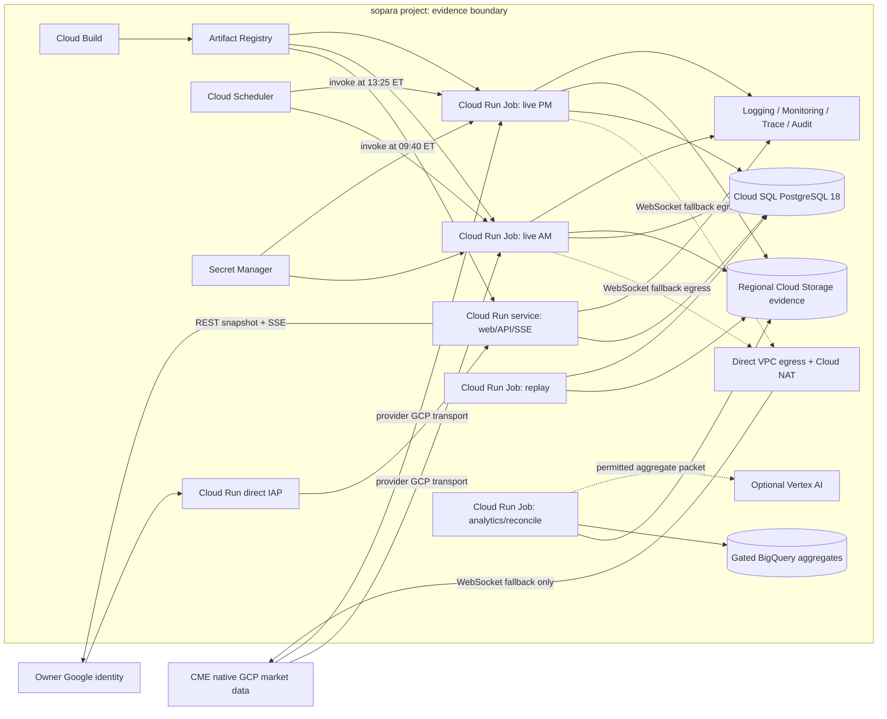
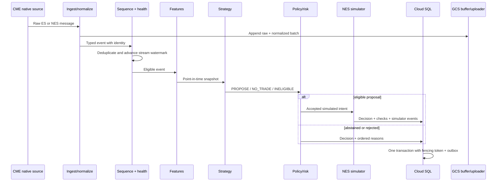

<!-- @format -->

# Sopara Technical and System Architecture

**Status:** Phase 2 approved; amended by approved Phase 3 interface architecture

**Version:** 0.6.0

**Date:** 2026-09-10

**Source contracts:** `docs/idea.md`, `docs/product.md`

**Deployment boundary:** Private, single-owner, non-commercial GCP-native evidence lab ending at live simulation

> [!IMPORTANT]
> Sopara v0 has no broker adapter, broker credential type, order-routing endpoint, or real-order destination. The only execution destination is the internal NES simulator. GCP is the authoritative runtime and evidence boundary. A local workstation may administer, develop, and run noncanonical source spikes; it cannot produce counted evidence.

## 1. Architecture decision summary

### 1.1 Approved inputs

| Decision | Chairman direction |
| --- | --- |
| Code/product topology | Option A — modular monolith |
| Workstation use | Allowed |
| Data-source path | Direct-CME-first spike approved; prefer CME's native GCP channel when available |
| Hosting direction | Full GCP-native wherever sensible and not forced |
| Live runtime | Option B — bounded Cloud Run Jobs per approved window |
| Cloud SQL availability | Zonal v0 baseline approved |
| Environment boundary | Single GCP project approved |

### 1.2 Approved architecture decisions

| ID | Decision | Approved selection | Status |
| --- | --- | --- | --- |
| `ADR-001` | Code topology | Modular monolith with explicit domain ports | Approved |
| `ADR-002` | Live runtime | Two single-task Cloud Run Jobs, one per approved window | Approved |
| `ADR-003` | Control surface | IAP-protected Cloud Run service serving same-origin UI, REST, and SSE | Approved |
| `ADR-004` | Transactional system of record | Zonal Cloud SQL for PostgreSQL 18 | Approved |
| `ADR-005` | Canonical market-event evidence | Immutable Parquet objects in regional Cloud Storage | Approved |
| `ADR-006` | Research analytics | BigQuery for license-cleared, non-reconstructable derived analytics only | Approved |
| `ADR-007` | Scheduling | Cloud Scheduler directly invokes each Cloud Run Job; the job enforces calendar boundaries | Approved |
| `ADR-008` | Commands and UI events | PostgreSQL command inbox and transactional outbox | Approved |
| `ADR-009` | Delivery semantics | At-least-once with application idempotency; no exactly-once assumption | Approved |
| `ADR-010` | Secrets | Secret Manager, version-pinned and accessed with workload identity | Approved |
| `ADR-011` | Data ingress and egress | CME native GCP channel when window-safe; Direct VPC plus Cloud NAT for WebSocket fallback | Approved |
| `ADR-012` | Optional model research | Separate Cloud Run Job using Vertex AI only after entitlement approval | Approved |
| `ADR-013` | Build and artifacts | Cloud Build and Artifact Registry; deploy images by digest | Approved |
| `ADR-014` | Observability | Cloud Logging, Monitoring, Trace, Error Reporting, and Audit Logs | Approved |
| `ADR-015` | Infrastructure definition | Terraform executed by Cloud Build with versioned GCS state | Approved |
| `ADR-016` | Environment isolation | One GCP project with resource-, identity-, and data-level development/evidence isolation | Approved |
| `ADR-017` | Web delivery | TanStack Start SPA output is built in Cloud Build and served by the existing FastAPI Cloud Run service | Approved |
| `ADR-018` | Application API runtime | FastAPI/Python exclusively owns REST, commands, SSE, IAP assertion validation, safe halt, and server-side domain policy | Approved |
| `ADR-019` | UI component base and tooling | Base UI-backed shadcn source via preset `b3ZheXgQEs`; Bun is build-time only | Approved |

### 1.3 Why cloud native changes the topology

The system remains a modular monolith in source code and domain authority. It does not mean one host or one local database. GCP-managed runtimes introduce distributed failure boundaries, so the architecture must add:

- fencing tokens for singleton session-window ownership;
- idempotent scheduled execution;
- Cloud SQL transactions and advisory coordination;
- immutable Cloud Storage generations;
- explicit reconciliation across database and object storage;
- reconnectable source and browser streams;
- per-service IAM identities;
- regional colocation and cost controls.

The design uses Pub/Sub on the hot path only if it is the transport CME provisions during native GCP onboarding. Sopara does not insert its own Pub/Sub hop after receipt. Cloud Tasks, Dataflow, GKE, Spanner, Redis, and a service mesh remain absent because they do not improve this v0 workload.

### 1.4 Non-negotiable invariants

1. Identical accepted inputs and versions produce identical canonical results.
2. ES information state and NES execution state remain distinct at every boundary.
3. `SYNTHETIC_NES_PROXY` can never satisfy an observed-NES or counted-session gate.
4. A model response can never affect canonical strategy, risk, simulation, or evidence state.
5. Cloud SQL is authoritative for control state; Cloud Storage is authoritative for market-event files; BigQuery is rebuildable.
6. No Cloud Run memory, local filesystem, browser cache, log stream, or BigQuery table is authoritative.
7. Every accepted decision binds exact ES and NES watermarks and immutable version hashes.
8. Market-event queues are bounded; canonical events are never silently sampled or dropped.
9. Loss of data, clock, storage, database, entitlement, or process continuity blocks new simulated orders.
10. A Cloud Run retry or replacement never silently continues the same live evidence window.
11. Every write path is idempotent and fenced against stale workload generations.
12. Raw or reconstructable licensed market data cannot leave the permitted GCP boundary without affirmative permission.
13. The shared workstation cannot write canonical evidence buckets or qualification tables.
14. v0 contains no real-order destination, broker interface, or production credential schema.
15. Live licensed ingestion cannot begin until CME confirms the storage, recovery, derived-data, model-use, and purge terms listed in Section 13.1 in writing.

## 2. Candidate GCP-native runtime walkthroughs

### 2.1 Option A — singleton Cloud Run worker pool with CME native GCP delivery

#### Lifecycle

One fixed-instance `sopara-live` Cloud Run worker pool runs the singleton source adapter and deterministic engine. The approved direct-CME spike first tests CME's native GCP real-time JSON channel; the exact subscriber transport and project grants are confirmed during onboarding. If CME provisions Google Pub/Sub, the worker uses regional StreamingPull with flow control. If native GCP delivery is unavailable for NES, the same worker uses the direct CME WebSocket adapter through controlled egress.

The worker stays connected across the midday gap and outside the two approved windows. Calendar policy controls eligibility while preserving source continuity. A `trading_session` represents one trade date and its two `session_window` children.

#### Implementation and operations

- Worker pools are GA, have no public URL, and fit continuous pull subscribers.
- One fixed instance avoids competing consumers and minimizes source reconnects.
- Cloud Scheduler uses `America/New_York`; exchange calendars still control eligibility.
- Duplicate scheduler delivery is rejected by a unique command key and fencing lease.
- The worker is billed while running; its fixed ceiling makes that cost bounded.
- A restart never masquerades as evidence continuity: the active window becomes invalid unless source continuity is re-proven under the same fenced process lifecycle.

#### Failure behavior

Worker-pool processes and network connections can still reset during platform maintenance or rollout. The source client must reconnect and prove contiguous provider sequence. Any unrecoverable gap invalidates the active window. Pub/Sub acknowledgement success is not a domain commit; the worker acknowledges only after durable object/ledger progress and still deduplicates by source identity.

#### Latency and scale

Market messages remain in one process after receipt through normalization, features, strategy, risk, and simulation. Sopara does not republish them to another topic. At 10× volume, replay scales by increasing Cloud Run Job tasks; the singleton live capture remains one instance until independent feeds or domains require sharding.

#### Migration cost

The same container can move to bounded Cloud Run Jobs or GKE Autopilot because source, clock, ledger, object store, and supervisor are ports. Domain schemas and evidence hashes do not change.

#### Verdict

Not selected. Retain as the first migration target if per-window source reinitialization repeatedly invalidates evidence.

### 2.2 Option B — bounded Cloud Run Jobs per approved window

#### Lifecycle

Cloud Scheduler directly invokes `sopara-live-am` at 09:40 ET and `sopara-live-pm` at 13:25 ET. Each is a single-task Cloud Run Job using the same image digest and immutable configuration family. The job authenticates, establishes independent ES and NES initial state, acquires a fenced window lease, runs the deterministic engine, drains, reconciles, and exits. `maxRetries=0` prevents a failed execution from silently resuming the same evidence window.

Strategy eligibility begins only at 09:45 or 13:30 and ends at 12:00 or 15:45. The five-minute lead is preflight time, not trading time. Each task timeout extends through a bounded post-window drain but stays below three hours. A daily session counts only after both executions reconcile, subject to exchange-calendar exceptions.

#### Implementation and operations

- Scheduler uses `America/New_York`, while the versioned exchange calendar remains authoritative for holidays and early closes.
- Scheduler calls the `run.googleapis.com` Jobs execution endpoint with an OAuth access token from a dedicated service account scoped to the two live jobs.
- Both job definitions bind the same image digest; a digest mismatch invalidates the trading session before either window runs.
- Each execution records scheduled time, actual start, cold-start delay, execution resource name, task attempt, and terminal status.
- A missed start cannot be backfilled as live evidence. An operator-triggered execution is diagnostic unless it begins before the approved eligibility boundary and passes the same preflight.

#### Benefits

- runtime is billed only during the two windows;
- execution identity and bounded completion are explicit;
- replay and live jobs share the same operational primitive;
- direct WebSocket capture does not face Cloud Run service request timeouts;
- remains fully managed and simpler than Kubernetes.

#### Costs and failure modes

- native Pub/Sub subscriptions may accumulate backlog while no task runs; startup must seek or drain to an entitlement-approved initial boundary without treating backlog as current state;
- each window begins with a reconnect and fresh initial-state proof;
- cold start or delayed Scheduler delivery can shorten the evidence interval;
- a platform job retry is unsafe for live continuity and must remain disabled;
- separate executions lose continuous midday source state;
- provider onboarding may assume a continuously attached subscriber;
- no midday continuity exists, so the afternoon execution must obtain a fresh authoritative book snapshot and sequence boundary.

#### Verdict

Selected for v0. The direct-CME spike remains a release gate: the native GCP channel is used only if it supports safe per-window initialization. Otherwise, the selected runtime remains Cloud Run Jobs but uses the direct CME WebSocket adapter through controlled GCP egress.

### 2.3 Rejected escalation — GKE Autopilot

GKE Autopilot offers Kubernetes lifecycle controls, disruption budgets, workload separation, and future feed sharding. It also adds cluster policy, release channels, manifests, pod disruption behavior, resource-request tuning, and a permanent management surface. A restarted pod would still invalidate a live evidence window. Use it only when multiple independently scalable live feeds or order domains require Kubernetes primitives.

### 2.4 Storage fork: Cloud SQL and GCS versus Spanner or Bigtable

| Candidate | Strength | Why not primary |
| --- | --- | --- |
| Cloud SQL PostgreSQL + GCS | Transactions for low-volume domain state; cheap immutable objects for high-volume events | Recommended |
| Spanner | Horizontal relational scale and multi-region availability | Forced for one owner and one live writer; higher schema/ops/cost tax |
| Bigtable | High-throughput ordered key/value time series | Weak fit for relational experiment, command, and reconciliation invariants |
| BigQuery only | Excellent analytics | Not an OLTP store; recovery retention may conflict with CME purge duties |

## 3. GCP resource topology

### 3.1 Project boundary

```text
sopara GCP project
├── development boundary
│   ├── `dev-*` service accounts and Cloud Run resources
│   ├── development Cloud SQL instance and buckets
│   └── synthetic/proxy fixtures and noncanonical tests
└── evidence boundary
    ├── `evidence-*` service accounts and Cloud Run resources
    ├── evidence Cloud SQL instance and licensed-data buckets
    └── counted replay, observed-NES simulation, and audit
```

The Chairman selected one GCP project. Development and evidence therefore share project-level quotas, service agents, billing, and an IAM-policy blast radius. They still use separate Cloud SQL instances, buckets, secrets, service accounts, Cloud Run resources, datasets, log sinks, and naming prefixes. No runtime identity is shared across boundaries. Promotion binds a verified Artifact Registry digest and signed configuration to evidence resources; it never copies mutable development state.

Project-level budget alerts are supplemented by mandatory labels and per-service metrics because GCP budgets cannot enforce boundary-specific shutdown. Organization-policy controls, public-access prevention, and deny policies apply project-wide. The workstation receives development roles only; evidence administration requires explicit short-lived elevation.

### 3.2 Regional selection

The direct-CME spike compares at least `us-central1` and `us-east4` using the identical capture image. It measures:

- authorization and NES product availability;
- exact GCP transport, project/subscription grants, and Unit of Count treatment;
- provider endpoint, destination controls, and source-IP requirements;
- connect and authentication time;
- round-trip and receive-time distributions;
- p50, p95, p99, and maximum event rate;
- disconnect and resubscription behavior;
- source sequence recovery;
- BBO/trade coverage and payload bytes;
- morning and afternoon startup reliability;
- regional Cloud SQL and GCS latency.

The winning single region hosts Cloud Run, Cloud SQL, Cloud Storage, Scheduler, Secret Manager, and observability sinks where supported. A BigQuery dataset is colocated only if its licensed-data gate passes. Region selection is evidence-driven, not based on assumed proximity to Chicago or the owner.

### 3.3 Resource diagram



### 3.4 Services deliberately absent

| Service | v0 disposition | Reason |
| --- | --- | --- |
| Pub/Sub | Provider transport only if CME provisions it | Do not add a second application-owned topic after receipt |
| Cloud Tasks | Not used for sessions | HTTP dispatch duration and at-least-once delivery do not fit live windows |
| Dataflow | Not used | One feed and one strategy do not justify a distributed streaming runner |
| Memorystore | Not used | Durable state already fits PostgreSQL; cache invalidation adds risk |
| GKE | Deferred | No Kubernetes-only requirement |
| Spanner | Deferred | Scale and availability do not justify cost/complexity |
| Vertex AI | Not provisioned initially | Optional offline research only after entitlement approval |
| External load balancer | Not used | Direct Cloud Run IAP protects the service without the extra cost/path |

## 4. Deployable units and authority

### 4.1 Shared modular-monolith package

```text
sopara/
  web/             TanStack Start SPA, shadcn components, typed REST/SSE adapters
  domain/          pure records, state machines, reason codes, invariants
  instruments/     ES/NES specs, calendars, contract and roll policy
  entitlements/    permitted-use policy and artifact labels
  ingest/          historical and live source adapters
  normalize/       mapping, tick validation, sequence, deduplication
  health/          freshness, gaps, clocks, storage, operability
  features/        point-in-time deterministic feature state
  strategy/        one deterministic strategy and NO_TRADE baseline
  policy/          eligibility and simulated-risk rules
  simulator/       NES order and portfolio state machines
  counterfactual/  immutable alternate outcomes
  evidence/        PostgreSQL ledger, GCS manifests, hashes, reconciliation
  replay/          simulated clock, checkpoints, worker partitioning
  api/             REST, commands, SSE, IAP identity
  model_gateway/   offline allowlist, Vertex AI, cost, attribution
  ops/             preflight, diagnostics, telemetry, recovery
```

All deployables use one locked source tree and container build. The web toolchain is build-time only; the resulting static shell and hashed assets are copied into the final Python image. Entrypoints enable only their required modules.

### 4.2 `sopara-web` Cloud Run service

Owns:

- same-origin UI assets;
- direct IAP identity validation;
- REST snapshots and bounded reads;
- idempotent command submission;
- resumable SSE over the transactional outbox;
- export request and download authorization.

It may append only through security-definer database functions for command, acknowledgement, and export requests. It cannot create decisions, fills, reconciliations, or accepted datasets.

The UI is TanStack Start in SPA mode with Base UI-backed shadcn components. FastAPI serves existing hashed assets before route fallback, reserves `/api/**`, `/events/**`, and `/safe/**` for Python server handlers, and rewrites only eligible browser `GET`/`HEAD` routes to `/_shell.html`. Non-idempotent requests, unknown API routes, safe-halt routes, and missing asset paths are never rewritten. TanStack Start server functions, server routes, middleware, SSR, and Node/Bun production processes are outside v0; this avoids adding a second API runtime or Cloud Run service solely for a private application with no SEO requirement.

FastAPI/Python is the only application server. Its generated OpenAPI document is the transport source of truth for browser types. TanStack loaders run in the browser and call FastAPI REST endpoints; the SSE client connects to FastAPI's outbox-backed stream. IAP assertion validation, CSRF, idempotency, expected-revision checks, database access, entitlement enforcement, and all domain rules remain Python responsibilities. The final runtime image contains Python and static UI output, not a JavaScript server runtime.

Baseline settings:

| Setting | Value |
| --- | --- |
| Ingress | HTTPS with direct Cloud Run IAP |
| Unauthenticated access | Disabled |
| Allowed IAP principal | Exact owner Google identity |
| Minimum instances | `1` during initial evidence period to avoid manual-halt cold starts |
| Maximum instances | `2` |
| Concurrency | Benchmark; begin at `20` |
| Request timeout | `3600s`; SSE closes itself before `3300s` |
| Database pool | Maximum five connections per instance |
| Session affinity | Not required |

### 4.3 `sopara-live-am` and `sopara-live-pm` Cloud Run Jobs

The two job resources use the same Artifact Registry digest, service account, entrypoint, and immutable runtime configuration except for `window_code` and resolved calendar bounds. Each execution has one task and no automatic retry. Cloud Scheduler calls the Cloud Run Jobs execution API with a dedicated service account that can execute only these two jobs.

| Setting | Value |
| --- | --- |
| Tasks per execution | `1` |
| Parallelism | `1` |
| Maximum retries | `0` |
| Task timeout | `10,800s` maximum; actual drain deadline is earlier |
| Source | CME native GCP channel; WebSocket adapter fallback |
| Region endpoint | Selected by source spike; fixed for evidence resources |
| Morning invocation | 09:40 ET |
| Morning eligibility | 09:45–12:00 ET |
| Afternoon invocation | 13:25 ET |
| Afternoon eligibility | 13:30–15:45 ET |
| Midday behavior | No live task; afternoon execution establishes fresh state |
| Database pool | Maximum five connections |
| Rollout | Outside all live windows; both job definitions must bind the same digest |

Each execution acquires a new fencing lease for its window and records the Cloud Run execution resource name. Platform success is necessary but not sufficient for evidence acceptance. A nonzero exit, timeout, OOM, lost lease, or restarted/retried execution invalidates the window. The reconciler—not Cloud Run's terminal status—decides whether evidence is complete.

### 4.4 `sopara-replay` Cloud Run Job

Historical replay uses frozen manifests. A coordinator creates nonoverlapping deterministic shards. Each task emits a sealed result package; final aggregation orders outputs by declared input keys, not completion time.

- retries MAY be `1` only because replay tasks are idempotent and checkpointed;
- task count begins at `1` and increases only after deterministic shard tests;
- a replay admission policy prevents Cloud SQL or GCS saturation during live windows;
- proxy and observed evidence use separate task identities and output prefixes.

### 4.5 `sopara-reconcile` Cloud Run Job

Runs after each window and after the daily session:

- verifies GCS generations, sizes, CRC32C, and SHA-256 hashes;
- folds the PostgreSQL ledger independently;
- compares orders, fills, positions, costs, P&L, and watermarks;
- seals the window/session manifest;
- submits idempotent BigQuery load jobs only for license-cleared derived aggregates;
- updates rebuildable qualification projections;
- emits an incident on mismatch.

### 4.6 Optional `sopara-model-review` Cloud Run Job

Absent until a specific entitlement snapshot permits model use. It reads only prebuilt, non-reconstructable packets from a dedicated GCS prefix and calls an approved Vertex AI model. It has no raw-bucket permission and no canonical database write role.

## 5. Runtime and dependency baseline

### 5.1 Application versions as of 2026-09-10

| Component | Baseline | Role |
| --- | --- | --- |
| Python | `3.14.7`, standard GIL | Application runtime |
| Bun | `1.4.2` | Build-only package manager and command runtime; excluded from final image |
| PostgreSQL | Cloud SQL PostgreSQL 18, Google-managed minor | Transactional ledger and control state |
| Apache Arrow/PyArrow | `25.0.1` | Typed batches and Parquet |
| Polars | `1.44.x` | Deterministic feature and research transforms |
| FastAPI | `0.141.1` | REST, OpenAPI, SSE |
| OpenTelemetry spec | `1.60.0` | Trace and metric semantics |
| OWASP ASVS | `5.0.0` | Web security verification baseline |

DuckDB is allowed only as an optional local developer tool over noncanonical fixtures. BigQuery is the shared GCP analytical surface for data that the entitlement policy permits BigQuery to retain.

### 5.2 Lock and provenance

Every container is built from:

- an exact Python version and base-image digest;
- a hash-locked direct and transitive dependency file;
- a source commit or source-tree hash;
- a Cloud Build provenance record;
- an Artifact Registry digest and vulnerability scan result;
- an SBOM retained with the release manifest.

Every experiment and session records these identities. Tags such as `latest` are forbidden in job or service revisions.

### 5.3 Upgrade policy

- Patch upgrades require golden replay, provider fixture, migration, restore, and performance tests.
- Minor upgrades add a reference-dataset comparison and schema review.
- Major runtime, database, or evidence-format upgrades require an ADR.
- Preview/beta services or libraries cannot enter the canonical path.
- No deployment or database migration occurs between the morning and afternoon windows.
- A different image digest across the two windows invalidates the daily session.

## 6. Transactional data architecture

### 6.1 Cloud SQL configuration

Proposed baseline:

- PostgreSQL 18;
- Enterprise edition;
- zonal availability in the selected region;
- SSD storage with automatic growth;
- private IP;
- automatic IAM database authentication through the Python connector;
- automated backups and PITR enabled explicitly in Terraform only after CME confirms their recovery-retention and purge treatment in writing;
- deletion protection at Terraform and Cloud SQL levels;
- query insights with parameter values excluded;
- maintenance window outside market and reconciliation hours;
- database flags changed only through reviewed infrastructure code.

The Chairman approved zonal Cloud SQL for v0. A database outage invalidates the active window and may delay later jobs until recovery. Promote to regional HA only after measured availability loss threatens the evidence program; HA would protect stored-state availability but still would not preserve feed continuity automatically.

### 6.2 Database roles

| Role | Principal | Permissions |
| --- | --- | --- |
| `schema_owner` | Migration service account | DDL only during approved migration |
| `web_command` | `sopara-web` | Execute owner command/ack/export stored functions; read projections |
| `live_engine` | Live-job service account | Execute AM/PM jobs; acquire window lease; append live domain events; update projections |
| `replay_engine` | Replay job service account | Append only to assigned run aggregates |
| `reconciler` | Reconcile job service account | Read evidence; append reconciliation; load permitted BigQuery aggregates |
| `model_importer` | Model job service account | Append attributed model-review artifact only |
| `readonly_owner` | Owner through IAM DB auth | Read approved views; no application-table mutation |

Direct `UPDATE` or `DELETE` on the domain event ledger is denied to runtime roles.

### 6.3 Core tables

#### `trading_session`

| Column | Type | Constraint |
| --- | --- | --- |
| `session_id` | `uuid` | Primary key, UUIDv7 |
| `trade_date` | `date` | Unique with experiment/runtime identity |
| `mode` | enum | `HISTORICAL_REPLAY` or `LIVE_SIMULATION` |
| `evidence_class` | enum | Required |
| `experiment_id` | `uuid` | Required |
| `runtime_manifest_hash` | `text` | Required before first window runs |
| `calendar_version` | `text` | Required |
| `state` | enum | Product session state |
| `reconciliation_id` | `uuid` nullable | Required for `CLOSED` |
| `row_version` | `bigint` | Monotonic optimistic version |

#### `session_window`

| Column | Type | Constraint |
| --- | --- | --- |
| `window_id` | `uuid` | Primary key |
| `session_id` | `uuid` | Foreign key |
| `window_code` | enum | `AM` or `PM` |
| `eligible_start_utc` / `eligible_end_utc` | `timestamptz` | Resolved from calendar |
| `cloud_run_execution` | `text` | Cloud Run Job execution resource name |
| `lease_epoch` | `bigint` | Fencing token |
| `last_heartbeat_at` | `timestamptz` | Required while active |
| `state` | enum | Window lifecycle |
| `terminal_watermarks` | `jsonb` nullable | ES/NES boundaries |
| `manifest_id` | `uuid` nullable | Required if reconciled |
| `invalid_reason_codes` | `text[]` | Empty only when valid |
| `row_version` | `bigint` | Monotonic |

Unique `(session_id, window_code)` prevents duplicate scheduled executions.

#### `window_lease`

| Column | Type | Constraint |
| --- | --- | --- |
| `lease_key` | `text` | Primary key; trade date plus window |
| `lease_epoch` | `bigint` | Incremented on every acquisition |
| `holder_execution` | `text` | Cloud Run Job execution resource name |
| `acquired_at` / `expires_at` | `timestamptz` | Server-generated |
| `last_heartbeat_at` | `timestamptz` | Server-generated |

Every live-domain write includes the current `lease_epoch`. A stored function rejects a stale holder even if a prior execution resumes after another execution acquired the lease.

#### `command_inbox`

| Column | Type | Constraint |
| --- | --- | --- |
| `command_id` | `uuid` | Primary key |
| `idempotency_key` | `text` | Unique with actor and command scope |
| `payload_hash` | `text` | Same key/different hash is conflict |
| `command_type` | enum | Allowlisted |
| `target_type` / `target_id` | text / uuid | Required |
| `expected_version` | `bigint` | Required for mutations |
| `actor_email_hash` | `text` | IAP identity attribution without broad exposure |
| `requested_at` | `timestamptz` | Database time |
| `state` | enum | `RECEIVED`, `CLAIMED`, `COMPLETED`, `REJECTED`, `EXPIRED` |
| `result_event_id` | `uuid` nullable | Correlated terminal event |

The web service submits commands through a security-definer function that validates scope and inserts the audit event atomically.

#### `domain_event`

| Column | Type | Constraint |
| --- | --- | --- |
| `event_id` | `uuid` | UUIDv7 primary key |
| `event_type` | `text` | Stable allowlisted type |
| `event_schema_version` | `smallint` | Positive |
| `aggregate_type` / `aggregate_id` | text / uuid | Required |
| `aggregate_seq` | `bigint` | Unique with aggregate ID |
| `occurred_at` / `recorded_at` | `timestamptz` | Required |
| `occurred_at_ns` | `bigint` | Exact domain time where needed |
| `actor_type` / `actor_id` | text | Required |
| `correlation_id` / `causation_id` | `uuid` | Required |
| `reason_codes` | `text[]` | Stable ordered codes |
| `payload` | `jsonb` | Versioned schema |
| `payload_hash` | `text` | Canonical SHA-256 |
| `runtime_manifest_hash` | `text` | Required for run/session events |
| `lease_epoch` | `bigint` nullable | Required for live window writes |

Application roles cannot update or delete rows.

#### `outbox_event`

| Column | Type | Constraint |
| --- | --- | --- |
| `outbox_seq` | `bigint generated always as identity` | Primary cursor |
| `event_id` | `uuid` | Unique domain-event reference |
| `topic` | `text` | UI/read-model classification |
| `payload` | `jsonb` | Bounded notification, not raw data |
| `committed_at` | `timestamptz` | Database time |

Outbox rows are committed in the same transaction as domain events and projections. PostgreSQL `LISTEN/NOTIFY` may wake the web service, but the durable sequence is always read from this table.

#### Market and decision records

The database stores metadata and decisions, not the tick stream:

- `data_source` and immutable `entitlement_snapshot`;
- `dataset_manifest` and `market_object` metadata;
- `instrument_spec`, contract, calendar, and roll policy versions;
- `experiment`, holdout use, and counterfactual declarations;
- `feature_snapshot` references and watermarks;
- `decision` with `PROPOSE`, `NO_TRADE`, or `INELIGIBLE`;
- ordered `policy_check` results;
- `sim_order_event`, `sim_fill`, position, and cost projections;
- `incident` and append-only incident occurrences;
- `reconciliation`, export manifest, and model review metadata.

### 6.4 Event and numeric types

| Concept | Representation | Rule |
| --- | --- | --- |
| ID | UUIDv7 | Time-sortable; no user data encoded |
| Price | Signed 64-bit integer ticks | Instrument spec resolves tick size |
| Quantity | Signed 64-bit integer contracts | Fractions forbidden |
| Money | Signed 64-bit integer microdollars | UI rounds only at edge |
| Statistic | Float64 or decimal | Versioned feature; NaN/Inf rejected |
| Source timestamp | Signed 64-bit epoch nanoseconds | Preserve supplied precision and quality |
| Database timestamp | `timestamptz` plus ns field where exact | UTC only |
| Duration/TTL | Monotonic nanoseconds in runtime | Never wall-clock delta |
| Hash | Lowercase SHA-256 | Canonical serialization versioned |
| Enum | Stable uppercase string | Unknown values fail closed |

NES invariant:

```text
tick_size_points = 0.5
contract_multiplier_usd = 0.50
one_tick_value_microdollars = 250_000
gross_pnl_microdollars = tick_delta × quantity × 250_000
```

## 7. Cloud Storage evidence architecture

### 7.1 Bucket policy

The canonical evidence bucket is regional Standard storage, colocated with Cloud Run and Cloud SQL. It uses:

- uniform bucket-level access;
- public-access prevention;
- application-specific service accounts;
- soft delete explicitly disabled for licensed-data buckets unless CME approves a recoverable deletion window in writing;
- no retention policy on licensed-data buckets until CME confirms an allowed minimum retention and purge procedure;
- no object overwrite permission for runtime identities;
- Cloud Audit Logs data-access logging;
- lifecycle transitions only after measured access and license review.

Cloud Storage enables seven-day soft delete by default, so Terraform must override it to zero for every licensed-data bucket. Bucket Lock is not enabled because it is irreversible and could make the Section 13.1 purge obligation impossible to meet. Synthetic fixtures, build artifacts, and Terraform state use separate buckets with independent recovery policies.

### 7.2 Object layout

```text
gs://<project>-sopara-evidence/
  objects/raw/schema=v1/trade_date=YYYY-MM-DD/instrument=ES/<sha256>.parquet
  objects/raw/schema=v1/trade_date=YYYY-MM-DD/instrument=NES/<sha256>.parquet
  objects/normalized/schema=vN/trade_date=YYYY-MM-DD/instrument=.../<sha256>.parquet
  objects/features/schema=vN/trade_date=YYYY-MM-DD/<sha256>.parquet
  manifests/datasets/<dataset_id>/<manifest_hash>.json
  manifests/windows/<window_id>/<manifest_hash>.json
  manifests/sessions/<session_id>/<manifest_hash>.json
  manifests/runs/<run_id>/<manifest_hash>.json
  exports/<export_id>/<sha256>
  quarantine/<artifact_id>/<generation>
```

Absolute local paths never enter portable evidence.

### 7.3 Object commit protocol

1. Build a bounded Arrow/Parquet chunk in Cloud Run ephemeral storage or memory.
2. Close and validate its schema, row count, min/max keys, and Parquet footer.
3. Compute SHA-256 and retain the library-provided CRC32C.
4. Upload directly to the content-addressed final key with `ifGenerationMatch=0`.
5. Treat `412 Precondition Failed` as an idempotent collision only after verifying generation, size, and checksums.
6. Read object metadata and record generation, metageneration, size, CRC32C, SHA-256, schema, and source range.
7. Append `MarketObjectCommitted` in Cloud SQL.
8. Include the object in a manifest only after every expected object is verified.
9. Upload the content-addressed manifest with `ifGenerationMatch=0`.
10. Commit its generation and hash in Cloud SQL.

Cloud Storage makes a complete object visible atomically; interrupted uploads do not expose partial objects. Database/object atomicity is achieved by reconciliation, not a fictitious distributed transaction.

### 7.4 Chunking and backpressure

Initial target is five-second chunks or 64 MiB, whichever occurs first, with two alternating buffers. Benchmark may tighten it. Each stage has bounded event count, byte size, and maximum age.

- warning threshold blocks nonessential feature/report work;
- high-water threshold pauses source reads when permitted;
- critical threshold blocks proposals and initiates halt;
- no canonical event is dropped or sampled;
- an unflow-controlled source that exceeds capacity invalidates the window.

Loss of an unuploaded chunk invalidates the window. It is never reconstructed from a later aggregate and presented as observed evidence.

### 7.5 Evidence classification enforcement

Object metadata and manifests carry exactly one class:

- `OBSERVED_NES`;
- `SYNTHETIC_NES_PROXY`;
- `NO_EXECUTION_EVIDENCE`.

Proxy and observed objects use separate prefixes, service-account scopes, analytical datasets, and qualification views. A database constraint forbids a counted window or session from referencing proxy objects.

## 8. Market event, order, and time semantics

### 8.1 Market event identity

```text
(source_id, channel_id, source_session_id,
 source_sequence, message_index, contract_id)
```

If a provider lacks stable sequences, the adapter declares a fallback identity using provider message identity, timestamps, and raw checksum. Such data carries `SEQUENCE_FIDELITY_UNVERIFIED` and cannot satisfy canonical completeness until an explicit policy is approved.

### 8.2 Independent ES and NES watermarks

The engine never total-orders ES and NES using timestamp alone.

```json
{
  "sourceId": "uuid",
  "channelId": "channel",
  "sourceSessionId": "session",
  "lastContiguousSequence": 123456,
  "maxExchangeTimeNs": 1789055100000000000,
  "maxReceiveTimeNs": 1789055100001000000,
  "completeness": "CONTIGUOUS"
}
```

Every feature snapshot and decision records the exact ES and NES watermarks consumed.

### 8.3 Point-in-time eligibility

An event becomes eligible only when:

- received from the live source or released by the replay clock;
- normalized and tick-validated;
- correction status was knowable then;
- prior book state exists;
- its interval is not quarantined;
- its entitlement snapshot permits the use;
- its explicit contract is eligible under the bound roll policy.

Late corrections create a new dataset version. They do not rewrite a completed run.

### 8.4 Clock policy

- Persist UTC instants and source nanoseconds.
- Evaluate policy using `America/New_York` and record tzdata version.
- Use monotonic time for freshness, deadlines, and queue age.
- Check drift against Google-managed host time and source timestamps.
- Backward jump or hard-threshold drift halts and invalidates the window.
- Replay uses an injected clock and cannot call current wall time for domain decisions.

### 8.5 At-least-once contract

Source reconnects, Scheduler invocation, HTTP commands, database notifications, BigQuery loads, and job completion may be repeated. Stable keys make duplicates safe. Duplicate identity with identical content is a no-op plus metric; identical identity with conflicting content is a blocking integrity incident.

## 9. Live synchronous and asynchronous flows

### 9.1 Scheduled invocation and fencing

```mermaid
sequenceDiagram
    participant S as Cloud Scheduler
    participant R as Cloud Run AM or PM Job
    participant D as Cloud SQL
    participant C as CME
    participant G as Cloud Storage

    S->>R: Execute scheduled job with authenticated API call
    R->>D: Create/get session and window
    R->>D: Acquire lease, increment lease_epoch
    alt duplicate or active holder
        D-->>R: Reject stale/duplicate execution
        R-->>S: Exit no-op or conflict
    else acquired
        D-->>R: Fencing token + runtime manifest
        R->>C: Authenticate; establish fresh ES/NES state
        R->>D: Record ordered preflight checks
        R->>G: Write immutable event chunks
        R->>D: Append decisions and simulator events
        R->>D: Reconcile and close window
    end
```

Cloud Scheduler authenticates to the Cloud Run Jobs execution API with its dedicated service account. That account can execute only `sopara-live-am` and `sopara-live-pm`. Duplicate invocation is expected. The unique window key, execution identity, lease, and fencing token—not Scheduler delivery—guarantee singleton ownership.

### 9.2 Preflight

Before `RUNNING`, the job records:

1. exact container digest and dependency lock;
2. GCP project and approved region;
3. Cloud SQL connection, schema, storage health, and entitlement-approved backup/PITR state;
4. GCS bucket policy, generation preconditions, and write/read probe;
5. source entitlement effective through the window;
6. Secret Manager credential version;
7. explicit ES and NES contract mapping;
8. exchange calendar, early close, expiry, and roll policy;
9. ES and NES authentication, subscription, initial book, and sequence continuity;
10. clock drift;
11. strategy, feature, risk, simulator, and cost versions;
12. one-contract NES tick and P&L fixture;
13. zero unresolved critical incident;
14. current fencing lease;
15. runtime manifest hash sealed.

Any missing blocking fact keeps the window out of `RUNNING`.

### 9.3 Event-to-decision hot path



No application-owned messaging hop sits between provider receipt and decision. If CME's provisioned transport is Pub/Sub, that subscription is the source boundary rather than an internal fan-out bus.

### 9.4 Command flow

1. Owner submits an HTTPS command through IAP.
2. Web service validates IAP assertion, CSRF, origin, schema, idempotency key, and expected version.
3. A stored function appends `CommandReceived`, `command_inbox`, and `outbox_event` atomically.
4. Active job receives PostgreSQL notification or observes the row during bounded polling.
5. Job verifies the fencing token and current aggregate version.
6. Job appends `CommandAccepted` or `CommandRejected` and applies the state transition.
7. Web SSE reads the correlated outbox event.

Database polling remains the correctness path if `NOTIFY` is lost. Manual halt polling interval targets 100 ms. Automated health gates do not depend on the web service.

### 9.5 Halt and Cloud Run signals

- Critical health condition immediately disables proposal eligibility.
- Source disconnect or failed liveness probe records an infrastructure interruption and blocks proposals before reconnect.
- A reconnect starts source resynchronization; proposals remain blocked until continuity is proven.
- `SIGTERM` starts Cloud Run's bounded best-effort drain, records the terminal event if dependencies remain available, and exits nonzero.
- `SIGKILL`, memory termination, lost lease, or process disappearance causes the reconciler to invalidate the window.
- Automatic retries are disabled. A separately invoked replacement execution receives a new identity and cannot continue or make the interrupted window count.

### 9.6 Window and daily reconciliation

Window reconciliation:

1. stop new proposals;
2. cancel resting simulated orders;
3. resolve positions under the bound exit policy;
4. drain input queues within deadline;
5. upload and verify final objects;
6. freeze terminal ES/NES watermarks;
7. independently fold domain events;
8. compare orders, fills, position, P&L, costs, and projections;
9. verify interval completeness and entitlement;
10. seal the window manifest;
11. mark reconciled only with zero unexplained mismatch.

Daily reconciliation verifies both windows, identical runtime identity, expected calendar coverage, and zero unresolved critical incident. A valid afternoon window cannot repair an invalid morning window.

## 10. Replay and licensed-data-safe analytics

### 10.1 Replay input

A replay job receives:

- frozen dataset manifest ID and GCS generations;
- experiment and counterfactual-set hashes;
- strategy, feature, risk, simulator, cost, calendar, roll, and runtime versions;
- deterministic seed when explicitly required;
- nonoverlapping shard boundaries.

The job reads objects by exact name and generation. Wildcard bucket scans are forbidden for canonical replay.

### 10.2 Checkpoints

A checkpoint binds input key, source watermarks, engine-state hash, preceding output hash, runtime manifest, and task index. Retry may resume only after verifying every field. Otherwise it creates a new run or fails.

### 10.3 BigQuery load

BigQuery is not a raw-event lake. It may receive only fields that CME has confirmed in writing are non-reconstructable derived data and may remain subject to BigQuery's deletion-recovery behavior. The gate is fail-closed: without that confirmation, the reconciler does not create or submit a BigQuery load job.

When the gate passes, only reconciled aggregate manifests load. The reconciler uses a deterministic job ID; batch loads are atomic, so all rows enter or none do.

Datasets:

```text
sopara_analytics
  session_metrics
  reason_code_counts
  cost_summary
  experiment_comparison

sopara_synthetic
  synthetic-only aggregates, never used by observed qualification views

sopara_ops
  load_manifest
  cost_allocation
  reconciliation_summary
```

Raw quotes, trades, timestamped event sequences, reconstructable features, individual decisions, orders, and fills are forbidden from BigQuery unless the written entitlement decision explicitly names them. Tables partition by `trade_date` and cluster where applicable by `strategy_version` and `evidence_class`. Qualification views reference only approved observed aggregates. If the gate remains closed, reconcile jobs compute reports against exact GCS generations and store only license-cleared summaries in Cloud SQL or a permitted GCS evidence object.

### 10.4 BigQuery cost and correctness controls

- require partition filters;
- dry-run large queries;
- set maximum bytes billed;
- prohibit `SELECT *` in application queries;
- use deterministic load job IDs;
- reconcile loaded row counts and hashes with the source manifest;
- set the minimum two-day time-travel window, while recognizing BigQuery then retains deleted data for a nonconfigurable additional seven-day fail-safe period;
- use on-demand billing initially;
- configure budget alerts, recognizing that budgets do not stop spend;
- treat BigQuery as optional, disposable, and rebuildable;
- deny observed-data dataset creation in the evidence boundary until the entitlement gate records approval.

## 11. API and browser consistency

### 11.1 Authentication boundary

Direct Cloud Run IAP protects the owner-facing `run.app` endpoint without an external load balancer. Only the exact owner Google identity receives the IAP accessor role. The application validates the signed `x-goog-iap-jwt-assertion`, including issuer, audience, expiry, and subject; it does not trust unsigned identity headers. Scheduler never traverses IAP; it authenticates separately to the Google Cloud Run Jobs execution API.

### 11.2 REST conventions

- Base path `/api/v1`.
- Schemas generated into OpenAPI.
- RFC 3339 UTC at the API edge; exact nanoseconds represented as strings.
- Money includes integer microdollars and display currency.
- Price includes integer ticks, tick size, and display points.
- Errors use problem details with stable code, correlation ID, retryability, and current version.
- Histories use opaque cursor pagination.

### 11.3 Authoritative snapshot

```json
{
  "schemaVersion": 1,
  "revision": 4812,
  "streamCursor": "4812",
  "generatedAt": "2026-09-10T14:00:00.123456789Z",
  "lastDomainEventAt": "2026-09-10T14:00:00.100000000Z",
  "lastIngestAt": "2026-09-10T14:00:00.110000000Z",
  "mode": "LIVE_SIMULATION",
  "operability": "HEALTHY",
  "evidenceClass": "OBSERVED_NES",
  "sourceHealth": {},
  "windowState": {},
  "incidents": [],
  "capabilities": {}
}
```

Capabilities are server-derived. The browser never infers authorization or legal state transitions.

### 11.4 SSE behavior

- Endpoint `GET /api/v1/events`.
- `outbox_seq` is the monotonic event ID.
- Reconnect uses snapshot cursor and `Last-Event-ID`.
- Duplicate IDs are ignored.
- Expired cursor, gap, incompatible schema, or invalid transition forces resnapshot.
- Heartbeats contain no domain state.
- Service closes streams before 55 minutes to stay below Cloud Run's 60-minute timeout and refresh authorization.
- Reconnection may reach any instance; all state comes from Cloud SQL.
- Lost heartbeat or read failure makes the UI show `STATUS_UNKNOWN` immediately.

SSE remains preferable to WebSocket because browser updates are one-way and commands retain ordinary HTTP audit and concurrency semantics.

### 11.5 Command responses

Every mutation requires IAP identity, CSRF and origin validation, `Idempotency-Key`, payload hash, and expected resource version.

| Result | Meaning |
| --- | --- |
| `202 Accepted` | Durable command receipt; not domain completion |
| `200/201` | Synchronous state committed |
| `409 Conflict` | Idempotency key reused with different payload or mutually exclusive command |
| `412 Precondition Failed` | Stale expected version |
| `422 Unprocessable Content` | Schema-valid but domain-invalid request |
| `503 Service Unavailable` | Trusted database or service unavailable |

The UI may display `REQUESTED` optimistically. It cannot display `RUNNING`, `HALTED`, or `CLOSED` until a correlated committed event or newer snapshot arrives.

## 12. IAM, secrets, and network security

### 12.1 IAM principles

- one service account per deployable responsibility;
- no user-managed service-account keys;
- IAM database authentication;
- secret-level and bucket-level grants;
- no primitive project Editor/Owner roles for workloads;
- owner administration through a separate privileged identity and just-in-time elevation where available;
- Data Access Audit Logs enabled for Secret Manager, GCS, BigQuery, and IAP-sensitive paths.

### 12.2 Secret Manager

CME credentials and signing material are stored as separate secrets. Workloads retrieve an explicit version through the API at startup using workload identity. Secrets never enter environment dumps, logs, Cloud SQL, GCS object metadata, BigQuery, build arguments, exports, or model packets.

A rotation creates a new secret version, updates the reviewed workload revision, and preserves the prior version until rollback expiry. Access is logged.

### 12.3 Network

- Cloud SQL uses private IP.
- Cloud Run uses Direct VPC egress.
- The preferred CME-native GCP source remains on provider-supported Google Cloud transport and does not traverse an application-owned NAT path.
- The WebSocket fallback uses Direct VPC egress plus Cloud NAT only when stable source IP is required.
- A reserved static egress IP proves source identity for allowlisting; firewall and route policy still control destinations because a static IP alone does not.
- GCS and Google APIs use supported private/restricted access paths where configured.
- `sopara-web` is the only internet-ingress workload and is protected by direct IAP.
- Jobs expose no HTTP service.
- Public bucket access is prevented at policy level.

### 12.4 Encryption

Google-managed encryption at rest is the v0 baseline. TLS is required in transit. Cloud KMS customer-managed keys are introduced only if entitlement, organizational policy, or a documented threat model requires them; forced CMEK adds key-disable and key-deletion failure modes without changing product authority.

### 12.5 Shared workstation

The workstation may, within the single project:

- build locally for development;
- run the same capture container against development resources;
- execute the approved regional source spike;
- query approved BigQuery views through owner ADC or service-account impersonation;
- administer development resources through short-lived user credentials.

It may not:

- hold service-account key files;
- write the canonical evidence bucket;
- write qualification BigQuery aggregates;
- mutate live domain tables directly;
- claim a local run toward the 20-session gate.

## 13. Entitlements and model isolation

### 13.1 Entitlement snapshot

Every source and derived artifact binds:

- provider and agreement identity;
- entitlement owner and effective period;
- instruments and data depth;
- live, delayed, or historical classification;
- display and non-display analysis permission;
- derived-data permission;
- export and aggregation limits;
- ML/AI/LLM permission;
- retention and deletion obligations;
- permitted GCP project, resource boundaries, and regions;
- redistribution prohibition;
- reporting/audit obligation;
- evidence document hash and policy contact.

Before any licensed live message enters Sopara, the owner must attach written CME confirmation covering all of the following:

1. NES availability and the exact native-GCP transport, authentication, and project/subscription grants;
2. Unit of Count treatment for the single GCP project, its service identities, and the allowed shared workstation;
3. non-display analysis, derived fields, evidence storage, and permitted export/aggregation;
4. raw and derived retention plus purge behavior for GCS soft delete, Cloud SQL backups/PITR, logs, and BigQuery time travel/fail-safe;
5. whether any market-derived packet may be sent to Vertex AI and under what retention and model-training terms;
6. required source IP, geography, reporting, and audit controls.

The gate is an infrastructure policy, not a checklist convention: absent or expired answers prevent licensed source credentials from being bound to either live job, prevent BigQuery dataset creation for observed data, and prevent Vertex AI permissions.

### 13.2 Propagation

- derived artifacts inherit the most restrictive source policy;
- combined datasets use the intersection of permissions;
- missing permission means denial;
- expiry blocks new use and opens an incident;
- revocation purges licensed payloads as required, preserves only a non-informational tombstone/audit fact, and marks dependent evidence non-reproducible;
- exports enumerate included, aggregated, redacted, and omitted fields;
- BigQuery loads require an affirmative destination-specific retention decision and preserve policy and evidence class;
- service accounts cannot cross observed/proxy boundaries.

### 13.3 Vertex AI boundary

Vertex AI is preferred over an external model provider only when optional model research is approved. GCP location alone does not grant market-data permission.

Always denied without affirmative entitlement:

- raw trades or quotes;
- timestamped event sequences;
- order-book states;
- reconstructable feature sequences;
- credentials and owner identifiers;
- live session state;
- unrestricted GCS, BigQuery, or Cloud SQL access.

The model job records model resource/version, endpoint region, prompt hash, allowlisted-input hash, output hash, latency, token/cost allocation, and citation-validation result. Failure yields `MODEL_REVIEW_UNAVAILABLE` and has no canonical effect.

## 14. Simulation and deterministic authority

### 14.1 Strategy contract

```text
evaluate(feature_snapshot, immutable_strategy_config)
  -> PROPOSE(proposal)
   | NO_TRADE(reason_codes)
   | INELIGIBLE(reason_codes)
```

Proposal fields include direction, quantity ceiling, NES reference ticks, validity interval, stop and exit policies, maximum holding duration, feature snapshot ID, ES/NES watermarks, and evidence class.

### 14.2 Ordered eligibility checks

1. current fencing lease;
2. operability;
3. entitlement;
4. approved window;
5. explicit ES and NES contracts;
6. ES freshness and continuity;
7. NES freshness, continuity, book, and market status;
8. evidence-class eligibility;
9. proposal expiry;
10. NES tick grid;
11. duplicate intent;
12. simulated position and maximum quantity;
13. simulated loss limits;
14. exit feasibility before window end.

Missing required state fails closed. The ledger records checks in evaluation order.

### 14.3 Fill model

Observed execution simulation consumes NES observations only. Versioned assumptions include spread, latency, queue position, passive-fill condition, partial allocation, slippage, gap behavior, fees, missed fill, and session-end liquidation.

Touching a passive limit is not automatically a fill. Empty, locked, crossed, stale, halted, zero-volume, or price-limited state produces a conservative outcome and stable reason code.

### 14.4 Counterfactual isolation

Canonical and alternate runs use different aggregates, GCS prefixes, database roles, and BigQuery datasets. Counterfactuals reference the canonical decision and a predeclared set hash. A post-hoc alternative is exploratory and cannot replace canonical evidence.

## 15. Failure matrix

| Failure | Automatic response | Evidence consequence | Recovery |
| --- | --- | --- | --- |
| Duplicate scheduler invocation | Unique window key and lease reject duplication | None | Record no-op |
| Stale job execution resumes | Fencing token rejects writes | Window invalid | New scheduled window only |
| Cloud Run maintenance interruption | Block proposals; reconnect source | Valid only if sequence continuity is proven within the same execution | Resync or invalidate |
| Job crash/timeout/OOM | No retry; lease expires | Window and daily session invalid | Next scheduled window/session |
| Duplicate source event, same payload | Ignore and count | None | Automatic |
| Duplicate identity, conflicting payload | Halt and incident | Invalid if unresolved | New source version |
| Sequence gap | Block proposals and resync | Invalid if unresolved | Owner review/new session |
| ES unhealthy | `NO_TRADE`/ineligible | May continue within threshold | Policy-controlled |
| NES stale/empty/crossed | No simulated intent | May continue within threshold | Policy-controlled |
| CME disconnect | Block proposals; reconnect | Invalid if continuity unproven | Resync or new window |
| Secret unavailable | Fail preflight or halt | Window invalid if active | Restore access/new execution |
| Entitlement expires | Disconnect and deny use | Invalid | New entitlement snapshot |
| Cloud SQL unavailable | Halt; buffer only within bound | Window invalid | Managed recovery/new window |
| Cloud SQL restart or outage | Reconnect and remain halted | Active window invalid | Reconcile stored state |
| Lost/stale lease | Reject every write | Invalid | New scheduled execution |
| GCS upload failure | Bounded retry; block close | Invalid if object cannot seal | New upload only before deadline |
| GCS checksum/generation mismatch | Quarantine | Invalid | Re-import licensed source |
| Optional BigQuery load failure | Retry deterministic load job | Canonical evidence unaffected | Rebuild permitted aggregates from manifest |
| Web service crash | Engine continues | None | Cloud Run restart and resnapshot |
| SSE timeout/gap | Client reconnect/resnapshot | None | Automatic |
| IAP denial/expiry | End request/stream | None | Owner reauthenticates |
| Projection mismatch | Rebuild; incident | Cannot close | Independent ledger fold |
| Reconciliation mismatch | Remain invalid/halted | Does not count | Investigation only |
| Vertex AI failure | Record unavailable | Canonical unaffected | Optional retry |
| Regional outage | Stop all activity | Active session invalid | Restore after region returns |

The owner is never asked to repair a running evidence window. A trust-losing failure ends it.

## 16. Performance and capacity

### 16.1 Acceptance gates

| Metric | Gate |
| --- | --- |
| Sustained ingest | `>=2×` observed combined ES+NES p99 rate for 15 minutes |
| Internal queue age | p99 `<=100 ms`; hard maximum `500 ms` |
| Event loss | Zero silent drops |
| Receive-to-decision | p99 `<=250 ms`, excluding provider conflation |
| Replay speed | `>=20×` wall clock on reference manifest |
| Web reads | p95 `<=250 ms` for bounded queries |
| Command receipt | p95 `<=250 ms` excluding domain completion |
| Manual halt observation | p95 `<=500 ms` from committed command to active job |
| SSE delivery | p95 `<=1 s` from outbox commit to connected browser |
| Window reconciliation | `<=5 min` after eligibility end |
| Cleared aggregate availability | `<=15 min` after valid window reconciliation when BigQuery gate is open; otherwise not applicable |

CME's WebSocket fallback API advertises conflated top-of-book updates at 500 ms. Sopara does not claim sub-feed-resolution execution fidelity; the native-GCP spike separately measures its delivered cadence.

### 16.2 Database capacity

- web pool maximum five connections per instance;
- live job maximum five connections;
- replay tasks maximum two connections each;
- web maximum instances and replay parallelism cap total connections;
- raw ticks never enter PostgreSQL;
- `domain_event` partitions by recorded month only after measured size justifies it;
- slow queries and lock waits have alerts and statement timeouts.

### 16.3 10× response

- increase Cloud Run replay task count over deterministic shards;
- increase GCS chunk upload concurrency within bounded memory;
- scale Cloud SQL only after query/lock evidence;
- batch optional BigQuery loads rather than increasing load frequency;
- keep the live hot path single-process until independent source domains exist;
- add Pub/Sub only for measured notification fan-out, never by default;
- evaluate a continuous worker pool or GKE only after measured source continuity or scale failures.

## 17. Observability and audit

### 17.1 Three evidence layers

1. PostgreSQL domain ledger: canonical commands, outcomes, transitions, and reconciliations.
2. Cloud platform logs: requests, containers, infrastructure, IAP, IAM, Secret Manager, GCS, BigQuery, and administration.
3. Metrics and traces: operational diagnosis, not canonical domain evidence.

### 17.2 Required metrics

| Area | Metrics |
| --- | --- |
| CME | Connections, auth failures, reconnects, messages, bytes, source lag |
| Watermarks | Per-stream sequence, exchange time, receive time, completeness |
| Queues | Depth, bytes, capacity, oldest age, processing rate |
| Decisions | Outcomes and reason-code counts |
| Policy | Pass/fail/unavailable per ordered check |
| Simulator | Orders, partial fills, fills, cancels, rejection, costs |
| Cloud SQL | Pool use, query latency, commits, locks, storage, connections, failover |
| GCS | Upload latency, retries, checksum conflicts, object count, bytes |
| Cloud Run | Scheduled start latency, execution identity/duration, maintenance signals, OOM, exit code |
| Web | IAP denials, latency, errors, SSE clients, cursor resets |
| BigQuery | Load jobs, row/hash mismatch, bytes scanned, query cost |
| Reconciliation | Duration and mismatch counts |
| Model | Denials, requests, latency, token/cost, unavailable, invalid citation |

Labels exclude credentials, raw payloads, event IDs, owner email, and unbounded cardinality.

### 17.3 Alerts

Cloud Monitoring notifies the owner for critical conditions without relying on the Sopara browser. Required alerts cover missing scheduled execution, delayed start, failed preflight, stale job heartbeat, sequence gap, Cloud SQL failure, GCS sealing failure, unresolved reconciliation, secret denial, entitlement expiry, backup failure, abnormal spend, and public-access-policy drift.

Acknowledgement never equals mitigation or resolution.

## 18. Backup, recovery, and retention

### 18.1 Recovery objectives

| Data | RPO | RTO target |
| --- | --- | --- |
| Committed Cloud SQL transaction | PITR boundary when licensed; otherwise last entitlement-compliant backup/export | Four hours |
| Committed GCS object | Zero after successful upload | Four hours |
| Unuploaded live buffer | May be lost; window invalid | Not reconstructed as counted evidence |
| Permitted BigQuery aggregates | Manifest boundary | 24 hours |
| Logs/telemetry | Best effort per retention | No release dependency |

### 18.2 Cloud SQL protection

- PITR and automated backups enabled only after CME confirms the recovery copies can satisfy purge duties;
- retained-backup policy, deletion path, and maximum purge latency documented in the entitlement snapshot;
- deletion protection enabled;
- monthly PITR into a new instance after that gate opens;
- restored schema, ledger fold, and projections verified before disposal;
- no restore overwrites the only primary copy.

### 18.3 GCS protection

- content-addressed write-once keys;
- runtime roles lack delete/overwrite;
- soft delete set explicitly to zero for licensed-data buckets until CME approves a recoverable-delete interval;
- no retention lock for licensed data;
- daily manifest inventory and checksum sample;
- optional second-region/project copy only when data license and cost approve it.

### 18.4 Optional BigQuery recovery

Permitted BigQuery aggregates are rebuilt from exact manifest object generations. A daily reconciliation compares table partition counts and hashes to load manifests. Qualification views are version-controlled and redeployed from source. Raw or reconstructable licensed market data is never copied into BigQuery unless CME explicitly approves the minimum two-day time-travel plus seven-day fail-safe behavior.

### 18.5 Retention

Accepted experiments, decisions, incidents, and reconciliation manifests persist for v0 unless law or license requires deletion. Raw and derived market-data retention follows the entitlement snapshot. A purge removes every licensed payload from active stores and approved recovery mechanisms, creates only a non-informational tombstone, and marks dependent evidence non-reproducible; it never silently rewrites history. Sopara cannot claim purge completion while a provider or GCP recovery copy remains inside a mandatory retention window.

## 19. Delivery, infrastructure, and change control

### 19.1 Cloud Build pipeline

1. lint and static type checks for Python and TypeScript;
2. unit/property/state-machine, component, keyboard, and responsive tests;
3. golden replay and NES math fixtures;
4. source contract and failure fixtures;
5. use a pinned Bun builder to install from `bun.lock` with frozen-lockfile enforcement and build the TanStack Start SPA shell and hashed assets;
6. verify route fallback exclusions, CSP, asset hashes, mobile workflows, and light/system/dark themes;
7. copy static output into and build one final Python container image with no Node or Bun production runtime;
8. generate SBOM and provenance for Python, JavaScript, fonts, icons, and container layers;
9. scan image and dependencies;
10. push to Artifact Registry;
11. deploy digest to development resources;
12. run integration, migration, restore, accessibility, and performance gates;
13. require owner promotion approval;
14. bind the identical digest to evidence resources outside session windows.

### 19.2 Terraform

Infrastructure code defines projects, APIs, service accounts, IAM, VPC, NAT, Cloud Run, Scheduler, Cloud SQL, buckets, BigQuery, Secret Manager metadata, monitoring, budgets, and build identities.

Terraform state is stored in a dedicated versioned GCS bucket with public-access prevention and restricted administration. Secrets themselves are not Terraform values or state.

### 19.3 Database migration

- forward-only numbered migrations;
- Cloud SQL backup/PITR verified first;
- expand, backfill, switch readers, contract;
- no migration during a live trade date;
- migration role separate from runtime roles;
- original event payloads never rewritten;
- failure restores to a new instance or applies a forward repair migration.

### 19.4 Evidence schema evolution

- domain event schemas immutable after use;
- breaking semantics create a new event type/version;
- upcasters are pure and fixture-tested;
- Parquet changes create a new dataset version;
- permitted BigQuery aggregate tables load into versioned staging before view promotion;
- configuration changes create content-addressed versions.

## 20. Verification strategy

### 20.1 Test layers

| Layer | Required proof |
| --- | --- |
| Domain | All transitions, invariants, and reason codes |
| Property | Tick/P&L math, idempotency, ledger fold, fencing, ordering |
| Golden replay | Fixed manifest produces fixed decisions, fills, costs, hashes |
| Provider contract | Recorded CME gaps, resets, corrections, malformed messages |
| Cloud Run | Duplicate schedule, zero retry, stale execution, signals, timeout, OOM, cold start |
| Cloud SQL | Lease theft, stale fencing, lock waits, failover, PITR, role denial |
| GCS | Interrupted upload, generation collision, checksum mismatch, licensed-bucket soft-delete override |
| BigQuery | Closed entitlement gate; then atomic load, duplicate job ID, partition filter, observed/synthetic isolation |
| API | IAP validation, CSRF, idempotency, `409`, `412`, SSE resnapshot |
| Security | Public access, secret leakage, IAM drift, path traversal, export denial |
| Performance | Twice observed p99 rate, bounded queues, no drops |
| Reconciliation | Independent fold equals projections and object manifests |

### 20.2 Deterministic fixtures

- one NES tick equals `$0.25` for one contract;
- ES-valid price that is off-grid for NES;
- pre-launch observed-NES request rejected;
- proxy object rejected from qualification view and session count;
- both approved windows and the excluded midday period;
- early close, holiday, DST, expiry, and roll overlap;
- duplicate Scheduler invocation;
- stale Cloud Run Job execution after lease transfer;
- maintenance disconnect with recoverable and unrecoverable sequence gaps;
- duplicate identical and conflicting source events;
- missing receive time and late correction;
- empty, locked, crossed, stale, halted, and price-limited NES book;
- passive touch without fill;
- partial fill and cancel/fill race;
- gap through stop/target;
- halt during exit;
- GCS upload collision and checksum mismatch;
- Cloud SQL failure after GCS upload and before manifest commit;
- GCS failure after database event and before window seal;
- same idempotency key with same/different payload;
- stale browser revision and expired SSE cursor;
- forbidden Vertex AI field and timeout;
- mixed-entitlement export;
- PITR restore and BigQuery rebuild.

### 20.3 Counted-session query

```text
mode = LIVE_SIMULATION
evidence_class = OBSERVED_NES
session.state = CLOSED
AM window = RECONCILED
PM window = RECONCILED
  OR exchange-calendar exception explicitly satisfies missing window
identical runtime_manifest_hash across required windows
all GCS object generations and hashes verified
zero unresolved ES/NES gaps
zero unexplained reconciliation mismatch
zero unresolved critical incident
zero unfenced or restarted live execution
```

The 20 sessions are consecutive eligible trade dates. An invalid or skipped eligible date resets the streak; an exchange-defined closure does not.

## 21. Product-requirement traceability

| Product requirements | Primary architecture sections |
| --- | --- |
| `DATA-001`–`DATA-010` | 6–9, 13 |
| NES evidence classification | 7.5, 10.3, 14, 20.3 |
| `EXP-001`–`EXP-010` | 6.3, 10, 18–19 |
| `STRAT-001`–`STRAT-006` | 4.1, 8, 14 |
| `REPLAY-001`–`REPLAY-006` | 8, 10, 19–20 |
| `RISK-001`–`RISK-007` | 9.2–9.5, 14.2, 15 |
| `SIM-001`–`SIM-008` | 6.4, 14, 20.2 |
| `LIVE-001`–`LIVE-006` | 4.3, 9, 15, 20.3 |
| `CF-001`–`CF-006` | 10, 13.3, 14.4 |
| `EVID-001`–`EVID-007` | 6–7, 10, 13, 18–19 |
| `ALERT-001`–`ALERT-005` | 11, 15, 17.3 |

## 22. Operational red-team conclusions

### 22.1 Distributed state is now real

Cloud SQL and GCS cannot share a transaction. A database row pointing to an absent object or an uploaded object absent from a manifest is possible. The only defensible solution is content addressing, generation preconditions, a strict commit protocol, and reconciliation before acceptance.

### 22.2 Managed does not mean uninterrupted

Cloud Run migrations can break outbound connections. Zonal Cloud SQL can restart or become unavailable. IAP sessions and SSE requests expire. Every path must reconnect and re-prove state; none may assume platform continuity.

### 22.3 Platform success is not domain success

A successful Cloud Run Job execution means the container exited zero. It does not prove complete market data, correct evidence class, sealed objects, or reconciled positions. Sopara's ledger and manifest gates remain authoritative.

### 22.4 GCP-native restraint

Pub/Sub exactly-once is regional, pull-only, and higher-latency; publish duplicates can still occur. Cloud Tasks is HTTP-oriented and at-least-once. Sopara adds neither as an application-owned hop. If CME provisions Pub/Sub as its native transport, the source adapter consumes that provider boundary and still uses domain idempotency.

### 22.5 Single-owner does not mean single credential

The owner is one human, but each workload needs a distinct service identity. A compromised web service must not gain raw-data deletion, live-engine writing, or Secret Manager breadth.

### 22.6 Single-project blast radius

One project reduces billing and policy administration but removes the project boundary as a defense between development and evidence. A mistaken project-level IAM grant, quota exhaustion, API disablement, or project suspension can affect both. Sopara compensates with separate runtime identities and resources, deny policies for development principals against evidence resources, evidence-specific deletion protection, label-based cost attribution, quota headroom, and a tested export/recovery package. If those controls cannot be expressed or continuously verified, a second project becomes a mandatory security migration rather than an optional refinement.

## 23. Migration triggers

### 23.1 Per-window jobs to worker pool

Move only if the CME spike or live evidence shows window startup/reconnect failures exceeding the approved threshold and a continuous connection materially improves completeness. The same source, engine, lease, and manifest ports remain unchanged.

### 23.2 Jobs or worker pool to GKE Autopilot

Move only when multiple feeds, independent live domains, disruption control, custom sidecars, or Kubernetes-only networking is required.

### 23.3 Cloud SQL scaling or Spanner

Scale Cloud SQL after measured CPU, I/O, lock, or connection pressure. Consider Spanner only when multi-region write availability or horizontal relational scale becomes a requirement. Do not dual-write live evidence during migration; validate offline with ledger-fold equality.

### 23.4 Add Pub/Sub

Add only when lifecycle notifications require independent consumers or UI/event fan-out exceeds PostgreSQL outbox capacity. Preserve application event IDs and idempotent consumers.

### 23.5 Regional disaster recovery

Add cross-region Cloud SQL replica and evidence replication only when recovery objectives, entitlement geography, and cost justify it. Cross-region async replication has nonzero RPO and cannot preserve an active evidence window.

## 24. Explicit non-goals

- broker or FCM connectivity;
- real, paper-broker, shadow-broker, canary, or production orders;
- multi-region active/active execution;
- public or third-party API;
- customers, organizations, billing, or tenancy;
- application-owned Kafka, Pub/Sub, or Dataflow hop after provider receipt;
- Kubernetes in v0;
- full-depth or market-by-order reconstruction;
- high-frequency latency claims;
- local-workstation canonical evidence;
- live LLM authority;
- automatic strategy promotion;
- legal entitlement determination by software.

## 25. Architecture acceptance criteria

1. Cloud Run Jobs cannot overlap or resume stale writes for one window.
2. A platform retry or replacement cannot make an interrupted window count.
3. Cloud SQL and GCS disagreement blocks acceptance and is reconcilable.
4. ES/NES identity, watermarks, ticks, and evidence class are enforced in storage.
5. BigQuery is optional, receives only written-license-approved non-reconstructable aggregates, and cannot authorize qualification by itself.
6. Browser state becomes unknown on stream/read failure.
7. IAP admits only the owner and validates signed identity in-app; Scheduler has execution permission only on the two live jobs.
8. Workload service accounts are least-privileged and hold no keys.
9. Shared-workstation results cannot enter canonical qualification paths.
10. Written CME terms gate ingestion and propagate through GCS, Cloud SQL recovery, BigQuery, exports, and Vertex AI packets.
11. Performance, spend, recovery, and migration triggers are measurable.
12. No type, endpoint, secret, or IAM role can express a real order destination.
13. Development principals are denied mutation of evidence Cloud SQL, GCS, Secret Manager, BigQuery, and live-job resources despite sharing one project.
14. The TanStack Start build produces a static shell that the existing FastAPI service can serve without a Node or Bun production runtime, and fallback routing cannot swallow API, SSE, safe-halt, or asset errors.
15. FastAPI/Python exclusively owns application APIs, command handling, SSE, IAP assertion validation, safe halt, persistence, and server-side domain policy; JavaScript server handlers cannot enter the runtime image.
16. `components.json` resolves Base UI, the binding shadcn preset and `--pointer` setting are recorded, and CI rejects Radix or mixed primitive bases.

## 26. Sources and ecosystem verification

- [Cloud Run Jobs creation, timeout, tasks, and retries](https://cloud.google.com/run/docs/create-jobs)
- [Cloud Run Job task timeout and maintenance migration behavior](https://docs.cloud.google.com/run/docs/configuring/task-timeout)
- [Cloud Scheduler execution of Cloud Run Jobs](https://docs.cloud.google.com/run/docs/execute/jobs-on-schedule)
- [Cloud Scheduler authentication for HTTP targets](https://docs.cloud.google.com/scheduler/docs/http-target-auth)
- [Cloud Run worker pools for continuous background work](https://docs.cloud.google.com/run/docs/deploy-worker-pools)
- [Cloud Run WebSocket and streaming timeout](https://docs.cloud.google.com/run/docs/triggering/websockets)
- [Direct IAP for Cloud Run](https://docs.cloud.google.com/iap/docs/enabling-cloud-run)
- [Cloud SQL PostgreSQL supported versions](https://docs.cloud.google.com/sql/docs/postgres/db-versions)
- [Cloud SQL IAM database authentication](https://docs.cloud.google.com/sql/docs/postgres/iam-logins)
- [Cloud SQL connections from Cloud Run](https://docs.cloud.google.com/sql/docs/postgres/connect-run)
- [Cloud SQL high availability](https://docs.cloud.google.com/sql/docs/postgres/high-availability)
- [Cloud SQL point-in-time recovery](https://docs.cloud.google.com/sql/docs/postgres/backup-recovery/configure-pitr)
- [Cloud Storage consistency and object atomicity](https://docs.cloud.google.com/storage/docs/consistency)
- [Cloud Storage generation preconditions](https://docs.cloud.google.com/storage/docs/request-preconditions)
- [Cloud Storage Bucket Lock](https://docs.cloud.google.com/storage/docs/bucket-lock)
- [Cloud Storage soft delete defaults and controls](https://docs.cloud.google.com/storage/docs/soft-delete)
- [BigQuery atomic batch loading](https://docs.cloud.google.com/bigquery/docs/batch-loading-data)
- [BigQuery time travel and nonconfigurable fail-safe](https://docs.cloud.google.com/bigquery/docs/time-travel)
- [BigQuery pricing and cost controls](https://cloud.google.com/bigquery/pricing)
- [Pub/Sub exactly-once limitations](https://docs.cloud.google.com/pubsub/docs/exactly-once-delivery)
- [Direct VPC egress](https://docs.cloud.google.com/vpc/docs/serverless-vpc-access)
- [Cloud Run static outbound IP](https://docs.cloud.google.com/run/docs/configuring/static-outbound-ip)
- [Secret Manager best practices](https://docs.cloud.google.com/secret-manager/docs/best-practices)
- [CME real-time futures and options data API](https://www.cmegroup.com/market-data/real-time-futures-and-options-data-api.html)
- [CME market data native to Google Cloud](https://www.cmegroup.com/market-data/connect-data/cloud-mdp.html)
- [CME market-data policy education center](https://www.cmegroup.com/market-data/license-data/market-data-policy-education-center.html)
- [CME Information License Agreement, June 2026](https://www.cmegroup.com/market-data/files/information-license-agreement-june-2026.pdf)
- [Python 3.14.7 release](https://www.python.org/downloads/release/python-3147/)
- [Apache Arrow 25.0.1 release](https://arrow.apache.org/release/25.0.1.html)
- [Polars 1.44 release](https://pola.rs/posts/polars-1-44/)
- [FastAPI releases](https://github.com/fastapi/fastapi/releases)
- [OpenTelemetry specification 1.60](https://opentelemetry.io/docs/specs/otel/)
- [OWASP ASVS 5.0](https://owasp.org/www-project-application-security-verification-standard/)
- [Bun 1.4.2 current release](https://bun.sh/)
- [Bun frozen lockfile and CI behavior](https://bun.com/docs/pm/cli/install)
- [TanStack Start SPA mode and static-shell rewrites](https://tanstack.com/start/latest/docs/framework/react/guide/spa-mode)
- [shadcn TanStack Start installation](https://ui.shadcn.com/docs/installation/tanstack)
- [shadcn Base UI default for new projects](https://ui.shadcn.com/docs/changelog/2026-07-base-ui-default)
- [Base UI accessibility](https://base-ui.com/react/overview/accessibility)

## 27. Chairman decision record

1. Live runtime: Option B, two bounded single-task Cloud Run Jobs, approved 2026-09-10.
2. Cloud SQL: zonal PostgreSQL 18 baseline approved 2026-09-10.
3. Environment topology: one GCP project with isolated development and evidence resources approved 2026-09-10.
4. Interface delivery: TanStack Start SPA mode and shadcn/ui preset `b3ZheXgQEs`, served from the existing FastAPI Cloud Run service, approved 2026-09-10.
5. Runtime boundary: no TanStack Start server functions, server routes, SSR, second JavaScript service, or production Node/Bun process in v0, approved 2026-09-10.
6. Component base: Base UI through `bunx --bun shadcn@latest init --preset b3ZheXgQEs --template start --pointer`, approved 2026-09-10.
7. API runtime: FastAPI/Python exclusively owns all application APIs and server-side behavior, approved 2026-09-10.

Phase 2 and its Phase 3 interface amendments are approved. Any change to these decisions requires a superseding ADR and Chairman approval.
