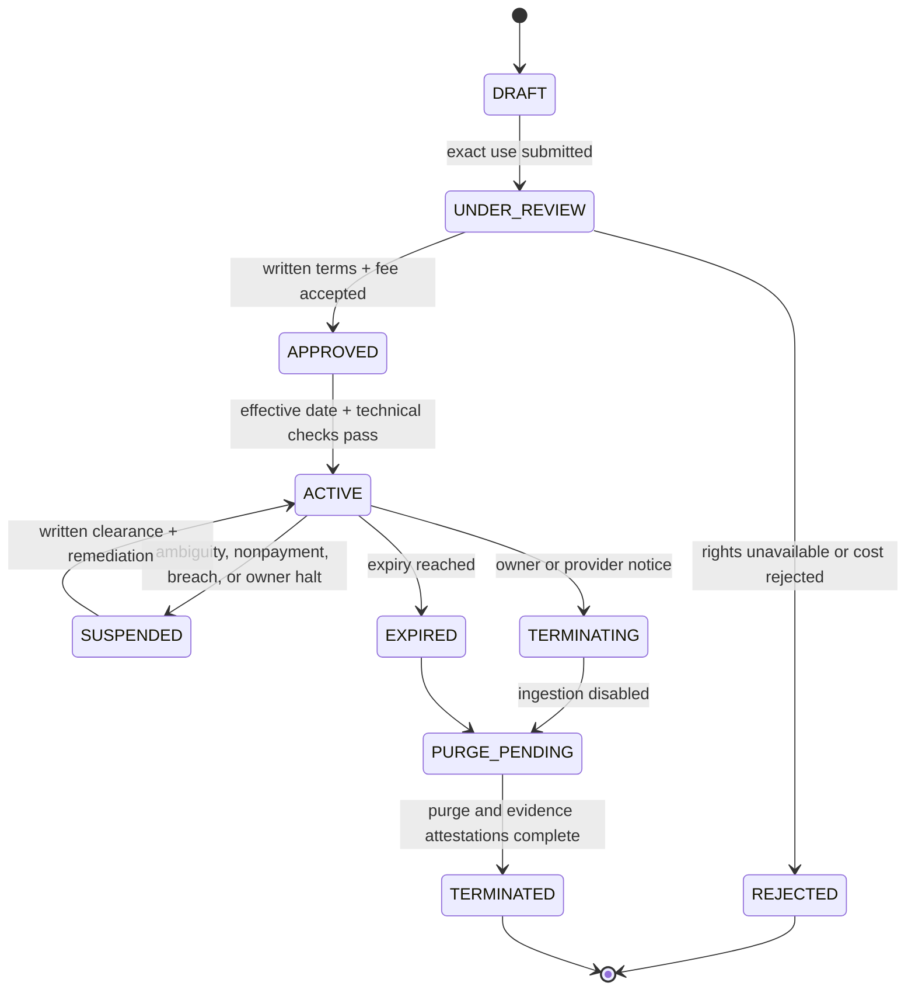
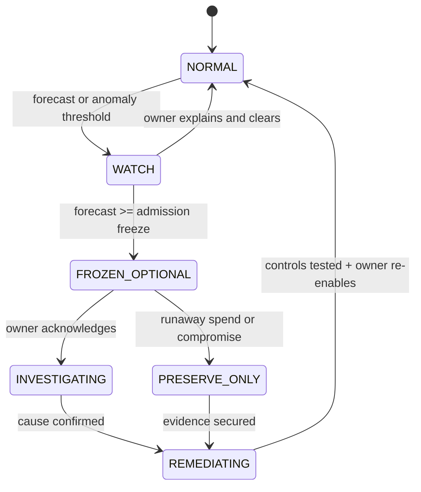

<!-- @format -->

# Sopara Business, Cost, Distribution, and Compliance Specification

**Status:** Approved — Phase 4 Chairman decisions incorporated

**Version:** 0.2.0

**Date:** 2026-09-10

**Source contracts:** `docs/idea.md`, `docs/product.md`, `docs/architecture.md`, `docs/design.md`

**Operating boundary:** Private, single-owner, non-commercial GCP-native evidence lab ending at live simulation

> [!IMPORTANT]
> Sopara is an internal research cost center, not a commercial trading product. It has no customers, revenue, customer pricing, subscriptions, public distribution, investment advice, pooled capital, brokerage, or real-money execution. A public fee schedule is planning evidence, not a market-data entitlement. Licensed ingestion remains disabled until the owner holds written terms covering Sopara's exact use.

## 1. Executive operating thesis

Sopara exists to answer one bounded question:

> Can a deterministic intraday ES-to-NES research hypothesis survive conservative costs, falsification, and 20 consecutive reconciled live-simulation sessions?

The business objective is not revenue. It is to purchase trustworthy evidence at a controlled cost while preventing three forms of false economy:

1. using cheap but legally unusable market data;
2. saving infrastructure cost by weakening evidence integrity;
3. paying for models, feeds, or reserved capacity before they demonstrate incremental value.

The operating model is therefore:

```text
approved scope
    -> written data rights
    -> capped GCP resources
    -> measured research runs
    -> accepted or invalid evidence
    -> continue, revise, or terminate
```

No positive strategy result creates authority to trade real money or commercialize Sopara.

## 2. Binding business decisions

| ID | Decision | Approved selection | Status |
| --- | --- | --- | --- |
| `BUS-ADR-001` | Economic model | Internal research cost center; no customer pricing or revenue model | Approved |
| `BUS-ADR-002` | Cloud purchasing | GCP pay-as-you-go until measured utilization supports a commitment | Approved |
| `BUS-ADR-003` | Market-data sourcing | Direct-CME-first; vendor only if the approved spike fails or total cost is materially lower | Approved |
| `BUS-ADR-004` | Market-data authority | Written CME or distributor approval gates every live, stored, displayed, exported, derived, and model-assisted use | Approved |
| `BUS-ADR-005` | Distribution | One IAP-authorized owner; no public product, public API, shared dashboard, or data redistribution | Approved |
| `BUS-ADR-006` | Cost attribution | One GCP project with mandatory resource labels, billing export, and evidence-class allocation | Approved |
| `BUS-ADR-007` | Model spend | Vertex AI disabled by default and separately budgeted after license and value gates | Approved |
| `BUS-ADR-008` | Commercialization | Any customer, advice, outside capital, broker connection, or public distribution starts a new product and legal review | Approved |

## 3. Scope and explicit non-goals

### 3.1 In scope

- licensed historical ES/NES research;
- licensed real-time ES/NES ingestion for two approved simulation windows;
- deterministic strategy, risk, fill, and cost-model research;
- one owner's private web interface behind IAP;
- immutable evidence retention within the approved GCP boundary;
- cost allocation by environment, workload, evidence class, and experiment;
- optional offline model research after entitlement and spend approval;
- software-supply-chain and market-data compliance controls;
- evidence-based continuation or termination decisions.

### 3.2 Out of scope

- real, paper-broker, shadow-broker, canary, or production orders;
- broker credentials or FCM connectivity;
- managing or accepting another person's money;
- individualized or published trading advice;
- signals, newsletters, APIs, datasets, dashboards, or derived works for others;
- subscriptions, metered customer billing, checkout, invoices, or tax collection;
- organizations, teams, seats, invitations, or role-based customer plans;
- public websites that expose market information;
- marketing acquisition, sales, support, or customer success;
- an assumption that single-owner or non-commercial use is exempt from exchange licensing;
- a claim that this document is legal, tax, accounting, or investment advice.

## 4. Candidate economic model walkthroughs

### 4.1 Option A — controlled private research cost center

#### Lifecycle

The owner approves a monthly cloud envelope and a separate market-data contract envelope. GCP resources run pay-as-you-go. Every experiment and scheduled session carries cost-allocation dimensions. The system compares spend with accepted evidence rather than revenue.

The owner reviews a monthly operating packet containing:

- actual and forecast GCP spend;
- contracted and variable data fees;
- accepted, invalid, and retried session counts;
- storage growth and retention actions;
- cost per accepted session and experiment;
- optional model spend and measured incremental value;
- open entitlement or compliance exceptions.

#### Implementation complexity

- low application complexity because there is no commercial billing domain;
- moderate FinOps work for labels, export, budgets, quotas, and allocation;
- high diligence at the market-data boundary because non-display, display, storage, recovery, and model use can have different rights;
- no customer support, payment, tax, sales, tenancy, or public-service obligations.

#### Failure modes

- fixed data fees make a technically cheap experiment economically irrational;
- invalid sessions consume feed and database cost without producing accepted evidence;
- a budget alert is mistaken for a hard cap;
- one project obscures development versus evidence spend;
- the same market-data application is accidentally counted as multiple applications after unnecessary service decomposition;
- UI display, BigQuery export, backup restoration, or model input exceeds written rights.

#### Migration cost

Low if Sopara remains private. Commercialization is intentionally expensive: it requires a new legal entity analysis, product specification, data agreement, security model, support model, regulatory review, customer tenancy architecture, and pricing study. Existing private evidence may be unusable in a commercial service unless its license permits that use.

#### Verdict

Recommended.

### 4.2 Option B — commercial analytics or signals SaaS

#### Lifecycle

The operator sells access to dashboards, signals, reports, APIs, or derived data. The product needs acquisition, onboarding, subscription billing, entitlements, customer isolation, support, availability objectives, incident communication, refunds, taxation, and churn management. Data must be licensed for external distribution or derived works, not merely internal research.

#### Implementation complexity

- customer identity, organizations, roles, payment processing, invoices, and tax treatment;
- multi-tenant data and audit boundaries;
- public abuse prevention, rate limits, support, and availability commitments;
- separate display, redistribution, derived-data, and possibly index licensing;
- legal review of marketing claims, advice, CTA status, privacy, and consumer protection;
- gross-margin modeling across feed, inference, support, and compliance costs.

#### Failure modes

- customer revenue begins before external distribution rights exist;
- a derived metric remains reconstructable and is treated as an unlicensed substitute for raw data;
- performance marketing becomes misleading or resembles compensated advice;
- one customer's queries or inference consume the margin of all other accounts;
- a single-project private architecture becomes an unacceptable customer blast radius;
- a historical backtest is marketed as expected performance.

#### Migration cost if assumptions break

Very high. The approved product, architecture, interface, and data agreements all explicitly exclude customers and public distribution. This is not a feature flag; it is a new system boundary.

#### Verdict

Rejected for v0.

## 5. Candidate cloud-purchasing walkthroughs

### 5.1 Option A — pay-as-you-go with measured rightsizing

Cloud Run services and jobs, zonal Cloud SQL, GCS, BigQuery, Cloud Build, Artifact Registry, Secret Manager, and observability use on-demand pricing. Autoscaling ceilings, job task count, query byte limits, log exclusions, and storage lifecycle rules constrain variable cost.

Benefits:

- no commitment before the live schedule and data volumes are proven;
- clean attribution of idle Cloud SQL, web availability, live windows, replay, storage, and analytics;
- simpler shutdown if the research thesis fails;
- no sunk-cost pressure to continue weak research.

Costs and failure modes:

- higher unit rates than a fully utilized commitment;
- Cloud SQL is billed continuously and can dominate GCP cost at low utilization;
- Cloud Run free tiers are billing-account-wide and cannot be assumed available;
- a new replay or BigQuery query can create a sudden variable-cost spike.

Migration trigger:

Evaluate a commitment only after three complete billing months and only when the eligible baseline utilization is at least 70%, expected to persist through the commitment term, and the net present savings exceed 20% after early-exit and overprovision risk.

### 5.2 Option B — committed use, reservations, or always-on worker capacity

The operator purchases eligible commitments or provisions continuous capacity based on forecast workload.

Benefits:

- predictable baseline rate for stable compute;
- possible discount on consistently utilized resources;
- useful after a continuous market-data connection becomes mandatory.

Costs and failure modes:

- the approved bounded-job workload is deliberately intermittent;
- failed strategy research can leave an unusable commitment;
- reserved capacity encourages architectural coupling to a cost purchase;
- commitments do not reduce market-data license fees or invalid-run waste;
- a worker-pool migration may change which compute is eligible.

Verdict: reject at launch; revisit only at the measured trigger.

## 6. Candidate market-data acquisition walkthroughs

### 6.1 Option A — direct CME, GCP-native first

#### Lifecycle

1. Submit the exact use-case inventory to CME Data Sales.
2. Ask CME to classify the simulation and research workload, each application, the private UI, storage, replay, backup, disaster recovery, BigQuery aggregates, exports, and optional Vertex AI use.
3. Obtain written commercial terms and technical onboarding instructions.
4. Run the approved GCP-native spike for ES and NES product availability, message type, sequence continuity, latency, session-window startup, recovery, and cost.
5. Enable only the approved products, environments, users, applications, and destinations.
6. Reconcile entitlements monthly and whenever an application or use changes.

CME advertises real-time and delayed binary data and real-time JSON futures/options data on GCP, with Google Cloud authentication. The WebSocket offer advertises top-of-book, trades, statistics, 500 ms conflation, usage pricing as low as `$0.50/GB`, and applicable ILA fees. These statements establish candidate availability, not entitlement or the final quote.

Benefits:

- direct source provenance;
- GCP-native delivery can avoid an unnecessary intermediary and internet egress path;
- JSON can reduce parser and operations cost for the v0 top-of-book scope;
- pay-for-consumption delivery may fit two bounded windows.

Failure modes:

- NES is not present in the chosen delivery product at launch;
- the native channel cannot provide sequence/recovery behavior needed for counted evidence;
- window reconnect behavior invalidates too many sessions;
- real-time research is classified as Category C2 plus other applicable fees;
- a visible real-time value creates a separate display-device obligation;
- backups, derived outputs, or model use are more restricted than the architecture assumes;
- per-GB delivery is cheap while the fixed ILA or application fee dominates.

Migration cost:

The adapter port permits a licensed distributor without changing canonical schemas. Existing raw evidence cannot be migrated or re-used unless both agreements allow it.

### 6.2 Option B — licensed distributor or data vendor

#### Lifecycle

Select a distributor only after comparing product coverage, rights, completeness, support, recovery, GCP delivery, and total fees. The vendor contract must identify the upstream CME rights and Sopara's direct non-display obligations.

Benefits:

- potentially simpler onboarding and broader historical packaging;
- one feed may provide normalized ES and NES data;
- vendor support can reduce source-integration burden;
- a consolidated historical/live product may lower engineering time.

Failure modes:

- distributor access does not remove CME non-display licensing based on use;
- normalized events lose source sequence or fields required by evidence rules;
- vendor-derived identifiers make later migration costly;
- redistribution or model restrictions are narrower than expected;
- variable API fees or egress exceed the direct route;
- the vendor lacks NES at the required launch date.

Verdict: contingency only. Compare total annual cost, not feed sticker price.

## 7. Market-data licensing control plane

### 7.1 Current planning interpretation

CME's non-display guidance says computer use for research and analysis, quantitative analysis, strategy development, signal processing, and time-series analysis falls within Category C2. It also says real-time and delayed non-display use requires licensing, applications must be inventoried, downstream non-display applications count, and sourcing through a distributor does not remove the policy.

The January 2026 public fee list shows, per exchange, a `$363/month` Basic Category C fee for one application and a `$610/month` real-time data-feed line. The WebSocket page instead advertises usage pricing beginning at `$0.50/GB` plus applicable ILA fees. These are planning scenarios only. Sopara must not infer that both line items apply, that either is exhaustive, or that the owner qualifies for a particular tier.

Because Sopara routes no orders to an exchange or intermediary, Category C2 appears more consistent than Category A in the published descriptions. Only CME can approve that classification for this implementation.

### 7.2 Required written answers before licensed ingestion

The owner must retain written answers to all of the following:

1. Are ES and NES available through the selected GCP-native or WebSocket service?
2. Is Sopara one non-display application or are live jobs, replay, reconciliation, web projections, and research tools counted separately?
3. Is the approved simulation-only use Category C2, Category A, or another category?
4. Does showing live price, trade, statistic, or chart content to the owner require a separate display-device entitlement?
5. Which DCMs, products, message types, and environments are covered?
6. Are real-time, delayed, and historical rights priced or reported differently?
7. May raw data be stored in regional GCS, and for how long?
8. May Cloud SQL retain source-derived state, identifiers, or order-book projections?
9. May point-in-time backups, soft delete, object versioning, and disaster-recovery copies retain the data?
10. May the data be replayed into the same application for research and incident reconstruction?
11. Which derived aggregates are non-reconstructable and may enter BigQuery?
12. May screenshots, exports, logs, traces, support bundles, or local downloads contain any market information?
13. May bounded data packets be sent to Vertex AI within the same GCP region and project?
14. What deletion, purge, audit, reporting, and termination duties apply?
15. What usage, application-count, device, and consumption reports are due and on what cadence?
16. Does development or test access count separately from evidence use?
17. Are any cloud-region, identity, encryption, subcontractor, or access-log controls contractual?
18. What fees apply to the exact approved topology, including minimums and taxes?

Any unanswered item defaults to prohibited.

### 7.3 Entitlement inventory schema

| Field | Type | Rule |
| --- | --- | --- |
| `entitlement_id` | UUID | Immutable internal identifier |
| `provider` | Enum | `CME_DIRECT` or approved distributor |
| `agreement_id` | Text | Contract or order reference; never a secret |
| `effective_at` | Timestamp | Inclusive UTC start |
| `expires_at` | Timestamp | Inclusive contractual end |
| `dcm` | Text | Explicit exchange scope |
| `products` | Text array | Exact ES/NES symbols or product families |
| `timing_class` | Enum | `REAL_TIME`, `DELAYED`, `HISTORICAL` |
| `use_categories` | Text array | Written classification, including C2 if approved |
| `application_ids` | UUID array | Every licensed application in the inventory |
| `display_allowed` | Boolean | False unless written terms say otherwise |
| `raw_storage_allowed` | Boolean | False unless written terms say otherwise |
| `max_retention_days` | Integer/null | Null means no inferred permission |
| `backup_allowed` | Boolean | Explicit; not inherited from storage permission |
| `derived_analytics_allowed` | Boolean | Requires definition of acceptable derivation |
| `model_use_allowed` | Boolean | False unless explicitly approved |
| `export_allowed` | Boolean | False unless explicitly approved |
| `reporting_cadence` | Text | Contractual obligation |
| `fee_model` | JSON | Fixed, per application, device, usage, minimums, taxes |
| `evidence_uri` | URI | Restricted GCS pointer to written approval |
| `owner_attested_at` | Timestamp/null | Required before activation |
| `status` | Enum | `DRAFT`, `APPROVED`, `SUSPENDED`, `EXPIRED`, `TERMINATED` |

### 7.4 Application inventory

The initial licensing submission must describe one modular application, Sopara, with bounded deployment units that share one research purpose. It must disclose rather than conceal:

- two live Cloud Run Jobs;
- historical replay and reconciliation jobs;
- the FastAPI web/API projection;
- the owner's private display surfaces;
- Cloud SQL, GCS, permitted BigQuery aggregates, backups, and logs;
- any development data path;
- optional Vertex AI processing.

CME's written application count controls. Architecture must not be distorted merely to obtain a lower count.

### 7.5 Entitlement state machine



No session may enter `RUNNING` unless every selected product and use resolves to one `ACTIVE` entitlement.

## 8. Pricing model: two independent approval envelopes

### 8.1 No customer pricing

Sopara has no plan names, seats, subscriptions, usage markups, trials, discounts, lifetime deals, or revenue forecast. Adding any of them violates scope.

### 8.2 Envelope A — GCP operating spend

Approved initial controls:

| Control | Approved value | Behavior |
| --- | ---: | --- |
| Monthly planning budget | `$250` | Expected ceiling for GCP-only spend, excluding market data |
| Forecast alert | `50%`, `80%`, `100%` | Email plus Pub/Sub event |
| Actual alert | `50%`, `80%`, `100%` | Email plus Pub/Sub event |
| Admission freeze | Forecast `>= $500/month` | Block new replay, experiments, deploys, BigQuery research, and model jobs |
| Emergency review | Actual `>= $500/month` | Owner investigates; preserve reconciliation, audit, and stored evidence |
| Single experiment ceiling | `$25 forecast` | Requires explicit owner override above this amount |
| BigQuery query ceiling | `10 GiB/query` initially | Use maximum-bytes-billed and per-user/project controls |
| Raw evidence growth | `1 TiB/month forecast` | Block new non-live ingestion pending review |
| Logging target | `< 10 GiB/month` | Exclude licensed payloads and high-cardinality debug logs |

`$500` is an operational freeze threshold, not a guaranteed invoice cap. Google states that alerts-only budgets do not automatically cap spend, notifications can lag, and estimated billing data can change. If a supported spend-cap budget is available for the selected services, use it as defense in depth; do not let it pause the safety, reconciliation, or retention resources required to close an active incident.

Never automatically disable project billing. In the approved single-project topology, that can prevent reconciliation, evidence retention, and incident diagnosis. The automated response is selective admission control:

1. disable optional Vertex AI invocation;
2. reject new replay and batch experiments;
3. reject new BigQuery research queries;
4. pause nonessential scheduled development work;
5. preserve active-session halt, close, reconciliation, audit, Cloud SQL, and GCS;
6. require owner acknowledgement before re-enable.

### 8.3 Envelope B — market-data and external contracts

No market-data contract or vendor subscription may be accepted under Envelope A. Each requires a separate Chairman decision containing:

- provider and agreement term;
- products, DCMs, timing, applications, devices, uses, and destinations;
- fixed monthly, annual, usage, minimum, onboarding, support, tax, and termination fees;
- expected monthly and worst-case variable usage;
- renewal and fee-change terms;
- purge and transition cost;
- total first-year cash cost;
- the result of the direct-versus-vendor comparison.

The system remains on license-cleared historical data if the quote is rejected.

## 9. GCP cost model

### 9.1 Cost-model rules

The deployed price model must be generated from the billing account's current pricing export or Google Cloud Pricing Calculator, not copied indefinitely from this document. Every estimate records:

- `price_as_of` date;
- billing account currency;
- region;
- SKU identifiers and unit prices;
- credits and free-tier treatment shown separately;
- workload quantities and assumptions;
- taxes excluded or included;
- low, expected, and high cases.

Free tiers are shown as credits after gross cost. They are billing-account-wide, can change, and cannot be treated as a durable unit-cost assumption.

### 9.2 September 2026 public-rate snapshot

This planning snapshot uses `us-central1` only to make the arithmetic reviewable. The selected runtime region must follow the approved CME transport and data-rights spike. Reprice before deployment.

| Cost center | Public planning rate or rule | Principal quantity driver |
| --- | --- | --- |
| Cloud Run Jobs | Conservative gross planning rate: `$0.000018/vCPU-second` and `$0.000002/GiB-second`; one-minute minimum | vCPU, GiB, task duration, retries |
| Cloud Run web | Request/instance configuration plus any minimum-instance idle charge | instance size, minimum instances, requests |
| Cloud SQL Enterprise | `$0.0413/vCPU-hour` and `$0.007/GiB-hour` in `us-central1`; zonal | provisioned vCPU, memory, storage, backup |
| GCS Standard regional | Approximately `$0.020/GiB-month` in `us-central1` | retained GiB-month, operations, retrieval/egress |
| BigQuery on demand | First `1 TiB/month` query processing free, then `$6.25/TiB`; minimum bytes rules apply | bytes scanned and stored |
| Cloud Scheduler | `$0.10/job/month`, with three free jobs per billing account | configured jobs, including paused jobs |
| Cloud Build | `2,500` free e2-standard-2 build minutes per billing account, then `$0.006/minute` in `us-central1` | builds and duration |
| Artifact Registry | First `0.5 GiB` free, then approximately `$0.10/GiB-month` | retained image GiB-month |
| Secret Manager | First six active versions and 10,000 access operations free; then version and access charges | active versions, regions, accesses |
| Cloud NAT | Gateway, processed GiB, external IP, and internet transfer charges | attached instances/use time, bytes, IP hours |
| Cloud Logging | First `50 GiB/project/month` free, then ingestion charges; retention beyond included period can add cost | log GiB and retention |

Public list prices can change. Contract pricing, currency, taxes, sustained-use mechanics, and SKU classification may differ.

### 9.3 Reviewable baseline calculation

The following is an illustration, not a quote or budget commitment.

Assumptions:

- 20 eligible weekdays per month;
- two live jobs per weekday;
- combined live duration `4.5 hours/day`;
- each live job uses `1 vCPU` and `1 GiB`;
- reconciler uses `1 vCPU`, `1 GiB`, `15 minutes/day`;
- Cloud SQL uses `1 vCPU`, `3.75 GiB`, `730 hours/month`;
- web minimum-instance, Cloud SQL storage/backups, NAT, GCS, logs, and operations remain separately measured;
- no free-tier credit is assumed in the gross figures.

```text
live_job_hours = 20 * 4.5 = 90 hours
reconciler_hours = 20 * 0.25 = 5 hours

cloud_run_job_hour =
    3600 * (($0.000018 * 1 vCPU) + ($0.000002 * 1 GiB))
    = $0.072/hour

gross_live_and_reconcile_compute =
    (90 + 5) * $0.072
    = $6.84/month

cloud_sql_compute_and_memory =
    730 * (($0.0413 * 1 vCPU) + ($0.007 * 3.75 GiB))
    = $49.31/month
```

This demonstrates why Cloud SQL and market-data rights, not bounded job compute, are the first optimization targets. It does not include all billable services and must not be presented as total monthly cost.

### 9.4 Storage bands

At an illustrative `$0.020/GiB-month` before operations and protections:

| Average retained Standard storage | Base capacity cost |
| ---: | ---: |
| `100 GiB` | `$2.00/month` |
| `500 GiB` | `$10.00/month` |
| `1 TiB` | `$20.48/month` |

Object versioning, soft delete, incomplete uploads, duplicate partitions, backups, retrieval, operations, and egress can materially increase the realized amount. Retention must follow license rights before cost optimization.

### 9.5 Cost allocation dimensions

Every label-capable GCP resource must carry:

| Label | Allowed examples |
| --- | --- |
| `system` | `sopara` |
| `environment` | `development`, `evidence` |
| `workload` | `web`, `live-am`, `live-pm`, `reconcile`, `replay`, `research`, `build` |
| `cost_class` | `fixed`, `session`, `experiment`, `storage`, `observability`, `security` |
| `evidence_class` | `noncanonical`, `proxy`, `observed-nes`, `shared` |
| `owner` | stable non-personal team token, even while single-owner |
| `managed_by` | `terraform`, `provider` |

High-cardinality identifiers such as `session_id` and `experiment_id` must not become GCP labels. They belong in application usage ledgers joined to daily billed cost.

### 9.6 Billing data flow

1. Enable Standard and Detailed Cloud Billing export to a dedicated BigQuery dataset inside the approved single project.
2. Enable pricing export where available.
3. Normalize changing export schemas behind versioned views.
4. Aggregate daily cost by service, SKU, resource, labels, credits, and currency.
5. Join application-measured usage for sessions, experiments, bytes, and model invocations.
6. Allocate shared fixed cost using the policy in Section 10.3.
7. Publish a monthly immutable cost manifest to restricted GCS.
8. Reconcile invoice totals after finalization; never overwrite the original forecast.

Billing export itself incurs BigQuery storage and query cost. Queries must be partition-bounded and use maximum bytes billed.

## 10. Unit economics for an evidence lab

### 10.1 Canonical units

Sopara measures cost per unit of evidence, not cost per customer.

| Metric | Formula | Decision use |
| --- | --- | --- |
| Eligible-session cost | allocable monthly cost / eligible scheduled sessions | Schedule planning |
| Attempted-session cost | session-variable cost / sessions that entered preflight | Detect startup waste |
| Accepted-session cost | allocable live cost / reconciled accepted sessions | Primary live unit cost |
| Invalid-session waste | cost of invalid sessions / live-session cost | Reliability economics |
| Experiment cost | direct compute + scan + storage + model + allocated shared cost | Research admission |
| Accepted-evidence GiB cost | storage and protection cost / accepted retained GiB-month | Retention planning |
| Reconciliation cost | reconciler direct cost / completed reconciliations | Integrity cost |
| Model net value | counterfactual improvement - inference - added data - added operations | Vertex continuation |
| Cost-stressed expectancy | gross simulated outcome - modeled execution costs - allocated research costs | Thesis evaluation |

### 10.2 Required cost ledger

Each metered application operation records:

| Field | Meaning |
| --- | --- |
| `usage_id` | Idempotent event identifier |
| `occurred_at` | UTC timestamp |
| `environment` | Development or evidence |
| `workload` | Runtime class |
| `session_id` | Nullable live/replay session |
| `experiment_id` | Nullable experiment |
| `evidence_class` | Proxy, observed NES, or noncanonical |
| `resource_type` | Compute, SQL, object storage, query, model, data, build, network |
| `quantity` | Measured amount |
| `unit` | Seconds, GiB-seconds, bytes, requests, tokens, GiB-month, application-month |
| `estimated_cost_usd` | Point-in-time operational estimate |
| `price_version` | Rate-card hash |
| `allocation_status` | Direct, shared, estimated, reconciled |

The ledger is not a replacement for GCP billing or provider invoices. It explains workload causality.

### 10.3 Shared-cost allocation

Use this order:

1. direct assignment where a billing row or measured resource maps to one workload;
2. measured usage share for Cloud SQL, web, and observability;
3. accepted-plus-invalid session runtime share for session infrastructure;
4. retained-byte share for common storage protection;
5. equal eligible-session allocation only when no better causal driver exists;
6. keep unallocable cost visible as `shared_unallocated` rather than inventing precision.

Market-data fixed fees are shown twice without double counting:

- cash view: full monthly contract cost;
- evidence view: allocated across eligible or accepted sessions with the denominator named.

### 10.4 Approved operating targets

The thresholds are binding launch targets. The first measured baseline month determines whether the system can meet them; it does not silently revise them.

| Target | Approved threshold |
| --- | ---: |
| GCP-only accepted-session cost | `<= $15` at 20-session cadence |
| Invalid-session waste ratio | `< 20%` monthly; `0%` required for the final 20-session gate |
| Unallocated GCP cost | `< 10%` of monthly GCP spend |
| Optional model cost | `0` until approved gate |
| Model continuation | positive lower-confidence-bound net incremental value after all added costs |
| BigQuery bytes scanned | `<= 1 TiB/month` without override |
| Logging volume | `< 10 GiB/month` target |
| Idle resource review | every monthly close |

The `$15` target excludes market-data contract cost because that quote may dominate and is independently approved. Reports must also show all-in accepted-session cost including allocated data fees.

## 11. Financial controls and operational response

### 11.1 Required controls

- budgets scoped to the single project and relevant labels where supported;
- actual and forecast thresholds with email and Pub/Sub notification;
- quotas for Vertex AI, BigQuery, Cloud Run max instances/tasks, Cloud Build, and APIs;
- Cloud Run Jobs fixed to one task and bounded retries per architecture;
- BigQuery maximum bytes billed on every research query;
- GCS lifecycle simulation and approval before rule deployment;
- Artifact Registry cleanup policy with protected release digests;
- log exclusions for health noise and all licensed payloads;
- no debug logging enabled indefinitely;
- billing export health alert if expected daily rows stop arriving;
- daily cost anomaly view and monthly invoice reconciliation;
- no unreviewed marketplace purchases or third-party SaaS charges.

### 11.2 Cost incident state machine



`PRESERVE_ONLY` permits halt, session close, reconciliation, audit, entitlement suspension, backup, and required purge. It blocks new research work. It never deletes evidence automatically.

### 11.3 Cost incident playbook

1. Authenticate the alert against Cloud Billing; do not trust an email link.
2. Identify service, SKU, resource, project, labels, and first abnormal interval.
3. Halt optional model, replay, query, and build work through explicit admission flags.
4. If a live session is active, issue safe halt and complete reconciliation.
5. Rotate or disable the narrow compromised identity or API path if abuse is suspected.
6. Preserve billing export, audit logs, application usage ledger, and deployment manifest.
7. Correct quota, retention, query, retry, or autoscaling cause.
8. Estimate accrued but not yet reported cost.
9. Record incident, actual cost, avoided recurrence control, and owner decision.
10. Re-enable one workload at a time.

## 12. Distribution and access specification

### 12.1 Approved distribution vector

The only product distribution is a private IAP-protected Cloud Run URL assigned to the owner. Deployment artifacts are private in Artifact Registry. Evidence is accessed through the product or authorized GCP administrative paths.

There is no app store, browser extension, package registry publication, public demo, hosted marketing page, community instance, or externally accessible API.

### 12.2 Allowed channels

| Channel | Allowed content | Control |
| --- | --- | --- |
| IAP web UI | Contract-approved private display and derived evidence | Owner allowlist, IAP, application assertion validation |
| FastAPI REST/SSE | Owner-only application projections | Same-origin, IAP, bounded schemas, no public token |
| GCP console/CLI | Administration and incident response | Owner identity, least privilege, audit logs |
| Restricted GCS | Canonical evidence, agreements, reports | Workload identity, retention, entitlement policy |
| Local workstation | Source, synthetic fixtures, approved noncanonical data | Cannot write canonical evidence |

### 12.3 Prohibited channels

- public URLs or anonymous access;
- sharing screenshots containing licensed or reconstructable data;
- emailing raw market data or support bundles;
- copying evidence into personal drives, consumer model tools, paste sites, or issue trackers;
- public Git repositories containing data, credentials, agreements, or generated market artifacts;
- external webhooks carrying market data;
- customer or collaborator accounts without a new scope and license review.

### 12.4 Export policy

Every export request resolves one of:

| Classification | Default |
| --- | --- |
| Raw or reconstructable market data | Deny |
| Provider identifiers or sequences | Deny unless written terms permit |
| Non-reconstructable aggregate | Deny until its derivation is approved |
| Strategy configuration or code | Allow only if it contains no licensed data or secret |
| Cost and operational report | Allow after redaction review |
| Screenshot | Deny if it renders licensed values; otherwise require manual review |
| Compliance evidence | Restricted internal export with manifest |

Approved exports carry a manifest with requester, purpose, classification, entitlement, derivation, object hashes, destinations, time, and retention duty.

## 13. Regulatory and conduct boundary

### 13.1 Current scope assessment

The CFTC describes a commodity trading advisor as a person who, for compensation or profit, engages in the business of advising others or regularly issues relevant analyses or reports. A commodity pool operator generally solicits or receives funds or property from others for trading commodity interests.

Sopara does neither: it is used by one owner, takes no customer funds, advises no other person, publishes no reports, charges no fee, and submits no trades. On the current facts, CTA, CPO, IB, FCM, exchange-member trading, customer-protection, and transaction-reporting operating models are outside product scope.

This is a scope assessment, not a registration determination or legal opinion. The system must not encode `regulation_not_applicable` as a permanent fact.

### 13.2 Mandatory re-review triggers

Stop affected work and obtain qualified legal/compliance advice before any of these occur:

- advice, signals, recommendations, reports, or access are provided to another person;
- compensation, subscription, donation, affiliate income, profit share, or other consideration is connected to the system;
- another person's funds, account, credentials, or trading authority are accepted;
- a broker, FCM, exchange order-entry API, or real-money account is connected;
- the system publishes performance, rankings, or expected-return marketing;
- raw, delayed, historical, or derived CME information is distributed;
- a company, partnership, fund, club, managed account, or shared ownership structure uses the system;
- the owner relocates or serves a user in a jurisdiction whose rules may apply;
- a model begins generating advice for anyone other than the owner;
- the product crosses the live-simulation ceiling.

### 13.3 Conduct requirements even in simulation

- never describe simulated P&L as actual trading performance;
- label backtests, replay, proxy data, observed NES simulation, and counterfactuals distinctly;
- retain failed and invalid experiments to reduce selective reporting;
- include modeled fees, spread, slippage, latency, and data/model costs;
- prohibit guaranteed-return, certainty, or effortless-profit claims;
- keep `SIMULATED — NO REAL ORDERS` on every authenticated surface and export;
- do not publish results without a new review.

## 14. Privacy and personal-data controls

### 14.1 Data inventory

Sopara is not designed to collect customer personal data. Expected personal or security-related data is limited to:

- the owner's Google identity assertions and email address;
- source IP, device/browser security metadata, and audit events;
- administrative reasons entered for commands;
- provider account references and business contact correspondence;
- billing-account and invoice metadata;
- secrets in Secret Manager, excluded from all analytics and logs.

### 14.2 Rules

- collect only fields required for access, attribution, security, licensing, and billing;
- never put email, IP, secrets, or agreement contents into GCP resource labels;
- redact authorization headers, IAP assertions, cookies, API tokens, and provider credentials;
- do not log raw market payloads merely for debugging;
- restrict agreement and invoice objects more tightly than ordinary research reports;
- honor provider and GCP retention duties without claiming privacy law is inapplicable;
- complete a new privacy assessment before any other user is added.

### 14.3 Retention schedule

Contractual, security, and evidentiary requirements override convenience. Approved defaults apply only where the market-data agreement permits them.

| Record | Approved retention | Disposition |
| --- | --- | --- |
| Raw licensed market data | Shortest of research need or written maximum | Verified purge including versions and recoverable copies |
| Accepted evidence manifests | Project life + 1 year | Retain hashes if underlying licensed data must be purged |
| Rejected/invalid experiment metadata | Project life | Preserve falsification record without prohibited payloads |
| Security/admin audit events | 400 days | Delete after investigation/legal need expires |
| Application operational logs | 30 days | Exclude payloads; extend only for incident hold |
| Cost usage ledger | 7 years | Revisit with tax/accounting advice if entity use begins |
| Provider agreements/invoices | Agreement term + 7 years | Restricted archive |
| Secrets | Active need only | Disable, destroy old version after rollback window |
| Local development artifacts | 30 days unless promoted as source fixture | Secure deletion; never canonical evidence |

## 15. Market-data termination and purge

Termination is a product workflow, not an ad hoc bucket deletion.

1. Set entitlement to `TERMINATING` and block new ingestion.
2. Halt active simulations safely and reconcile the last permissible window.
3. Enumerate raw objects, versions, soft-deleted generations, database projections, backups, BigQuery tables, exports, logs, local copies, and model packets.
4. Preserve only records the agreement permits, such as non-reconstructable hashes or invoices.
5. Apply provider-required purge timing and method.
6. Wait through recoverability windows or use an approved immediate-deletion path.
7. Verify absence through inventory queries and restore tests where contractually appropriate.
8. Produce a signed purge manifest with counts, locations, exceptions, and evidence.
9. Submit required termination or application-inventory reporting.
10. Move entitlement to `TERMINATED` only when every obligation is closed.

## 16. Open-source and supply-chain compliance

### 16.1 Policy

The codebase may use permissive and compatible dependencies, but package popularity is not license approval. Source-owned shadcn components, Base UI, TanStack libraries, Hugeicons, fonts, Python packages, containers, and transitive dependencies all enter the software bill of materials.

### 16.2 Build requirements

- pin frontend packages in `bun.lock` and Python packages with hashes;
- deploy container images by digest;
- generate CycloneDX or SPDX SBOMs for the frontend build and final Python image;
- scan dependencies and images for known vulnerabilities and prohibited licenses;
- retain license text and notices required by redistributed artifacts;
- record the source and license for icons, fonts, sample data, and copied code;
- prohibit dependencies with unknown, noncommercial-only, field-of-use, source-available, or incompatible copyleft terms until reviewed;
- fail CI when an unapproved license appears;
- do not publish the application image or source merely because dependencies permit it;
- treat market data and documentation content separately from software licenses.

### 16.3 Dependency review record

| Field | Requirement |
| --- | --- |
| Package and version | Exact resolved version |
| Source | Canonical repository or registry |
| License expression | SPDX identifier plus file hash |
| Distribution mode | Internal source, bundled client, runtime image, build-only |
| Notice duty | Text and location |
| Security posture | Current advisory result and exception expiry |
| Approver | Owner |
| Reviewed at | UTC timestamp |

The browser receives bundled JavaScript, component source, icons, and fonts; their redistribution duties still apply even though access is private.

## 17. Vendor and contract diligence

Any paid provider must be evaluated on:

| Dimension | Required evidence |
| --- | --- |
| Product coverage | ES and NES symbols, launch availability, message types |
| Provenance | Direct source and transformation disclosures |
| Completeness | Sequence, correction, cancel, statistics, and recovery behavior |
| Rights | Live, delayed, historical, non-display, display, storage, replay, derived, model, export |
| Security | Auth, key rotation, access logs, encryption, incident notification |
| GCP fit | Native delivery, region, service identities, egress path |
| Operations | Status, maintenance, support response, backfill |
| Economics | Fixed, usage, minimum, overage, tax, support, onboarding, renewal |
| Exit | Export, purge, survival clauses, notice, transition help |
| Liability | Warranty, disclaimer, indemnity, limitation, audit rights |

No purchase decision may be based on a website price alone.

## 18. Optional Vertex AI economics and compliance gate

Vertex AI remains disabled until all of these are true:

1. written data rights permit the exact input fields and destination;
2. the packet allowlist proves raw or reconstructable data is excluded unless explicitly authorized;
3. model, region, retention, training-use, logging, and abuse-monitoring terms are recorded;
4. a deterministic baseline exists;
5. an experiment has a maximum invocation, token, and dollar budget;
6. quotas and a kill switch are tested;
7. outputs cannot enter canonical strategy, risk, simulation, or promotion paths;
8. latency, tokens, dollar cost, and counterfactual value are measured;
9. stopping criteria are defined before the run.

Stop model research when the lower confidence bound of net incremental value is nonpositive, the cost ceiling is reached, output reproducibility is inadequate, or data rights become ambiguous.

## 19. Monthly operating review

### 19.1 Required packet

- scope and entitlement status;
- GCP budget, forecast, actual, credits, and invoice reconciliation;
- market-data invoice and application/device inventory;
- cost by service, workload, environment, and evidence class;
- eligible, attempted, accepted, invalid, and retried sessions;
- accepted-session cost both excluding and including data fees;
- experiment count, acceptance, cost, and termination decisions;
- storage age bands, growth, deletion, and exceptions;
- BigQuery scan volume and top queries;
- logging volume and top producers;
- model spend and net incremental value, or confirmation it remained disabled;
- security, cost, licensing, privacy, and vendor incidents;
- expiring agreements, secrets, exceptions, and dependencies;
- rightsizing, continuation, and termination recommendations.

### 19.2 Decision states

| State | Meaning | Required action |
| --- | --- | --- |
| `CONTINUE` | Evidence value and controls justify current spend | Maintain envelope |
| `OPTIMIZE` | Thesis remains viable but avoidable cost exists | Time-bounded correction |
| `FREEZE` | Cost, rights, or integrity is uncertain | No new evidence work |
| `TERMINATE_FEED` | Data cost/rights fail the research case | Execute purge plan |
| `TERMINATE_PROJECT` | Research thesis no longer justifies operation | Preserve allowed records and decommission |

## 20. Ten-times-scale red-team

### 20.1 Ten times the market-event volume

- Cloud Run task compute remains bounded, but parser lag can invalidate windows.
- GCS operations, object counts, logs, and SQL writes may grow faster than byte volume.
- raw payload logging can overwhelm the observability free tier and violate license restrictions.
- the response is backpressure, larger object batching within recovery bounds, and measured database tuning—not silent sampling.

### 20.2 Ten times the experiment volume

- BigQuery scan cost and Cloud Run replay concurrency become the main unbounded paths.
- repeated holdout inspection raises false-discovery cost even when compute remains cheap.
- experiment admission must require a forecast, child hypothesis, maximum concurrency, and stopping rule.

### 20.3 Ten times the retained data

- base GCS capacity may still look cheap while versioning, backup, operations, and contractual purge become operationally expensive.
- inventory and deletion verification become the dominant burden.
- partition manifests, lifecycle dry runs, and deletion proofs are required before scale.

### 20.4 Ten times the users

This is prohibited, not a scale target. Ten users would change display-device counts, application access, privacy, identity, support, and possibly regulatory posture. Stop and redesign.

### 20.5 Ten times the service count

CME application counting can include downstream applications with non-display functionality. Unnecessary microservices can increase licensing inventory, observability cost, operational blast radius, and audit work. Preserve the modular-monolith decision until a measured boundary justifies separation.

### 20.6 On-call burden

One owner cannot sustain a 24/7 commercial on-call obligation. Bounded windows, fail-closed jobs, safe halt, no real orders, no customers, and no SLA are business controls as much as architectural ones. Any need for continuous availability invalidates the single-owner operating model.

## 21. Risk register

| Risk | Probability | Impact | Leading indicator | Control | Owner action |
| --- | --- | --- | --- | --- | --- |
| Market-data classification is wrong | Medium | Critical | Provider questions or conflicting terms | Written scope matrix; deny by default | Suspend entitlement |
| Data contract dominates research value | High | High | Quote exceeds approved envelope | Separate contract approval; historical-only fallback | Reject or terminate feed |
| Budget treated as cap | Medium | High | Spend crosses alert between updates | Quotas, selective freeze, supported spend cap | Investigate and freeze |
| Cloud SQL idle cost dominates | High | Medium | Fixed cost > 50% of GCP spend | Rightsize after load test; monthly review | Resize with evidence |
| Invalid sessions waste feed fees | Medium | High | Invalid cost ratio >= 20% | Preflight, continuity spike, root-cause gate | Freeze new sessions |
| One-project IAM error crosses boundary | Medium | Critical | Deny-policy drift or broad grant | Continuous IAM checks; second-project trigger | Freeze evidence writes |
| Licensed values leak in logs/export | Medium | Critical | Payload-shaped log or blocked export | Schema allowlists, log redaction, DLP-style tests | Incident and purge |
| Model spend or data use escapes gate | Low | Critical | Vertex API enabled or quota changes | API deny, quota zero, separate approval | Disable and investigate |
| OSS license obligation missed | Medium | Medium | Unknown license in SBOM | CI policy and notices | Block release |
| Research becomes advice or solicitation | Low | Critical | External user, payment, or publication | Hard scope trigger | Stop and obtain counsel |
| Fee schedule changes | High annually | Medium | provider notice or renewal | renewal calendar and reforecast | Reapprove contract |
| Single owner unavailable | Medium | Medium | missed alerts/reviews | fail closed, bounded runtime, documented recovery | Keep workloads halted |

## 22. Exit and decommissioning plan

Sopara must remain cheap to stop.

### 22.1 Feed-only exit

- cancel per agreement notice;
- disable ingress identities and schedules;
- perform provider-required purge and reporting;
- retain only permitted manifests and financial records;
- verify no recurring vendor, IP, or minimum fee remains.

### 22.2 Full project exit

1. Halt all jobs and revoke application access.
2. Export source, IaC, configuration schemas, SBOMs, cost manifests, incident records, and permitted evidence.
3. Complete licensed-data purge before deleting the controls that prove it.
4. Disable secrets and provider credentials.
5. Remove schedules, minimum instances, NAT, reserved IPs, images, datasets, and databases in dependency order.
6. Reconcile final GCP and vendor invoices.
7. Verify zero active billable resources through asset inventory and the following billing cycle.
8. Delete the GCP project only after recovery, legal, contractual, and evidence holds are cleared.

Destructive execution requires a separate, explicit owner instruction and exact target verification.

## 23. Business and compliance acceptance criteria

1. No customer, revenue, public distribution, advice, outside capital, or broker concept exists in the deployed product.
2. Live licensed ingestion cannot start without an `ACTIVE` entitlement backed by written terms for the exact topology.
3. The provider-approved application and device inventory matches deployed services and surfaces.
4. Raw, reconstructable, displayed, stored, backed-up, derived, exported, and model-used data each resolve to explicit permission.
5. GCP and market-data spend are approved separately.
6. Billing export, labels, price version, application usage ledger, and invoice reconciliation produce reviewable cost attribution.
7. GCP-only and all-in accepted-session costs are both reported with named denominators.
8. Budget alerts, quotas, query caps, job ceilings, log exclusions, and selective admission freeze pass controlled tests.
9. A cost response never disables safe halt, reconciliation, audit, or evidence-preservation paths during an incident.
10. Vertex AI remains technically disabled until its license, privacy, budget, and value gates pass.
11. No licensed payload or secret appears in logs, traces, exports, screenshots, build artifacts, or local fixtures.
12. SBOM, license allowlist, notices, vulnerability scan, and digest-pinned artifact exist for every release.
13. The mandatory regulatory re-review triggers are encoded in product governance and owner checklists.
14. Feed termination and full decommissioning are tested with synthetic fixtures before live entitlement activation.
15. The monthly packet can support a `CONTINUE`, `OPTIMIZE`, `FREEZE`, or `TERMINATE` decision without hidden cost.
16. Any move beyond private single-owner simulation requires a new Chairman-approved product, architecture, licensing, and legal phase.

## 24. Decision gates before implementation

### Gate 1 — GCP envelope

Approval recorded 2026-09-10:

- `$250/month` GCP planning budget;
- alerts at 50%, 80%, and 100%;
- `$500/month` forecast admission freeze;
- safety, reconciliation, audit, and required storage remain available;
- no automatic project billing disablement.

### Gate 2 — market-data contract

Required artifact:

- completed written-answers matrix from Section 7.2;
- direct GCP spike result;
- direct-versus-vendor total annual cost;
- separate fee approval;
- tested entitlement enforcement and purge path.

### Gate 3 — live licensed evidence

Required proof:

- technical continuity and recovery acceptance;
- correct ES/NES product coverage;
- active entitlement and application/device inventory;
- budget controls and cost ledger;
- no payload leakage;
- owner attestation.

### Gate 4 — optional model research

Required proof:

- written model-use rights;
- packet allowlist and privacy record;
- quota and dollar ceiling;
- deterministic counterfactual;
- stopping rule and separate owner approval.

## 25. Research and ecosystem verification

### GCP economics and controls

- [Cloud Run pricing](https://cloud.google.com/run/pricing)
- [Cloud SQL pricing](https://cloud.google.com/sql/pricing)
- [Cloud Storage pricing](https://cloud.google.com/storage/pricing)
- [BigQuery pricing and cost controls](https://cloud.google.com/bigquery/pricing)
- [Cloud Scheduler pricing](https://cloud.google.com/scheduler/pricing)
- [Cloud Build pricing](https://cloud.google.com/build/pricing)
- [Artifact Registry pricing](https://cloud.google.com/artifact-registry/pricing)
- [Secret Manager pricing](https://cloud.google.com/security/products/secret-manager)
- [Cloud NAT pricing](https://cloud.google.com/vpc/network-pricing)
- [Google Cloud Observability pricing](https://cloud.google.com/products/observability/pricing)
- [Cloud Billing budgets and budget alerts](https://docs.cloud.google.com/billing/docs/how-to/budgets)
- [Programmatic budget notifications](https://docs.cloud.google.com/billing/docs/how-to/budgets-programmatic-notifications)
- [Spend-cap budgets](https://docs.cloud.google.com/billing/docs/how-to/budgets-spend-caps)
- [Cloud Billing export to BigQuery](https://docs.cloud.google.com/billing/docs/how-to/export-data-bigquery-setup)
- [Standard billing export schema, labels, and tags](https://docs.cloud.google.com/billing/docs/how-to/export-data-bigquery-tables/standard-usage)

### CME market data

- [CME market data native to Google Cloud](https://www.cmegroup.com/market-data/connect-data/cloud-mdp.html)
- [CME real-time futures and options WebSocket API](https://www.cmegroup.com/market-data/real-time-futures-and-options-data-api.html)
- [CME market-data policy education center](https://www.cmegroup.com/market-data/license-data/market-data-policy-education-center.html)
- [CME January 2026 market-data fee list](https://www.cmegroup.com/market-data/files/january-2026-market-data-fee-list.pdf)
- [CME non-display licensing guidelines and FAQ](https://www.cmegroup.com/market-data/distributor/files/cme-group-data-licensing-policy-guidelines-and-non-display-licensing-faq.pdf)
- [CME Information License Agreement, June 2026](https://www.cmegroup.com/market-data/files/information-license-agreement-june-2026.pdf)
- [CME advisory on AI use of market data](https://www.cmegroup.com/files/download/ai-data-services-advisory.pdf)
- [CME derived-data licensing](https://www.cmegroup.com/market-data/browse-data/derived-data.html)

### Regulatory boundary

- [CFTC intermediary definitions, including CTA and CPO](https://www.cftc.gov/IndustryOversight/Intermediaries/index.htm)
- [CFTC futures glossary](https://www.cftc.gov/LearnAndProtect/AdvisoriesAndArticles/CFTCGlossary/index.htm)
- [CFTC advisory: AI Won't Turn Trading Bots into Money Machines](https://www.cftc.gov/LearnAndProtect/AdvisoriesAndArticles/AITradingBots.html)

## 26. Chairman decision record

| Date | Decision | Chairman direction | Status |
| --- | --- | --- | --- |
| 2026-09-10 | Economic posture | Private, single-owner, non-commercial | Binding input |
| 2026-09-10 | Cloud provider | GCP-native wherever sensible | Binding input |
| 2026-09-10 | Project topology | Single GCP project | Binding input |
| 2026-09-10 | GCP spend envelope | `$250` planning budget; 50/80/100% alerts; `$500` forecast admission freeze; preserve safety and evidence paths | Approved |
| 2026-09-10 | Market-data purchase gate | Direct-CME-first; no contract spend without exact rights matrix, spike evidence, annual quote, and separate purchase approval | Approved |
| 2026-09-10 | Unit-economic thresholds | `<= $15` GCP-only accepted-session cost; `< 20%` invalid-session waste; zero invalidity in final qualification sequence | Approved |
| 2026-09-10 | Commercialization boundary | Any external user, advice, compensation, outside capital, broker connection, or public distribution starts a new product and legal review | Approved |
| 2026-09-10 | Phase 4 specification | `docs/business.md` version 0.2.0 | Approved |
