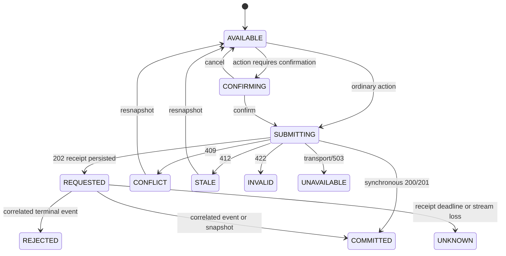

<!-- @format -->

# Sopara UI/UX and Interface Specification

**Status:** Approved — Phase 3 Chairman decisions incorporated

**Version:** 0.3.0

**Date:** 2026-09-10

**Source contracts:** `docs/idea.md`, `docs/product.md`, `docs/architecture.md`

**Interface boundary:** Private, single-owner, non-commercial research interface for historical replay and live NES simulation only

> [!IMPORTANT]
> Every authenticated product surface must say `SIMULATED — NO REAL ORDERS`. The interface may submit commands, but it never decides whether an action is legal or complete. Cloud SQL-backed server state is authoritative. When current state cannot be proved, the interface displays `STATUS_UNKNOWN`, disables every action that could start or resume work, and preserves `HALT SIMULATION` when the server can still accept it.

## 1. Design decision summary

### 1.1 Binding product and architecture inputs

| Input | Interface consequence |
| --- | --- |
| One owner | No organizations, teams, invitations, roles UI, or approval queues |
| Private GCP deployment | Direct IAP authentication; no application login or password reset UI |
| Historical replay and live simulation only | No broker, account funding, order ticket, or real-order language |
| ES information; NES simulated execution | Signal and execution instruments are always labeled separately |
| Two bounded live jobs | Morning and afternoon windows appear as separate executions within one trading session |
| Cloud SQL authority | Browser state is a projection, never an authority |
| REST plus SSE | Snapshots establish truth; stream events incrementally update it |
| At-least-once delivery | Duplicate events and command receipts are normal and idempotent |
| Observed versus proxy evidence | Evidence class appears on every derived surface and export |
| Sticky halt and recovery review | Clearing an alert never exposes an automatic resume action |
| Shared workstation allowed | Development results are visibly noncanonical and cannot enter qualification flows |
| WCAG 2.2 AA | Accessibility is an acceptance gate, not a polish pass |

### 1.2 Approved design decisions

| ID | Decision | Approved selection | Status |
| --- | --- | --- | --- |
| `UX-ADR-001` | Frontend architecture | TanStack Start React in SPA mode, built by its Vite plugin and served same-origin by `sopara-web` | Approved |
| `UX-ADR-002` | Component system | Source-owned shadcn/ui components initialized with preset `b3ZheXgQEs` and Base UI | Approved |
| `UX-ADR-003` | Data surfaces | TanStack Table 9, TanStack Virtual 3 where justified, and shadcn/Recharts 3 charts with equivalent tables | Approved |
| `UX-ADR-004` | Server-state management | TanStack Query 5 for REST; explicit reducer for SSE revision state | Approved |
| `UX-ADR-005` | Navigation | TanStack Router file routes, typed search parameters, route-addressable investigation pages | Approved |
| `UX-ADR-006` | Responsive policy | Every workflow and surface is fully operable on supported mobile, tablet, and desktop widths | Approved |
| `UX-ADR-007` | Theme | Explicit `light`, `system`, and `dark` choices with identical semantic meaning | Approved |
| `UX-ADR-008` | Canonical update policy | Snapshot first, ordered SSE second, fail closed on uncertainty | Approved |
| `UX-ADR-009` | Mutation policy | No optimistic domain state; only an attributed `REQUESTED` receipt may be optimistic | Approved |
| `UX-ADR-010` | Destructive actions | Consequence-specific modal confirmation with typed reason when required | Approved |
| `UX-ADR-011` | Accessibility target | WCAG 2.2 AA; keyboard behavior is a first-class contract for every workflow | Approved |
| `UX-ADR-012` | Client persistence | Preferences only; no canonical state, credentials, evidence, or form secrets in browser storage | Approved |
| `UX-ADR-013` | Form state | TanStack Form 1 with shared Standard Schema validation and explicit focus-on-error behavior | Approved |
| `UX-ADR-014` | Server boundary | All application APIs, commands, SSE, authentication enforcement, and server-side domain rules use FastAPI/Python | Approved |

## 2. Candidate interface walkthroughs

### 2.1 Option A — TanStack Start with shadcn/ui and TanStack primitives

#### Lifecycle

Cloud Build uses Bun to install dependencies and execute TanStack Start's Vite build, producing a static SPA shell and hashed assets. FastAPI/Python serves `/_shell.html`, route fallbacks, immutable assets, every application API, every command endpoint, and SSE from one Cloud Run service. IAP authenticates the owner before the application loads. TanStack Start server functions, server routes, middleware, SSR, and a Node or Bun production runtime are prohibited in v1; server-side domain behavior remains in FastAPI/Python.

TanStack Router owns file-based navigation and validated URL search state. TanStack Query fetches bounded REST projections. TanStack Form owns controlled form state, while native form semantics and server validation remain authoritative. The client fetches an authoritative snapshot, renders only after schema validation, then opens one SSE stream from the snapshot cursor. Domain mutations post ordinary HTTP commands with idempotency and expected-version headers.

#### Benefits

- explicit component state machines fit live, degraded, halted, and recovery states;
- route-level code splitting keeps charts and comparison tools out of the live command path;
- shadcn/ui supplies source-owned composition while Base UI primitives cover established dialog, drawer, menu, tabs, tooltip, form, keyboard, and focus-management behavior;
- TanStack Router, Query, Form, Table, and Virtual share typed React-first conventions without forcing one visual system;
- same-origin deployment avoids CORS and a second hosting surface;
- React testing and accessibility tooling are mature;
- complex decision traces and experiment comparisons remain inspectable without full-page reloads.

#### Costs and failure modes

- the prerendered SPA shell still hydrates, and JavaScript failure can blank route content without the static recovery frame;
- client caches can display stale data unless revision and freshness are explicit;
- copied shadcn components become Sopara-owned code and therefore carry an explicit maintenance and regression-testing burden;
- headless libraries do not provide accessible markup automatically;
- grid virtualization can confuse assistive technology and browser find;
- a newly released framework minor can introduce regressions;
- long-lived tabs can leak listeners or accumulate stream state.

#### Mitigations

- retain React 19.2.7 rather than adopting React 19.3 one day after release;
- record the decoded preset and generated component versions; upgrades use reviewed diffs rather than blind regeneration;
- use native HTML tables and controls by default, adding TanStack state engines only where they earn their cost;
- render a static HTML failure frame before the JS bundle executes;
- require root, route, panel, stream, and command error boundaries;
- cap retained client events and fetch histories from the server;
- use semantic native tables for bounded critical evidence;
- soak the command center for eight hours with reconnect and memory assertions.

#### Verdict

Recommended for v0.

### 2.2 Option B — server-rendered FastAPI/Jinja with HTMX-style fragments

#### Lifecycle

FastAPI renders full pages and bounded HTML fragments. Small JavaScript controllers handle confirmation dialogs and an SSE connection that swaps server-rendered fragments into the document.

#### Benefits

- smaller client runtime and fewer state-management dependencies;
- useful content survives more classes of JavaScript failure;
- authorization and formatting logic remain server-centric;
- conventional HTML forms provide strong progressive-enhancement behavior.

#### Costs and failure modes

- high-frequency fragment replacement can destroy focus, selection, and scroll position;
- ordered revision reconciliation becomes distributed across DOM fragments;
- comparison tables, synchronized filters, and decision traces require increasingly custom client code;
- partial failures can leave different panels at different server revisions;
- accessible announcements become difficult to coalesce when the server replaces markup;
- testing state transitions across fragments is less direct than one typed client reducer.

#### Migration cost

REST, SSE, and URL contracts remain reusable, but component behavior and most interaction tests would be rewritten. The visual token layer can remain.

#### Verdict

Viable for a read-mostly administration console, but not recommended for this live evidence interface.

### 2.3 Rejected runtime variant — TanStack Start SSR service

Running TanStack Start as a second Node service or a sidecar would enable SSR and server functions, but this private IAP application has no SEO requirement. It would also duplicate routing and authentication boundaries, add another runtime to patch, and complicate same-origin SSE behavior. SPA mode preserves TanStack Router and build-time conventions while keeping the approved FastAPI Cloud Run boundary intact.

### 2.4 Binding shadcn preset

The official shadcn CLI decodes `b3ZheXgQEs` as:

| Field | Value |
| --- | --- |
| Style | `sera` |
| Base color | `neutral` |
| Theme | `lime` |
| Chart color | `cyan` |
| Body font | `dm-sans` |
| Heading font | `geist` |
| Icon library | `hugeicons` |
| Radius | `default` |
| Menu accent | `subtle` |
| Menu color | `default-translucent` |
| Pointer cursor | Enabled for buttons by `--pointer` |

The binding initialization command is:

```shell
bunx --bun shadcn@latest init --preset b3ZheXgQEs --template start --pointer
```

As of this specification, shadcn defaults new projects to Base UI; `components.json` MUST resolve the component base to Base UI and CI MUST fail if it resolves to Radix or React Aria. The command is an interactive bootstrap step, never a floating CI dependency. Generated source, `components.json`, resolved preset output, `bun.lock`, license notices, and the initializer command are reviewed and committed together. Later component updates use Bun, explicit component names, and reviewed diffs; regeneration may not overwrite Sopara behavior silently.

### 2.5 Component-base candidates

#### Option A — Base UI-backed shadcn components — selected

Base UI 1.x is stable, is now shadcn's default for new projects, implements common WAI-ARIA patterns, and includes focus, keyboard, pointer, form, and software-keyboard-aware Drawer behavior. Its failure mode is false confidence: composition, responsive Sheets/Drawers, custom tables, and application copy can still break names, focus order, or dismissal. Every imported primitive therefore receives a wrapper-level keyboard and screen-reader fixture, and upstream fixes arrive only through reviewed regeneration.

#### Option B — Radix-backed shadcn components

Radix remains supported and mature, but it is not the Chairman-selected base. Switching bases rewrites generated component contracts and focus behavior, so it is not a per-component preference; it requires a design ADR, full component regeneration review, and the complete accessibility journey suite. Mixing Base UI and Radix would double the state matrix and is prohibited.

### 2.6 Responsive-policy candidates

#### Option A — full mobile parity — selected

Every route, mutation, confirmation, and recovery flow operates at `320px` and above. Dense tables become record cards or bounded scroll regions, long forms become staged flows, and context rails become inline disclosures. This adds layout/test cost and makes comparison work slower on a phone, but it prevents emergency administration from depending on a desktop and removes contradictory capability rules by viewport.

#### Option B — compact inspection and halt only

This reduces form and comparison design effort and limits accidental activation in cramped layouts. It fails the Chairman's portability requirement, creates a second capability model, and strands readiness or recovery when a desktop is unavailable. Migrating later would require reworking nearly every route after desktop assumptions had hardened. Rejected.

### 2.7 Theme-policy candidates

#### Option A — light, system, and dark — selected

A semantic-token layer resolves to independently tested light and dark values; `system` follows the operating-system preference. This costs a second visual regression matrix, a pre-paint bootstrap, and chart/status verification, but it respects the owner's context without allowing colors to change meaning.

#### Option B — one fixed theme

A fixed theme is cheaper and removes bootstrap flash risk. It does not meet the Chairman's three-mode requirement and makes later theming expensive if route-level colors leak into components. Rejected.

## 3. Experience principles

1. Trust before performance. Blocking warnings and evidence validity precede P&L.
2. Simulation is unmistakable. No surface relies on color or a one-time disclaimer.
3. Unknown is not neutral. Missing freshness is an explicit unsafe state.
4. Commands are receipts, not outcomes. `202 Accepted` never renders as completed.
5. Evidence is traversable. Every metric and event links to its definitions and inputs.
6. Abstention is normal. `NO_TRADE` receives the same inspection quality as a simulated fill.
7. Failures remain visible. Invalid and failed runs are not hidden from lists or comparisons.
8. Safety actions are spatially stable. Halt never moves because a panel refreshes.
9. The interface does not infer. Capabilities and state transitions come from the server.
10. Density must not erase hierarchy. The system is information-rich, not visually frantic.

## 4. Information architecture

### 4.1 Route map

```text
/
├── readiness
├── sessions
│   └── :sessionId
│       └── windows/:windowId
├── experiments
│   ├── new
│   └── :experimentId
│       ├── manifest
│       ├── runs/:runId
│       └── compare
├── decisions/:decisionId
├── datasets
│   └── :datasetId
├── incidents
│   └── :incidentId
│       └── recovery
├── reports/:reportId
├── exports/:exportId
└── system
    ├── health
    ├── integrations
    └── audit
```

Filters, sort order, selected tabs, comparison IDs, and time ranges are encoded in the URL when safe. Credentials, raw market payloads, owner identity, free-form reasons, and entitlement documents never appear in a URL.

### 4.2 Primary navigation

| Label | Purpose | Badge behavior |
| --- | --- | --- |
| Command Center | Current operability, windows, exposure, decisions, alerts | Critical unresolved count only |
| Sessions | Historical and live-simulation sessions | Running/invalid count |
| Experiments | Hypotheses, manifests, replay, comparison | Queued/running count |
| Datasets | Sources, entitlement, validation, quarantine | Blocking finding count |
| Decisions | Proposal, abstention, rejection, order, and fill ledger | None |
| Incidents | Alert groups, acknowledgement, mitigation, recovery | Unresolved severity count |
| Reports | Reconciliations, qualification, cost, exports | Pending export count |
| System | Health, versions, integrations, audit | Configuration drift count |

Navigation badges are textual for screen readers and never pulse. Counts above 99 display `99+`, while the accessible name contains the exact count.

### 4.3 Page hierarchy

Every authenticated page renders in this order:

1. skip link;
2. persistent simulation banner;
3. global header with operability and stream state;
4. primary navigation;
5. page title and evidence context;
6. blocking notices;
7. page actions;
8. primary content;
9. provenance and freshness footer.

Performance metrics never precede blocking notices.

## 5. Application shell

### 5.1 Persistent simulation banner

Visible at every viewport and never dismissible:

```text
SIMULATED — NO REAL ORDERS
Mode: LIVE SIMULATION | Signal: ESZ6 | Execution simulation: NESZ6
Evidence: OBSERVED NES
```

Requirements:

- minimum height `40px` desktop and `48px` compact;
- adjacent text, icon, and bordered shape communicate simulation;
- `SIMULATED` appears beside every P&L value outside the banner;
- proxy evidence changes the final line to `SYNTHETIC NES PROXY — NOT QUALIFYING`;
- `NO_EXECUTION_EVIDENCE` uses `NO EXECUTION EVIDENCE`;
- the banner remains visible in screenshots, print styles, fullscreen charts, dialogs, and exports.

### 5.2 Global header

Contains:

- current operability badge;
- stream state and last verified snapshot age;
- current ET time and trade date;
- current or next approved window;
- owner menu containing identity, theme, density, and sign out;
- help entry for keyboard shortcuts and terminology.

The header never displays profitability.

### 5.3 Emergency rail

`HALT SIMULATION` is visually separated from routine page actions.

- desktop: fixed at the end of the global header, after a separator;
- compact: fixed bottom action bar with safe-area inset;
- minimum target `44 × 44px`;
- never hidden inside an overflow menu;
- visible in `STARTING`, `HEALTHY`, `DEGRADED`, and `STATUS_UNKNOWN` if the command endpoint is reachable;
- disabled only when the server explicitly reports no active or starting live session, or command submission itself is unavailable;
- repeated activation uses the same in-flight command and cannot enqueue duplicates.

### 5.4 Global operability presentation

| State | Label | Icon/shape | Global behavior |
| --- | --- | --- | --- |
| `OFFLINE` | Offline | hollow circle | Read-only; show next window |
| `STARTING` | Starting checks | rotating indicator unless reduced motion | Start/resume disabled |
| `HEALTHY` | Healthy for simulation | check in circle | Server capabilities determine actions |
| `DEGRADED` | Degraded — no new simulated orders unless policy permits | warning diamond | Warning banner before content |
| `HALTING` | Halting simulation | stop octagon | All routine mutations disabled |
| `HALTED` | Halted | filled stop octagon | Inspection and recovery entry only |
| `RECONCILING` | Reconciling | split arrows | Recovery actions disabled |
| `RECOVERY_REVIEW` | Recovery decision required | clipboard warning | Explicit approve/reject recovery actions |
| `STATUS_UNKNOWN` | Status unknown — actions restricted | question mark in dashed diamond | Disable start/resume/accept; preserve safe inspection |

State labels must be written in full on the Command Center. Icons without text are allowed only in repeated dense rows with accessible names.

## 6. Visual system

### 6.1 Color and theme tokens

The preset's neutral/lime/cyan scale is mapped onto Sopara semantic roles. Components consume semantic CSS custom properties; domain code never selects raw palette steps. The following safety-critical pairs are hard overrides where the generated preset alone cannot express product meaning.

Light mode:

| Token | Foreground | Background | Intended use |
| --- | --- | --- | --- |
| `text.primary` | `#172033` | `#FFFFFF` | Body and headings |
| `text.secondary` | `#56647A` | `#FFFFFF` | Supporting text |
| `action.primary` | `#FFFFFF` | `#2457D6` | Routine primary action |
| `state.healthy` | `#0B6B3A` | `#DDF7E8` | Healthy |
| `state.degraded` | `#7A4A00` | `#FFF2CC` | Degraded/warning |
| `state.critical` | `#A11212` | `#FDE4E4` | Halted/critical |
| `state.unknown` | `#3F4653` | `#E8ECF2` | Unknown/unavailable |
| `evidence.simulated` | `#5B21B6` | `#EDE9FE` | Simulation identity |
| `evidence.observed` | `#0C4A6E` | `#E0F2FE` | Observed NES |

Dark mode:

| Token | Foreground | Background | Intended use |
| --- | --- | --- | --- |
| `text.primary` | `#F8FAFC` | `#0B1220` | Body and headings |
| `text.secondary` | `#CBD5E1` | `#0B1220` | Supporting text |
| `action.primary` | `#FFFFFF` | `#1D4ED8` | Routine primary action |
| `state.healthy` | `#86EFAC` | `#052E16` | Healthy |
| `state.degraded` | `#FDE68A` | `#422006` | Degraded/warning |
| `state.critical` | `#FCA5A5` | `#450A0A` | Halted/critical |
| `state.unknown` | `#CBD5E1` | `#1E293B` | Unknown/unavailable |
| `evidence.simulated` | `#DDD6FE` | `#2E1065` | Simulation identity |
| `evidence.observed` | `#BAE6FD` | `#082F49` | Observed NES |

All listed foreground/background pairs exceed `4.5:1`; measured ratios range from `5.83:1` to `17.89:1`. Large shapes and focus indicators still require `3:1` against their actual adjacent color. Every generated preset token and every interactive state is independently measured in light and dark mode; colors are not algorithmically inverted at runtime.

Color never carries direction, validity, severity, evidence class, or P&L sign alone. Each adds text and icon/shape.

### 6.2 Typography

- body font: self-hosted DM Sans from the binding preset, with system UI fallback;
- heading font: self-hosted Geist from the binding preset, with system UI fallback;
- font files are vendored, subset only to supported glyphs, covered by retained license notices, and never fetched from a third-party origin;
- body: `14px/20px` at desktop, `16px/24px` for compact form-heavy views;
- small supporting text: minimum `12px/16px`, never used for critical content;
- page title: `24px/32px`, weight 650;
- section title: `18px/26px`, weight 650;
- numeric cells: `font-variant-numeric: tabular-nums`;
- identifiers and hashes: system monospace, wrap anywhere, copy affordance;
- all-caps reserved for short safety/evidence labels, never paragraphs.

At `200%` browser zoom, content reflows without loss or two-dimensional page scrolling except bounded data tables and charts.

### 6.3 Spacing and shape

- base spacing unit: `4px`;
- content gaps: `8`, `12`, `16`, `24`, `32px`;
- routine control height: `40px` desktop, `44px` compact;
- card radius: `8px`; modal radius: `10px`;
- borders communicate groups; shadows are limited to dialogs and temporary overlays;
- critical controls use a distinct border and position, not dramatic animation.

### 6.4 Motion

- default transitions: `120–180ms` for opacity or position;
- no auto-playing chart animation;
- no pulsing live indicators;
- `prefers-reduced-motion: reduce` removes nonessential transitions and uses static progress labels;
- live row updates use a temporary border, not movement, and never steal focus.

### 6.5 Density

The owner may select `Comfortable` or `Compact`. Density affects row padding and card gaps only. It cannot hide labels, warnings, reason codes, evidence class, or timestamps. Preference may persist locally.

### 6.6 Theme state machine

The preference is one of `light`, `system`, or `dark`; the default is `system`.

```text
UNSET -> SYSTEM
LIGHT <-> SYSTEM <-> DARK
SYSTEM + OS_CHANGE -> resolved LIGHT | resolved DARK
```

- the preference persists under a versioned, non-sensitive local-storage key;
- TanStack Router `ScriptOnce` injects a byte-stable, CSP-hash-authorized pre-paint script that reads the preference and `prefers-color-scheme`, sets `data-theme`, and prevents a light/dark flash before hydration;
- malformed or unavailable storage falls back to `system` without blocking startup;
- `system` subscribes to operating-system changes for the current tab; explicit `light` or `dark` does not;
- changing theme never changes evidence, operability, severity, focus position, chart meaning, or data density;
- native `color-scheme`, form controls, scrollbars, print styles, charts, code blocks, skeletons, selected rows, focus rings, and forced-colors behavior are verified in both resolved themes;
- the theme menu uses a three-item radio group with visible text and the current choice; the toolbar icon alone is not the label.

## 7. Responsive layout

### 7.1 Breakpoints

Breakpoints change composition, never capability. Server capabilities remain authoritative at every width; CSS hiding is never an authorization control.

| Width | Layout | Interaction policy |
| --- | --- | --- |
| `<480px` | One column, sheet navigation, card/list data views, full-width staged forms | Full operation; no horizontal page scroll |
| `480–767px` | One column, sheet navigation, selectively scrollable evidence regions | Full operation |
| `768–1023px` | One/two columns, collapsed navigation rail | Full operation |
| `1024–1279px` | Twelve-column compact desktop | Full operation |
| `1280–1599px` | Twelve-column standard desktop | Full operation |
| `>=1600px` | Maximum content width `1600px`; optional detail rail | Full operation |

### 7.2 Desktop shell

```text
┌──────────────────────────────────────────────────────────────────────┐
│ SIMULATED — NO REAL ORDERS                                           │
├──────────────┬───────────────────────────────────────┬───────────────┤
│ Navigation   │ Operability / window / stream         │ HALT          │
├──────────────┼───────────────────────────────────────┴───────────────┤
│              │ Blocking notices                                     │
│              ├───────────────────────────┬───────────────────────────┤
│              │ Primary content           │ Context / current alerts  │
│              │                           │                           │
└──────────────┴───────────────────────────┴───────────────────────────┘
```

- navigation width `232px`, collapsible to `64px`;
- primary content has minimum width `0` to prevent overflow;
- context rail is `320–400px` and collapses before primary content;
- sticky elements account for focus visibility and never cover focused controls.

### 7.3 Mobile and compact shell

- simulation banner remains first;
- global status becomes a two-row summary;
- primary navigation becomes a labeled shadcn Sheet with a visible menu button and focus return;
- context rail becomes an inline disclosure after blocking notices;
- tables transform into ordered record cards by default; a semantic scrollable-table view remains available when column comparison is essential;
- bounded horizontal regions have visible scroll affordances, programmatic labels, and do not cause page-level two-dimensional scrolling;
- the halt bar reserves layout space and does not overlay content;
- all start, resume, manifest acceptance, entitlement acceptance, recovery approval, replay, compare, incident, export, and audit workflows remain available;
- dialogs become bottom or full-screen sheets only when their focus, labeling, dismissal, and confirmation semantics remain equivalent;
- a Base UI Drawer containing form controls uses `Drawer.VirtualKeyboardProvider`; pinned headers and action footers sit outside its scroll body and reserve `--drawer-keyboard-inset` with a `0px` fallback;
- the software keyboard cannot obscure the focused field, field error, or sticky action bar; inputs use at least `16px` text on mobile;
- safe-area insets are reserved for top and bottom controls;
- portrait and landscape orientations preserve the same workflow state and entered values.

### 7.4 Mobile workflow adaptation matrix

| Workflow/surface | Mobile composition | Capability and safety invariant |
| --- | --- | --- |
| IAP/startup | Single-column blocking state and full-width retry | No prior domain data survives an auth failure |
| Readiness | Summary, filterable checklist cards, then selected-check detail | Source acceptance retains phrase, reason, and entitlement detail |
| Command Center | Blocking notices, operability, active window, exposure, incidents, then decisions | Halt is persistent; status and simulation identity precede P&L |
| Session/window | AM/PM segmented control and vertical execution timeline | Both jobs remain distinct; switching never discards state |
| Experiment creation | Numbered multi-step form with persistent progress and review step | Back/forward preserve values; immutable acceptance uses full diff |
| Manifest review | Section index sheet plus one expanded section at a time | No field or warning is omitted; search and expand-all remain available |
| Replay/run | Progress summary followed by collapsible diagnostics | Cancel/retry commands retain confirmation and receipt states |
| Comparison | One synchronized candidate card at a time plus paired metric rows | Baseline and candidate labels repeat on every row; deltas are textual |
| Decision trace | Vertical causal timeline with expandable raw evidence | Source, receive, decision, and simulated execution times stay distinct |
| Dataset/source | Filter cards, entitlement summary, quarantine details | Acceptance and revocation consequences remain complete |
| Incident/recovery | Incident timeline, reconciliation checklist, session-boundary diff | Approval never becomes a swipe gesture or shortened confirmation |
| Reports/exports | Filter sheet, report sections, export review steps | Evidence class, omissions, hash, and expiry remain visible |
| System/audit | Service cards and server-paginated audit records | No raw credentials or licensed payloads enter the view |
| Dialogs/menus/help | Responsive Dialog, Drawer, Sheet, or Popover chosen by available space | Roles, focus cycle, Escape behavior, and invoker focus return stay constant |

Every row in this matrix has an automated `390px` fixture and a manual keyboard-plus-touch fixture. A desktop-only call to action, hidden field, hover-only explanation, drag-only reorder, or shortened mobile confirmation is a release blocker.

### 7.5 Print and export styles

- include title, generated time, mode, evidence class, signal/execution instruments, filters, warnings, and report hash;
- remove navigation and routine actions;
- retain `SIMULATED — NO REAL ORDERS` on every printed page;
- expand truncated labels and identifiers;
- render charts with their textual summary and data-table reference;
- never print secrets, owner email, or hidden columns.

## 8. Component hierarchy

```text
AppRoot
├── StaticFailureFrame
│   └── SafeHaltLink
├── IapBoundary
├── SchemaCompatibilityBoundary
└── AppProviders
    ├── ThemeProvider
    ├── QueryClientProvider
    ├── StreamStateProvider
    ├── CommandReceiptProvider
    └── TanStackStartRouter
        └── AppShell
            ├── SkipLink
            ├── SimulationBanner
            ├── GlobalHeader
            │   ├── OperabilityBadge
            │   ├── StreamIndicator
            │   ├── WindowClock
            │   ├── OwnerMenu
            │   └── HaltControl
            ├── PrimaryNavigation
            ├── GlobalNoticeStack
            ├── RouteErrorBoundary
            │   └── RouteOutlet
            ├── CommandReceiptTray
            └── ProvenanceFooter
```

### 8.1 Shared primitives

| Component | Required states |
| --- | --- |
| `AsyncPanel` | `IDLE`, `LOADING`, `READY`, `EMPTY`, `STALE`, `ERROR`, `UNKNOWN` |
| `EvidenceBadge` | `OBSERVED_NES`, `SYNTHETIC_NES_PROXY`, `NO_EXECUTION_EVIDENCE` |
| `ModeBadge` | `HISTORICAL_REPLAY`, `LIVE_SIMULATION` |
| `OperabilityBadge` | All states in Section 5.4 |
| `ReasonCodeList` | Collapsed summary, expanded ordered list, missing definition |
| `InstrumentPair` | ES signal contract and NES simulated-execution contract |
| `Timestamp` | ET display, UTC detail, nanosecond precision when supplied, quality warning |
| `MoneyValue` | Gross/net, signed microdollar source, display rounding, adjacent `SIMULATED` |
| `VersionRef` | Short hash, full copy value, navigation target, unavailable |
| `Freshness` | Current, aging, stale, unknown |
| `CommandButton` | Available, unavailable with reason, submitting, requested, terminal failure |
| `DataTable` | Loading, empty, ready, paginating, filter error, partial unavailable |
| `ChartWithTable` | Loading, ready, empty, insufficient data, invalid evidence, rendering failure |

shadcn/ui primitives are copied into `src/components/ui`; Sopara composites live in `src/components/domain`. Route files may compose domain components but must not fork base primitives locally. `DataTable`, `ChartWithTable`, safety confirmations, and responsive record cards each have one shared implementation so semantics cannot drift by route or viewport.

### 8.2 Component invariants

- unavailable controls remain visible when their absence would hide product state;
- disabled controls expose a visible reason through adjacent text, not tooltip only;
- tooltips supplement labels and appear on hover and focus;
- icon-only controls require an accessible name and `44px` target when critical;
- skeletons preserve approximate layout but never resemble actual P&L or health values;
- empty states distinguish `no records`, `not run`, `filtered out`, `not entitled`, and `failed to load`;
- copy buttons announce success through one polite status region;
- timestamps never use relative time without an absolute accessible label.

### 8.3 First-class keyboard contract

Keyboard behavior is specified with each component, implemented before pointer enhancements, and exercised at mobile, tablet, and desktop widths. Native HTML behavior wins unless a recognized WAI-ARIA composite pattern requires managed focus.

| Primitive/workflow | Required keys | Focus and state behavior |
| --- | --- | --- |
| Global navigation | `Tab`, `Shift+Tab`, `Enter`, `Space` | Skip link is first; current route is programmatic; sheet close returns focus to its trigger |
| Route navigation | Browser back/forward, link activation | New navigation focuses `h1`; history restoration returns recorded focus/scroll when target still exists |
| Dialog/alert dialog | `Tab`, `Shift+Tab`, `Escape` where cancellable | Focus cycles inside, initial focus follows consequence policy, close returns to invoker; critical automatic halt cannot be dismissed |
| Tabs | Arrow keys, `Home`, `End` | Roving tab stop follows the APG pattern; activation mode is explicit and consistent |
| Disclosure/accordion | `Enter`, `Space` | Trigger remains in normal tab order and communicates expanded state |
| Menu/radio menu | Arrows, `Home`, `End`, typeahead, `Escape` | Selection and focus are distinct; closing restores trigger focus |
| Combobox | Printable input, arrows, `Enter`, `Escape` | Input retains focus; active option is announced; free text is rejected unless explicitly allowed |
| Form | Native tab order, `Enter` only where submission is unambiguous | Invalid submit focuses the error summary, whose links focus fields; no auto-submit on option selection |
| Semantic table | `Tab` reaches controls and links only | Reading follows DOM order; sorting uses a button in the header; rows are not fake tab stops |
| Composite data view | Arrow keys only if grid semantics are intentionally declared | Roving focus is documented per instance; card fallback preserves every action and field |
| Chart | `Tab` to summary/toggle; arrows only inside declared accessible layer | Keyboard access never replaces the equivalent table; hover tooltip data is available on focus |
| Pagination | `Tab`, `Enter`, `Space` | Current page is named; page change focuses the table or result heading after announcement |
| Toast/status | No focus movement | Status is announced once; durable details remain in the receipt tray |
| Halt | `Shift+H` focuses; `Enter`/`Space` opens confirmation | Shortcut never submits; confirmation requires a second deliberate activation |

Global shortcuts use modifiers, never override browser or assistive-technology bindings, and are disabled in inputs, textareas, selects, editable regions, dialogs with text entry, and while IME composition is active. A visible Help surface lists shortcuts. Pointer, touch, and keyboard paths dispatch the same intent function and produce the same idempotency key lifecycle.

## 9. Global client state machines

### 9.1 Bootstrap and stream state

```mermaid
stateDiagram-v2
    [*] --> SHELL_LOADING
    SHELL_LOADING --> AUTH_REQUIRED: IAP challenge or 401/403
    SHELL_LOADING --> SNAPSHOT_LOADING: bundle and schema load
    SNAPSHOT_LOADING --> LIVE: valid snapshot; stream connected
    SNAPSHOT_LOADING --> SNAPSHOT_ERROR: request/schema failure
    LIVE --> RECONNECTING: stream rotate or transport close
    LIVE --> UNKNOWN: error, revision gap, invalid event, freshness deadline
    RECONNECTING --> LIVE: resnapshot and stream connected
    RECONNECTING --> UNKNOWN: reconnect deadline or invalid snapshot
    UNKNOWN --> SNAPSHOT_LOADING: automatic bounded retry or owner retry
    SNAPSHOT_ERROR --> SNAPSHOT_LOADING: owner retry
    LIVE --> INCOMPATIBLE: unsupported server schema
    UNKNOWN --> INCOMPATIBLE: unsupported server schema
```



Rules:

1. Fetch `GET /api/v1/snapshot` with `cache: no-store`.
2. Validate schema version before rendering domain content.
3. Store snapshot revision and stream cursor in memory.
4. Open exactly one `EventSource` per tab from the cursor.
5. Ignore an event whose ID is at or below the applied cursor.
6. Apply only the next valid revision or a declared non-domain heartbeat.
7. On a gap, unknown event schema, parse error, or transport error, close the stream and enter `UNKNOWN` immediately.
8. While unknown, disable start, resume, acceptance, recovery approval, and ordinary mutation commands.
9. Keep the last snapshot available only as visibly watermarked `LAST VERIFIED AT <time>` inspection data; replace every operability/freshness badge with unknown presentation.
10. Resnapshot with exponential backoff `1s, 2s, 5s, 10s`, then every `30s`; `Retry now` is available.
11. Reopen SSE only after a valid snapshot.
12. The server intentionally rotates the stream before 55 minutes; a declared rotate event triggers an immediate resnapshot.
13. Stream state never changes server operability.

The live region announces only `Connection lost; status unknown`, `Reconnecting`, and `Current status restored`. Market ticks and ordinary projection updates are never announced.

### 9.2 Freshness state

```text
CURRENT -> AGING -> STALE -> UNKNOWN
```

- `CURRENT`: within the server-declared freshness target;
- `AGING`: within the warning interval and visibly timestamped;
- `STALE`: exceeded domain threshold; server state determines operability;
- `UNKNOWN`: transport or timestamp cannot be trusted.

The client never converts `AGING` or `STALE` back to `CURRENT` using its own clock alone. A newer authoritative snapshot or event is required.

### 9.3 Command lifecycle



Every command includes:

- UUID idempotency key created once per owner intent;
- payload hash;
- expected resource revision;
- current route context;
- CSRF token and same-origin headers;
- owner-provided reason where required.

Double-click protection improves feedback but is not relied on for correctness. A reload after `REQUESTED` queries the command by idempotency key and does not issue it again.

### 9.4 Multi-tab behavior

- each tab has its own snapshot and SSE connection;
- a `BroadcastChannel` shares only tab count and command-in-flight hints, never authoritative domain state;
- expected revisions and idempotency protect against stale commands from another tab;
- when another tab commits a mutation, this tab receives the server event and updates normally;
- more than three open tabs produces a nonblocking warning about stream/resource use;
- closing one tab never changes server state.

## 10. Screen specifications

### 10.1 IAP and startup surfaces

#### Authentication challenge

IAP owns sign-in. Sopara must not imitate a login form. If the app receives `401` or `403`, show:

- `Access unavailable`;
- whether authentication or authorization failed when safely known;
- requested deployment identity without echoing the owner email;
- `Retry through Google sign-in` link;
- correlation ID;
- no domain data from a prior render.

#### Schema incompatible

Show a static blocking page with UI version, server schema version, correlation ID, refresh action, and system-status link. Clear all cached domain projections from memory.

#### Static safe-halt surface

The HTML shell includes a plain link to `GET /safe/halt`, so a bundle, router, or root-render failure does not remove the last-resort control. The server-rendered page:

- is protected by the same IAP identity;
- fetches current server state without browser cache;
- shows active/starting session identity and `STATUS UNKNOWN` when proof is incomplete;
- posts to `POST /safe/halt` with server-issued CSRF protection and one idempotency key;
- requires an explicit confirmation and optional reason;
- displays the durable command receipt, not a fabricated halted state;
- contains no general start, resume, recovery, or experiment actions.

### 10.2 First-use readiness

Purpose: establish `RESEARCH_READY` without masking partial readiness.

Layout:

1. readiness summary with `0–N blocking`;
2. ordered checklist for identity, entitlement, contracts, source, clock/calendar, GCS, Cloud SQL, and deterministic fixture;
3. selected check detail;
4. quarantined sample findings table;
5. acceptance action.

Check states are `NOT_RUN`, `RUNNING`, `PASS`, `WARNING`, `FAIL`, and `UNAVAILABLE`. Overall readiness is `READY` only when every blocking check is `PASS`. Warnings never collapse failures.

The source-acceptance dialog names the source version, instruments, entitlement expiry, permitted destinations, retention obligations, and checksum. Confirmation requires the phrase `ACCEPT SOURCE VERSION` and a reason.

### 10.3 Command Center

Purpose: answer, in under ten seconds:

1. Is state current?
2. Is the system allowed to create new simulated orders?
3. Which window/job is active or next?
4. Is simulated exposure open?
5. What requires attention?

Desktop layout:

```text
┌─────────────────────────────────────────────────────────────────────┐
│ Blocking notices                                                    │
├──────────────────────┬──────────────────────┬───────────────────────┤
│ Operability          │ Current window/job   │ Simulated exposure    │
├──────────────────────┴──────────────────────┼───────────────────────┤
│ ES signal / NES execution health             │ Unresolved incidents  │
├──────────────────────────────────────────────┴───────────────────────┤
│ Recent decisions: proposal / no-trade / rejection / simulated fill │
└─────────────────────────────────────────────────────────────────────┘
```

Required content:

- current snapshot revision and age;
- morning and afternoon job states separately;
- scheduled time, actual start, execution ID, current lease epoch, and deadline;
- ES and NES contracts, watermarks, freshness, and independent health;
- open simulated orders and positions with adjacent simulation labels;
- gross P&L, each modeled cost, and net simulated P&L;
- last ten decisions including `NO_TRADE`;
- unresolved incidents ordered by operability impact then recency;
- next required owner action.

If no job is active, show the next eligible window and most recent reconciled session. Never fill the live panels with zeroes that could be mistaken for current activity.

### 10.4 Session list and detail

Session list columns:

- trade date;
- mode;
- evidence class;
- AM state;
- PM state or calendar exception;
- reconciliation state;
- validity;
- decision/fill counts;
- net simulated P&L;
- unresolved incident count;
- runtime manifest short hash.

Invalid and failed sessions remain in chronological order and cannot be filtered out by default. Default filter is `All outcomes`.

Session detail order:

1. validity and reconciliation banner;
2. immutable identity and versions;
3. AM and PM execution cards;
4. instrument/data health timeline;
5. simulated exposure and P&L decomposition;
6. decisions and incidents;
7. evidence objects and hashes;
8. export and report actions.

The AM and PM cards never merge their execution identities or continuity claims.

### 10.5 Experiment registry and creation

Experiment list emphasizes hypothesis status, evidence validity, and sample size before performance.

Creation is a seven-step form:

1. hypothesis and falsification criterion;
2. dataset versions and time ranges;
3. strategy and feature versions;
4. simulator and cost model;
5. session, roll, and risk policies;
6. holdout/leakage review;
7. immutable manifest review and acceptance.

Each step has a heading, description, error summary, and saved in-memory draft state. Back navigation preserves entries. Reload warns that the unsaved draft will be lost; it is not persisted to local storage.

Manifest acceptance:

- shows a human-readable diff from any parent experiment;
- shows all blocking validation findings before the action;
- requires the exact immutable hash to be visible;
- confirmation says changes create a child rather than mutating this experiment;
- only a committed server event displays `QUEUED`.

### 10.6 Replay run

Displays:

- dependency/preflight checks;
- task and checkpoint progress;
- cancellation state;
- deterministic hash comparison;
- canonical and counterfactual counts;
- failure/invalidity reason;
- metrics only after validity.

Progress is a server-reported count with an accessible text equivalent. Indeterminate work uses `Working — completion estimate unavailable`, not a fabricated percentage.

Cancellation is a confirmation dialog naming the run and explaining that partial output remains evidence but cannot appear complete.

### 10.7 Experiment comparison

Comparison supports two experiments in v0.

The first section is an immutable manifest diff, followed by evidence warnings, sample/regime comparability, metric definitions, and results. P&L is never the first comparison row.

Each metric row includes:

- left value;
- right value;
- absolute and relative difference where meaningful;
- sample size;
- definition/version;
- uncertainty/caveat;
- evidence class.

Charts synchronize hover/focus by time bucket, but each chart also has `View data table` and a textual summary. Proxy and observed series cannot share an unlabeled color legend.

### 10.8 Decision trace

The decision trace is an ordered causal record, not a generic event dump.

Header:

- outcome: `PROPOSED`, `NO_TRADE`, `INELIGIBLE`, `RISK_REJECTED`, `SIM_ACCEPTED`, or terminal simulated-order state;
- exact decision time;
- ES signal and NES simulation contracts;
- mode and evidence class;
- correlation/causation IDs;
- validity.

Ordered sections:

1. source watermarks and freshness;
2. point-in-time feature snapshot;
3. strategy evidence and invalidation conditions;
4. eligibility checks in evaluation order;
5. simulated risk checks;
6. simulated order transitions;
7. fill/cost assumptions;
8. position and P&L effect;
9. counterfactual outcomes;
10. health and incident context.

Missing evidence renders `MISSING — NOT RECONSTRUCTED` with the expected field and reason. It never disappears or displays zero.

### 10.9 Dataset, source, and entitlement views

Dataset list groups `READY`, `VALIDATING`, `QUARANTINED`, and `SUPERSEDED` without hiding any state. Evidence class and provider/license identity precede row counts.

Dataset detail includes:

- immutable manifest and object generations;
- ES/NES coverage and contract mapping;
- gaps, duplicates, corrections, tick violations, and sequence resets;
- source/exchange/receive timestamp quality;
- entitlement effective period and permitted destinations;
- retention and purge requirements;
- downstream runs and reports;
- repair lineage.

Entitlement documents are downloadable only through an audited request and never rendered into model-review surfaces.

### 10.10 Incidents and recovery review

Incident list groups repeated occurrences by stable reason code, source, and scope. Rows show severity, first/last occurrence, count, operability impact, acknowledgement, mitigation, and resolution evidence.

Acknowledgement dialog states `Acknowledgement does not resolve or mitigate this incident`.

Recovery review displays:

1. halt trigger and session boundary;
2. independently reconstructed data, simulated orders, positions, P&L, and watermarks;
3. field-level differences;
4. unresolved incidents;
5. proposed new session boundary;
6. approve or reject recovery.

Approval requires a reason and confirmation phrase `START NEW SESSION BOUNDARY`. It never says `Resume previous session`.

### 10.11 Reports and exports

Reports lead with validity, evidence class, warnings, sample size, and metric definitions. Export controls show included, aggregated, redacted, and omitted fields before submission.

Export lifecycle:

```text
CONFIGURING -> VALIDATING -> REQUESTED -> GENERATING
             -> DENIED | FAILED | READY -> DOWNLOADED | EXPIRED
```

`READY` shows hash, size, generated time, entitlement boundary, and expiry. Download completion is not inferred from link activation.

### 10.12 System health and audit

Health panels cover Cloud Run jobs/service, Cloud SQL, GCS, BigQuery gate, Scheduler, Secret Manager, source connectivity, and browser stream. Each reports `HEALTHY`, `DEGRADED`, `FAILED`, `UNKNOWN`, or `NOT_CONFIGURED` with last checked time.

The audit view is read-only and server-paginated. It distinguishes domain events, owner commands, IAP/platform access, configuration changes, and export events. Raw credentials and licensed payloads are excluded.

## 11. Confirmation and safety interactions

### 11.1 Action classes

| Class | Examples | Confirmation |
| --- | --- | --- |
| Read-only | Open decision, filter, copy hash | None |
| Reversible preference | Theme, density, column visibility | None; reset available |
| Durable routine | Queue replay, request export | Summary confirmation when cost/scope is material |
| Immutable acceptance | Accept source or experiment manifest | Modal, consequence text, reason, confirmation phrase |
| Safety stop | Halt simulation | Modal by default; keyboard shortcut requires second deliberate confirmation |
| Recovery authority | Approve recovery/new session boundary | Modal, diff reviewed, reason, confirmation phrase |

### 11.2 Halt dialog

Title: `Halt simulated activity?`

Body names:

- active session and AM/PM execution;
- open simulated orders and position;
- immediate consequence: new simulated orders blocked;
- configured cancellation/exit policy;
- fact that recovery review is required before a new session.

Buttons:

- primary danger: `HALT SIMULATION`;
- secondary: `Keep simulation running`.

Initial focus is the safe secondary action unless the halt was automatically requested by the system, in which case the dialog is informational and cannot block server action. Escape closes only an owner-opened dialog. Focus returns to the invoking halt control.

### 11.3 Keyboard shortcut

`Shift+H` focuses the halt control; it does not issue the command. Shortcuts are disabled while typing in a form and are listed in Help.

## 12. Forms and validation

- TanStack Form 1 owns controlled client form state; shadcn Field, Label, Input, Select, Checkbox, Radio Group, Textarea, and error primitives own markup and visual states;
- Standard Schema definitions are shared by route search validation and forms where the domain shape is identical; generated transport types never substitute for runtime validation;
- labels remain visible; placeholders are examples only;
- required fields use text and programmatic indication;
- validation runs on blur and submit, not each keystroke for long text;
- server errors map to fields and a focusable error summary;
- invalid submit focuses the error summary first; its links move focus to the invalid field without hiding it under sticky content;
- TanStack Form has no markup awareness, so focus-on-error is an application adapter with component tests rather than an assumed library behavior;
- submission buttons use `aria-disabled` plus an explanatory message when the owner must still inspect unmet requirements; hard `disabled` is reserved for true inability to receive focus or activation;
- reset buttons are `type="button"` and call `form.reset()` so native reset and controlled state cannot diverge;
- units appear in labels and values, for example `Latency (ms)`;
- price inputs use NES tick-aware integer conversion at the boundary and show points plus ticks;
- destructive free-form reasons are plain text with a documented maximum length;
- unsaved changes prompt on route or browser navigation;
- server-normalized values are shown in a review diff before immutable acceptance.

## 13. Tables, charts, and numeric presentation

### 13.1 Tables

- TanStack Table 9 owns sorting, filtering, pagination, visibility, and selection state only; shadcn Table and native table elements own markup;
- server-side pagination is mandatory for histories;
- default page size `50`, selectable `25`, `50`, or `100`;
- sort and filter state appears in the URL;
- column headers expose sort direction textually;
- row selection is not used as an implicit command target;
- every action names its row target;
- first column is the accessible row header;
- critical evidence tables prefer semantic HTML over virtualization;
- virtualization is allowed for read-only lists above 200 rendered rows and must pass keyboard/screen-reader tests;
- TanStack Virtual 3 is opt-in per surface, not a default; on React 19, `useFlushSync: false` is tested first to avoid lifecycle warnings and lower-end mobile scroll cost;
- mobile record cards and desktop rows consume the same column/value model and action definitions, preventing hidden mobile-only data loss;
- loading a new page preserves focus on the table heading, not an arbitrary row;
- empty filtered results offer `Clear filters` without implying the dataset is empty.

Table 9 features are opt-in and tree-shaken. Multi-filtering, pinning, grouping, and editable cells are enabled only for a named workflow with keyboard and mobile fixtures; no surface becomes a spreadsheet by accident.

### 13.2 Charts

- shadcn chart source and Recharts 3 provide presentation; `accessibilityLayer` is enabled, then verified rather than assumed sufficient;
- charts are explanatory, never the sole evidence source;
- initial rendering cap is 5,000 points after deterministic server downsampling;
- raw event inspection uses paginated tables, not millions of DOM or canvas points;
- axis labels include units and timezone;
- tooltip values are keyboard reachable and duplicated in the adjacent summary/table;
- directional series use line style or markers in addition to color;
- invalid or incomplete intervals are hatched or interrupted, not interpolated;
- zero baselines are visible for signed metrics;
- logarithmic scales require explicit labeling and are never automatic;
- every chart exposes a textual summary and equivalent data table;
- chart rendering failure leaves the table available.

### 13.3 Money, prices, and P&L

- every P&L value has adjacent `SIMULATED` text;
- display dollars to cents while preserving microdollar source precision in detail;
- positive values use `+`, negative values use a true minus sign, and zero is neutral;
- do not use green/red alone;
- gross, fees, spread, slippage, inference/data allocation, and net remain separately inspectable;
- NES price displays points and tick count where interpretation matters;
- the one-tick reference is always `0.5 points = $0.25 for one NES contract`.

### 13.4 Time

- primary operator time is `America/New_York` with `ET` plus `EST`/`EDT` detail;
- UTC is available adjacent to investigative timestamps;
- source, receive, decision, and simulated execution times are distinct fields;
- sub-millisecond precision is shown only when supplied and trustworthy;
- relative ages update visually no more than once per second and expose absolute time;
- dates use unambiguous month names in prose and ISO format in dense tables.

## 14. Error-boundary architecture

### 14.1 Boundary hierarchy

| Boundary | Catches | User result | Safety effect |
| --- | --- | --- | --- |
| Static failure frame | Bundle/CSP/bootstrap failure | Reload, correlation guidance, safe-halt link, no stale data | Only server-rendered safe halt available |
| IAP boundary | `401/403` | Authentication/access surface | Clear domain state |
| Schema boundary | Unsupported snapshot/event version | Upgrade-required page | Enter unknown; no mutations |
| Root boundary | Provider/router fatal error | Minimal shell and reload | Enter unknown; halt remains only if independently operable |
| Route boundary | Page loader/render failure | Page-specific retry and navigation | Global state remains visible |
| Panel boundary | Chart/table/widget failure | Inline unavailable panel | Other panels remain usable |
| Stream boundary | SSE gap/parse/network failure | Global `STATUS_UNKNOWN`, resnapshot | Start/resume/accept disabled |
| Command boundary | Mutation HTTP/domain failure | Receipt-specific error and recovery | Never infer completion |

### 14.2 Error copy contract

Every error provides:

- plain-language outcome;
- stable problem code;
- affected resource/scope;
- whether retry is safe;
- what state remains authoritative;
- correlation ID;
- next action.

Stack traces, credentials, raw licensed payloads, internal SQL, and owner identity are never rendered.

### 14.3 Partial availability

- a chart failure does not hide its table;
- a BigQuery analytics failure does not mark canonical evidence unavailable;
- an export failure does not alter its source report;
- a model-review failure becomes `MODEL_REVIEW_UNAVAILABLE`;
- a snapshot failure makes all domain panels unknown rather than preserving green cached values;
- a server capability omission hides no safety warning and displays an unavailable reason.

## 15. Accessibility specification

### 15.1 Structure and focus

- one `main` landmark and unique page heading;
- labeled navigation, status, complementary, and footer landmarks;
- skip link targets main content;
- logical DOM order matches visual order;
- route change focuses the page heading unless restoring browser history;
- dialogs trap focus, identify title/description, and return focus to the invoker;
- focus is never moved for SSE updates, alert counts, or table refreshes;
- sticky banners and compact halt bar reserve layout space so focus is not obscured;
- focus indicator is at least `2px` and `3:1` against adjacent colors.

### 15.2 Live announcements

One polite atomic status region announces:

- command received;
- command completed or rejected;
- results loaded or no results;
- export ready;
- connection restored.

One assertive alert region is reserved for:

- transition to `HALTING` or `HALTED`;
- `STATUS_UNKNOWN`;
- a new critical incident that changes operability.

Repeated events are grouped. Market ticks, P&L changes, countdown seconds, and ordinary health polling are never sent to live regions.

### 15.3 Keyboard behavior

- Section 8.3 is normative for every component and route; no workflow is accepted with a pointer-only path;
- Base UI behavior underneath shadcn is treated as a baseline, not proof that a composed component remains accessible;
- native tab order is preferred; positive `tabindex` values are prohibited;
- semantic tables do not invent spreadsheet keyboard semantics; a true grid documents and tests its roving-focus model;
- Escape closes owner-opened noncritical overlays and never discards entered data without warning;
- no single-key shortcut issues a mutation, changes canonical state, or captures printable characters;
- tooltips open on focus and hover, satisfy dismissible/hoverable/persistent behavior, and never contain required-only information;
- context menus always have a visible button equivalent;
- external keyboards on iOS and Android execute the same critical journeys as desktop keyboards;
- focus order and focused-element visibility are tested after responsive reflow, orientation change, validation, stream updates, pagination, and theme change.

### 15.4 Touch and pointer

- WCAG minimum targets are met; primary and safety actions target `44px`;
- no action depends on hover, drag, multi-touch, or precise pointer movement;
- chart brushing has numeric input alternatives;
- row actions do not appear only on hover.

### 15.5 Content and cognition

- use consistent terms from the product glossary;
- never abbreviate evidence states without expansion;
- warnings identify consequence and next action;
- avoid flashing and time-limited confirmations;
- countdowns do not remove owner-entered form data;
- reason codes pair stable machine identifiers with concise explanations;
- status is repeated at point of action when context matters.

## 16. Security and privacy in the interface

- no application password, API key, broker credential, or token field exists;
- `/safe/halt` is the only server-rendered mutation fallback and follows IAP, CSRF, idempotency, and audit requirements;
- HTML shell and APIs use `Cache-Control: no-store`; hashed static assets use immutable caching;
- no service worker or offline/PWA cache in v0;
- Content Security Policy allows only self-hosted scripts, images, connections, and nonce-authorized styles;
- no third-party fonts, analytics, session replay, tag managers, or CDN scripts;
- never use `dangerouslySetInnerHTML` for server, provider, incident, or model text;
- model output is plain text or a fixed structured schema, never executable Markdown/HTML;
- commands require CSRF, origin, idempotency, payload hash, and expected revision;
- external links display their destination and use safe opener isolation;
- clipboard controls exclude hidden fields and warn before copying licensed identifiers;
- browser storage contains only theme, density, and non-sensitive column preferences;
- logout clears in-memory projections and returns through the IAP-controlled path;
- screenshots and print views retain simulation and evidence labels.

## 17. Frontend implementation baseline

### 17.1 Dependency baseline

| Component | Baseline | Policy |
| --- | --- | --- |
| React / React DOM | `19.2.7` | Hold newly released 19.3 pending soak |
| TypeScript | `6.0.x` | Prior stable compiler line; strict mode and no unchecked indexed access |
| Bun | `1.4.2` | Pinned package manager and build-command runtime; absent from production image |
| TanStack Start / Router | Current stable `1.x` | SPA mode and file routes; no server functions or production Node runtime |
| TanStack Query | `5.x` | Server state only; mutations never auto-retry |
| TanStack Form | `1.x` | Controlled form state; application owns markup and focus-on-error |
| TanStack Table | `9.x` | Headless state engine; opt-in features and server pagination |
| TanStack Virtual | `3.x` | Read-only large lists only; semantic nonvirtual fallback |
| shadcn/ui | Generated source from preset `b3ZheXgQEs` | Base UI; `--pointer`; source and resolved preset reviewed in-repo |
| Base UI | Stable `1.x` | Only headless component base; exact version locked by Bun |
| Tailwind CSS | `4.x` | CSS-variable tokens; no runtime-generated class names |
| Recharts | `3.x` | Through source-owned shadcn chart composition; accessible table required |
| Standard Schema validator | Zod `4.x` | Runtime validation for URL, form, and transport boundaries |
| Vite | Start-supported stable line | Build implementation detail; exact patch lock |
| Vitest | Supported stable | Reducer, component, formatting tests |
| Playwright | Supported stable | Browser and accessibility journeys |
| axe-core | `4.x` | Automated scan supplement, not sole proof |

Exact direct and transitive versions are locked in `bun.lock`; frozen-lockfile installation is mandatory in Cloud Build. The version matrix is validated together because Start, Router, React, Vite, Base UI, and their plugins can have peer constraints. A new framework or component major, a regenerated shadcn primitive, or a preset change requires an ADR, migration test, keyboard regression pass, mobile comparison, and both-theme visual comparison.

TanStack is preferred when a stable library owns a real problem: Start/Router for routing and builds, Query for server projections, Form for controlled form state, Table for data-state mechanics, and Virtual for exceptional long lists. TanStack Store is alpha, TanStack Hotkeys is alpha, and TanStack Pacer remains pre-1.0 as of this specification; none enters v0 merely for family consistency. React state plus the explicit SSE reducer remains sufficient for client-only state, the single `Shift+H` focus shortcut uses a small audited listener, and simple search delay uses a cancelable local timer. Reconsider those libraries when stable or when complexity demonstrates a concrete need.

### 17.2 Build and delivery

- one production bundle generated in Cloud Build with TanStack Start SPA mode enabled;
- the build must emit and test `/_shell.html`; FastAPI serves existing hashed assets first, `/api/**`, `/events/**`, and `/safe/**` as server routes, then rewrites other eligible `GET`/`HEAD` routes to the shell;
- non-idempotent requests, unknown API routes, and asset misses are never rewritten to the shell;
- hashed assets are stored in the application image and served by FastAPI;
- route-level lazy loading for comparisons, charts, system audit, and model review;
- command center, shell, halt dialog, and incident summary remain in the initial bundle;
- source maps are retained as restricted build artifacts, not served publicly;
- UI build metadata includes source hash, dependency lock hash, and API schema version;
- deployment by Artifact Registry digest with the backend.

### 17.3 Client/server type contract

- OpenAPI generates TypeScript transport types;
- client adapters convert transport values into branded domain display types;
- unknown enum values fail the containing panel and trigger schema telemetry;
- money remains integer microdollars until formatting;
- nanosecond timestamps remain decimal strings or branded big integers;
- capabilities come from the server snapshot;
- client reducers are exhaustive over known event types.

### 17.4 FastAPI/Python server boundary

| Path or responsibility | Owner | Prohibited alternative |
| --- | --- | --- |
| `/api/v1/**` snapshots, reads, and commands | FastAPI `APIRouter` and Python application services | TanStack server functions or Node/Bun handlers |
| `/events/v1/**` resumable SSE | FastAPI streaming response over the PostgreSQL outbox | TanStack server routes or an in-memory JavaScript event bus |
| `/safe/**` degraded halt flow | FastAPI server-rendered HTML, CSRF, idempotency, and audit | Client-only safety mutation |
| OpenAPI schema | FastAPI-generated contract checked into the UI build | Hand-maintained duplicate TypeScript API types |
| Authentication enforcement | Cloud Run IAP plus FastAPI validation of the signed identity assertion | Trusting client route guards |
| Validation and domain policy | Python transport schemas and domain services | Browser-only validation or duplicated JavaScript business rules |
| Static shell and assets | FastAPI/Starlette delivery from the final image | A production TanStack, Node, Bun, or Vite server |

TanStack route loaders execute in the browser and call typed FastAPI REST clients. Imports of `createServerFn`, TanStack server-route APIs, Nitro/h3 server adapters, or a JavaScript database client fail the UI architecture check. Bun is the pinned package manager, test runner where selected, and build tool only; it is absent from the final runtime image unless vulnerability scanning requires retaining its package metadata.

## 18. Performance and resilience budgets

| Measure | Budget |
| --- | --- |
| Initial compressed JS | `<=300 KiB` excluding lazy routes |
| Initial CSS | `<=80 KiB` compressed |
| Largest route chunk | `<=200 KiB` compressed |
| LCP | `<=2.5s` on desktop and `<=3.0s` on the defined mid-tier mobile profile |
| INP | `<=200ms` p75 on desktop and mobile during the exercised workflow |
| CLS | `<=0.1` |
| Snapshot-to-usable command center | `<=1s` after snapshot response completes |
| SSE commit-to-visible update | `<=1s` p95, matching architecture gate |
| Table DOM rows | `<=150` without approved virtualization |
| Chart points | `<=5,000` after declared downsampling |
| Long-tab memory growth | `<20%` between hour 2 and hour 8 under steady workload |

The application retains no unbounded event array. Detail histories are cursor-paginated. Query caches use bounded lifetimes and are cleared on schema change, logout, and environment change.

## 19. Verification and acceptance

### 19.1 Required test layers

| Layer | Proof |
| --- | --- |
| Token | Contrast, focus, theme, density, reduced motion |
| Component | Every required state in Section 8.1 |
| Reducer | Duplicate, gap, out-of-order, unknown schema, reconnect, rotation |
| Contract | OpenAPI fixtures and unknown enum/version rejection |
| Journey | Readiness, experiment, replay, compare, live session, halt, recovery, export |
| Accessibility | Keyboard, focus, announcements, zoom, screen reader, axe |
| Responsive | `320`, `390`, `480`, `768`, `1024`, `1280`, `1600px`; portrait and landscape; software and hardware keyboards |
| Resilience | Offline, `401/403`, `409/412/422/503`, partial panel failure, stale snapshot |
| Performance | Bundle, Web Vitals, 5,000-point chart, 100-row page, eight-hour soak |
| Security | CSP, CSRF, injection, unsafe URL, cache, storage, dependency/license checks |

### 19.2 Critical end-to-end fixtures

1. Browser disconnects while server remains healthy: UI immediately shows unknown and disables start/resume.
2. Stream sends duplicate event ID: no duplicate visual transition or announcement.
3. Stream skips a revision: UI resnapshots before applying later state.
4. Halt receives `202`: UI says requested, not halted, until correlated evidence arrives.
5. Halt is repeated from two tabs: one domain command, both tabs converge.
6. `412` stale command: stale projection is discarded and refreshed.
7. AM succeeds and PM fails: daily session is invalid and cannot appear qualified.
8. Observed and proxy results coexist: every row, chart, comparison, and export remains distinct.
9. Missing decision evidence: trace says missing and does not synthesize a value.
10. Critical alert arrives while focus is in a form: announcement occurs without focus theft or data loss.
11. `390px` viewport: experiment creation, immutable manifest acceptance, live start, halt, and recovery approval all complete without omitted information or page-level horizontal scrolling.
12. Reduced motion: all workflows complete without essential animation.
13. `200%` zoom: focused actions remain visible and operable.
14. Chart throws: equivalent table and warnings remain available.
15. IAP expires during SSE: prior state is cleared from trusted presentation and reauthentication is offered.

### 19.3 Browser and assistive-technology matrix

- current and previous Chrome on macOS;
- current and previous Edge on Windows;
- current and previous Firefox on macOS/Windows;
- current and previous Safari on macOS;
- current and previous Safari on supported iOS, including an external-keyboard pass;
- current and previous Chrome on supported Android, including an external-keyboard pass;
- VoiceOver plus Safari;
- NVDA plus Firefox;
- keyboard-only at every responsive test width;
- browser zoom at `200%` and text spacing override.

The primary operational browser may be Chrome, but critical journeys cannot rely on Chrome-only behavior.

### 19.4 Definition of design acceptance

Phase 3 is accepted only when:

1. every product state has a defined visual, textual, keyboard, and error behavior;
2. `STATUS_UNKNOWN` cannot retain a healthy presentation or start/resume capability;
3. `202 Accepted` cannot appear as command completion;
4. signal ES and simulated-execution NES cannot be visually conflated;
5. proxy evidence cannot appear qualifying;
6. blocking warnings precede performance on every applicable route;
7. halt remains spatially stable and keyboard reachable;
8. recovery creates a new session boundary in copy and interaction;
9. charts have equivalent tables or textual summaries;
10. every workflow has mobile feature parity, while layout adaptation never changes server authority or shortens a safety confirmation;
11. all critical journeys have automated and manual WCAG 2.2 AA evidence;
12. no UI element implies broker, real-order, capital, or production capability.

## 20. Product and architecture traceability

| Contract | Design sections |
| --- | --- |
| Owner identity and access | 5, 10.1, 15–16 |
| Operability state machine | 5.4, 9, 10.3, 10.10 |
| Scheduled windows and Cloud Run Jobs | 5.2, 10.3–10.4 |
| Dataset validation and entitlement | 10.2, 10.9, 16 |
| Experiment lifecycle | 10.5–10.7, 12 |
| Decision evidence | 10.8, 13 |
| Halt and recovery | 5.3, 10.10, 11 |
| Alerts and incidents | 5.4, 10.10, 15.2 |
| REST/SSE consistency | 9, 14, 17.3 |
| Evidence class isolation | 5.1, 8, 10, 13 |
| BigQuery optionality | 10.11–10.12, 14.3 |
| GCP single-project boundary | 16, 17.2 |

## 21. Red-team conclusions

### 21.1 A beautiful stale dashboard is dangerous

The most serious UI failure is not a crash; it is credible-looking stale health. Snapshot age, stream state, revision gaps, schema validation, and unknown-state restrictions are global rather than widget-specific.

### 21.2 A halt button can lie

Disabling double clicks or changing button color does not prove a halt. The interface separates submission, durable receipt, command acceptance, and completed halt. Only a correlated server event changes operability presentation.

### 21.3 Dense grids can erase meaning

Virtualization, hidden columns, and compact density can remove context needed to interpret evidence. Critical tables retain row headers, validity, evidence class, units, and definitions, and always use server pagination.

### 21.4 Live regions can become an incident

Announcing every tick, P&L change, or alert occurrence makes the application unusable with a screen reader. Announcements are semantic transitions, coalesced status, and critical operability changes only.

### 21.5 Small screens can create unsafe compression

Compressing immutable-manifest review or recovery comparison into a phone viewport can hide consequences. The mobile design therefore stages content, repeats target identity and consequences at confirmation, preserves an expand-all/search path, and blocks release when any field or warning disappears. Mobile parity means equivalent information and authority, not a miniature desktop grid.

### 21.6 One project does not justify one visual environment

Development and evidence share a GCP project, so visual environment identity must be stronger. Development shows a persistent `DEVELOPMENT — NONCANONICAL` banner in addition to the simulation banner; evidence shows `EVIDENCE`. Theme color alone never distinguishes them.

### 21.7 Source-owned components can silently fossilize

shadcn components do not receive behavior fixes merely because an npm package was patched. The repository records the originating CLI version, preset decode, component list, and local deviations. A scheduled dependency review compares upstream components, but updates land only as reviewed source diffs followed by keyboard, screen-reader, mobile, and both-theme regression suites.

### 21.8 SPA fallback routing can disguise server failures

A broad catch-all can return HTML with `200` for a missing JavaScript chunk or mistyped API path, causing opaque parse failures and cached bad state. The FastAPI route order and integration fixtures prove assets, API, events, and safe-halt exclusions before the shell fallback. The static safe-halt document remains independently navigable when Start cannot boot.

### 21.9 Theme boot can lie by flashing stale semantics

If storage is malformed or the pre-paint script is blocked by CSP, the first paint can use the wrong theme. The script is byte-stable and CSP-hash-pinned, theme storage is schema-checked, and system preference is resolved before CSS paint. Failure falls back to system with no domain-state consequence; tests assert no healthy/critical color mapping changes across the transition.

## 22. Explicit interface non-goals

- broker connection, account, buying power, or real-order ticket;
- production-capital or promotion controls;
- multi-user roles, comments, approvals, or collaboration;
- customer onboarding, billing, subscriptions, or marketing pages;
- a separate reduced-capability mobile product or native mobile application;
- offline operation or cached domain state;
- direct raw-market-data visualization at tick-stream scale;
- free-form dashboard building;
- natural-language command execution;
- AI chat embedded in the live command center;
- automatic acknowledgement, mitigation, resolution, recovery, or resume;
- accessibility sign-off based only on automated scanning.

## 23. Sources and ecosystem verification

- [React version policy and releases](https://react.dev/versions)
- [React 19.3 release timing](https://react.dev/blog/2026/09/09/react-19-3)
- [TypeScript 6.0 release notes](https://www.typescriptlang.org/docs/handbook/release-notes/typescript-6-0.html)
- [Bun 1.4.2 current release](https://bun.sh/)
- [Bun lockfile and frozen-install behavior](https://bun.com/docs/pm/cli/install)
- [shadcn CLI and preset commands](https://ui.shadcn.com/docs/cli)
- [shadcn TanStack Start installation](https://ui.shadcn.com/docs/installation/tanstack)
- [shadcn TanStack Form composition](https://ui.shadcn.com/docs/forms/tanstack-form)
- [shadcn Base UI default for new projects](https://ui.shadcn.com/docs/changelog/2026-07-base-ui-default)
- [shadcn Base UI chart and Recharts 3 accessibility layer](https://ui.shadcn.com/docs/components/base/chart)
- [shadcn TanStack Start light, dark, and system theme pattern](https://ui.shadcn.com/docs/dark-mode/tanstack-start)
- [Base UI accessibility and keyboard baseline](https://base-ui.com/react/overview/accessibility)
- [Base UI stable releases](https://base-ui.com/react/overview/releases)
- [Base UI software-keyboard-aware Drawer](https://base-ui.com/react/components/drawer)
- [TanStack Start SPA mode and rewrite contract](https://tanstack.com/start/latest/docs/framework/react/guide/spa-mode)
- [TanStack Router file-based routing](https://tanstack.com/router/latest/docs/routing/file-based-routing)
- [TanStack Router typed search parameters](https://tanstack.com/router/latest/docs/guide/search-params)
- [TanStack Query 5 documentation](https://tanstack.com/query/latest/docs/framework/react)
- [TanStack Query retry defaults](https://tanstack.com/query/latest/docs/framework/react/guides/query-retries)
- [TanStack Form validation](https://tanstack.com/form/latest/docs/framework/react/guides/validation)
- [TanStack Form focus-management ownership](https://tanstack.com/form/latest/docs/framework/react/guides/focus-management)
- [TanStack Table 9 headless model](https://tanstack.com/table/latest/docs/overview)
- [TanStack Virtual 3 React behavior](https://tanstack.com/virtual/latest/docs/framework/react/react-virtual)
- [TanStack Hotkeys alpha status](https://tanstack.com/hotkeys/latest/docs/overview)
- [TanStack Store alpha status](https://tanstack.com/store/latest)
- [TanStack Pacer pre-1.0 React documentation](https://tanstack.com/pacer/latest/docs/framework/react/guides/debouncing)
- [Vite supported release lines](https://vite.dev/releases)
- [W3C WCAG 2.2](https://www.w3.org/TR/WCAG22/)
- [W3C ARIA Authoring Practices patterns](https://www.w3.org/WAI/ARIA/apg/patterns/)
- [W3C modal dialog pattern](https://www.w3.org/WAI/ARIA/apg/patterns/dialog-modal/)
- [WCAG status messages](https://www.w3.org/WAI/WCAG22/Understanding/status-messages.html)
- [WCAG focus not obscured](https://www.w3.org/WAI/WCAG22/Understanding/focus-not-obscured-minimum)
- [WCAG target size minimum](https://www.w3.org/WAI/WCAG22/Understanding/target-size-minimum.html)
- [MDN server-sent events behavior](https://developer.mozilla.org/en-US/docs/Web/API/Server-sent_events/Using_server-sent_events)

## 24. Chairman decision record

| Decision | Chairman direction | Incorporated in |
| --- | --- | --- |
| Interface stack | No Material-based component system; use shadcn/ui heavily, TanStack Start, and TanStack-preferred libraries with preset `b3ZheXgQEs` | 1–2, 8, 12–13, 17 |
| Component base and initializer | Base UI; use `bunx --bun shadcn@latest init --preset b3ZheXgQEs --template start --pointer` | 1–2, 8, 15, 17 |
| API runtime | All application APIs and server-side behavior use FastAPI/Python; TanStack Start remains a static browser application | 1–2, 9, 14, 17 |
| Responsive scope | Every workflow and surface must be mobile compatible | 7, 15, 18–19, 21–22 |
| Themes | Support light, system, and dark | 6, 16, 19 |
| Input | Keyboard navigation is a first-class consideration | 8.3, 11–13, 15, 19 |
