<!-- @format -->

# Autonomous Intraday Futures Research & Trading System

**Status:** System Design / Product Requirements  
**Version:** 0.1  
**Date:** 2026-09-10  
**Initial market hypothesis:** Intraday S&P 500 equity-index futures, using **ES** as the primary information market and **MES** as the initial execution instrument  
**Deployment model:** `TEST MONEY → SHADOW → PROD MONEY`, with gradual capital promotion and automatic demotion  
**Primary objective:** Build a measurable, falsifiable, highly observable trading system that combines deterministic quantitative rules with tightly bounded agentic reasoning—without allowing an AI model to bypass deterministic risk controls.

> [!IMPORTANT]
> This document is an engineering and research design, not a claim that the proposed strategy has an edge or will be profitable. The strategy must earn the right to trade through out-of-sample testing, live simulation, shadow deployment, and progressively sized live deployment. Futures are leveraged instruments and can produce losses substantially faster than unlevered spot exposure.

---

# 1. Executive Summary

The system should **not** be designed as “an AI that trades futures.”

It should be designed as:

> **A constrained quantitative trading platform with an autonomous research organization attached to it.**

The deterministic trading system owns the parts that must be predictable and enforceable:

- position sizing,
- order construction,
- exposure limits,
- stop policies,
- maximum daily and weekly loss,
- market-data-health checks,
- duplicate-order prevention,
- broker reconciliation,
- production promotion/demotion,
- and the final ability to submit or reject an order.

Agentic models operate _inside_ that envelope. Their role is to reason over structured evidence, challenge uncertain signals, discover new hypotheses, analyze failures, and design experiments. They do **not** receive unconstrained authority to trade, change risk limits, modify production strategies, or promote their own experiments.

The initial market should be deliberately narrow:

> **Short-horizon intraday trading of S&P 500 futures, learning repeatable momentum, mean-reversion, breakout/failure, volatility, and liquidity patterns primarily from price, volume, order flow, volatility, market structure, and time-of-day.**

The larger **E-mini S&P 500 (`ES`)** contract is the preferred information source because it is the benchmark E-mini market. The smaller **Micro E-mini S&P 500 (`MES`)** is the preferred initial execution instrument because each contract represents `$5 × S&P 500 Index`, with a minimum outright tick of `0.25 index points = $1.25`. Its smaller unit size gives us finer control over live capital exposure during production ramp-up. [CME: MES Contract Specifications](https://www.cmegroup.com/markets/equities/sp/micro-e-mini-sandp-500.contractSpecs.html) · [CME: Micro E-mini FAQ](https://www.cmegroup.com/articles/faqs/frequently-asked-questions-micro-e-mini-equity-index-futures.html)

The platform will have two major capital phases:

1. **TEST MONEY**  
   Historical event replay → live simulated trading → production shadow trading. This stage runs for months and is where strategies, execution assumptions, agents, risk rules, and observability are tuned.

2. **PROD MONEY**  
   Minimum-size live trading → progressively larger capital tiers. Capital increases only after explicit promotion criteria are satisfied, and the system can automatically reduce size or fall back to shadow-only mode when performance, execution, or infrastructure deteriorates.

The core scientific principle is:

> **Every component must be measurable against a counterfactual.**

If an AI agent rejects a deterministic trade, we continue simulating the rejected trade. If the AI approves a low-confidence trade, we compare it with the baseline that would have abstained. If a strategy version is replaced, the previous version continues in shadow mode.

The project therefore becomes three systems with separate authority:

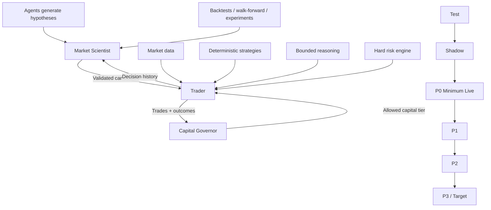

---

# 2. Design Principles

## 2.1 Survival precedes optimization

The system objective is not:

> maximize winning trades.

It is:

> **maximize risk-adjusted expected return subject to explicit survival constraints.**

The priority order is:

1. Do not allow infrastructure failure to create uncontrolled exposure.
2. Do not trade when the system cannot establish trustworthy market or account state.
3. Do not trade without a validated source of expected edge.
4. Preserve capital when model uncertainty or regime uncertainty rises.
5. Exploit validated edge within predefined risk limits.
6. Search continuously for better edge through controlled experimentation.

The CFTC explicitly warns that AI cannot predict sudden market changes and that claims of guaranteed or extraordinary algorithmic returns should be treated skeptically. That warning is directly relevant to our design philosophy: model sophistication must not be confused with certainty.  
Source: [CFTC — AI Won’t Turn Trading Bots into Money Machines](https://www.cftc.gov/LearnAndProtect/AdvisoriesAndArticles/AITradingBots.html)

---

## 2.2 Deterministic authority over probabilistic reasoning

A language/reasoning model may recommend:

- `APPROVE`
- `REJECT`
- `REDUCE_SIZE`
- `DEFER`

It may not:

- submit a raw broker order,
- raise an exposure limit,
- remove a stop,
- turn off a kill switch,
- alter account-level drawdown rules,
- modify a production strategy in place,
- promote a candidate strategy,
- or conceal/erase evidence.

Every model recommendation passes through deterministic software.

---

## 2.3 Abstention is a first-class action

Low confidence should not mean:

> “ask the AI until someone produces a trade.”

Often the correct output is:

> `NO_TRADE`.

A useful initial decision topology is:

|                Deterministic confidence | Default behavior               |
| --------------------------------------: | ------------------------------ |
|                                Very low | Reject / abstain               |
|                           Low-to-medium | Optional bounded investigation |
|                                    High | Eligible for risk review       |
|         Any confidence + risk violation | Reject                         |
| Any confidence + unhealthy system state | Reject / halt                  |

The exact numeric thresholds must be learned from calibration data rather than selected aesthetically.

---

## 2.4 The AI must prove incremental value

“Agentic reasoning sounds useful” is not a performance metric.

For each agent intervention, calculate:

```text
Agent Incremental Value
    =
Actual outcome with intervention
    -
Counterfactual baseline outcome
    -
Incremental execution costs
    -
Inference / data costs
```

An AI component that creates compelling explanations but worsens expectancy should be removed.

---

## 2.5 Production is immutable; research is generative

An agent may produce:

```text
strategy_mes_intraday_v17_candidate
```

but cannot overwrite:

```text
strategy_mes_intraday_v16_production
```

A candidate moves through a fixed lifecycle:

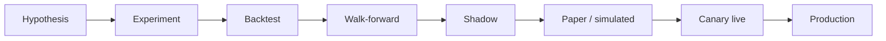

Promotion is governed by objective criteria and independent validation.

---

# 3. Why Start With Equity-Index Futures?

The initial market should satisfy several criteria simultaneously:

- enough movement to create an opportunity set,
- high liquidity,
- a mature electronic market,
- accessible historical data,
- a small set of interpretable market variables,
- no requirement for expensive alternative datasets,
- and a small enough contract for controlled live deployment.

## 3.1 Candidate families

| Market family                | Strengths                                                                          | Main drawback for v0                                                   | v0 verdict       |
| ---------------------------- | ---------------------------------------------------------------------------------- | ---------------------------------------------------------------------- | ---------------- |
| S&P 500 equity-index futures | Deep benchmark market, strong historical ecosystem, broad systematic applicability | Highly competitive                                                     | **Preferred**    |
| Nasdaq-100 futures           | More movement / tech sensitivity                                                   | Potentially more volatile and regime-sensitive                         | Candidate later  |
| Treasury futures             | Deep, systematic                                                                   | Macro-event interpretation can dominate                                | Later            |
| Crude oil                    | Strong intraday movement                                                           | Inventory/geopolitics/physical-market context matters                  | Later            |
| Gold                         | Liquid, macro-sensitive                                                            | USD/rates/geopolitical context often material                          | Later            |
| Agricultural futures         | Rich structure                                                                     | Seasonality, crop reports, delivery mechanics, specialized domain data | Not v0           |
| Crypto futures               | 24/7, rich data                                                                    | Different venue/market structure, fragmented spot context              | Separate project |

This is a **research prioritization**, not a statement that ES/MES is easier to beat. Highly liquid index futures are also highly competitive. The attraction is that the _engineering problem is well constrained_ and the data required to falsify ideas is available.

---

# 4. Initial Slice: Intraday ES/MES Market-State Trading

## 4.1 Problem definition

The initial research question is:

> **Given the current intraday S&P 500 futures market state, is there a statistically favorable short-horizon position over approximately the next 1–30 minutes?**

We are deliberately **not** initially trying to predict:

- the market close,
- overnight gaps,
- multi-day macro direction,
- company earnings,
- Fed policy,
- individual stocks,
- or broad narrative sentiment.

The system instead learns conditional behavior from market microstructure and recent state.

---

## 4.2 Proposed market states

The market-state classifier can begin with interpretable labels such as:

```text
TRENDING_UP
TRENDING_DOWN
MEAN_REVERTING
RANGE_BOUND
BREAKOUT
FAILED_BREAKOUT
VOLATILITY_EXPANSION
VOLATILITY_COMPRESSION
LIQUIDITY_DISLOCATION
TRANSITION
UNKNOWN
NO_TRADE
```

These labels are research constructs, not truths. We should expect to revise, split, merge, or eliminate them after observing their predictive usefulness.

---

## 4.3 Initial trading session

CME lists Micro E-mini equity-index futures for nearly 24-hour trading during the trading week. CME's current FAQ gives trading hours of **Sunday–Friday, 6:00 p.m.–5:00 p.m. ET, with a 4:15–4:30 p.m. ET trading halt**.  
Source: [CME — Micro E-mini Equity Index Futures FAQ](https://www.cmegroup.com/articles/faqs/micro-e-mini-equity-index-futures-frequently-asked-questions.html)

The v0 system should intentionally trade a much smaller window, for example:

```text
Primary research window:
09:35–15:45 ET

Potential focus windows:
09:45–12:00 ET
13:30–15:45 ET

Initially:
NO OVERNIGHT POSITIONS
```

These are **our risk/research restrictions**, not exchange trading-hour constraints.

The reasons are practical:

- simpler session boundaries,
- easier P&L attribution,
- lower overnight gap exposure,
- more direct linkage to U.S. cash-equity activity,
- easier operational supervision during early production.

We should validate whether narrower windows improve expectancy rather than assuming they do.

---

# 5. ES as Information Market; MES as Execution Instrument

## 5.1 Contract facts

CME specifies MES as:

- product code: `MES`,
- contract multiplier: **$5 × S&P 500 Index**,
- outright minimum price increment: **0.25 index points**,
- dollar value per outright tick: **$1.25**,
- quarterly cycle tied to March/June/September/December,
- financially/cash settled.

Sources:

- [CME — MES Contract Specs](https://www.cmegroup.com/markets/equities/sp/micro-e-mini-sandp-500.contractSpecs.html)
- [CME — Micro E-mini FAQ](https://www.cmegroup.com/articles/faqs/frequently-asked-questions-micro-e-mini-equity-index-futures.html)
- [CME — Micro E-mini Product Overview](https://www.cmegroup.com/education/courses/understanding-micro-futures-contracts-at-cme-group/micro-e-mini-futures/micro-e-mini-equity-index-futures-products-overview)

CME describes the Micro E-mini products as one-tenth the size of their corresponding E-mini contracts. The conventional E-mini S&P 500 uses a `$50 × index` multiplier and a 0.25-point tick worth `$12.50`; MES uses the `$5 × index` multiplier and a 0.25-point tick worth `$1.25`.  
Source: [CME — Understanding Stock Index Futures](https://www.cmegroup.com/education/files/understanding-stock-index-futures.pdf)

---

## 5.2 Why observe ES?

The research system should ingest both ES and MES where practical.

Conceptually:

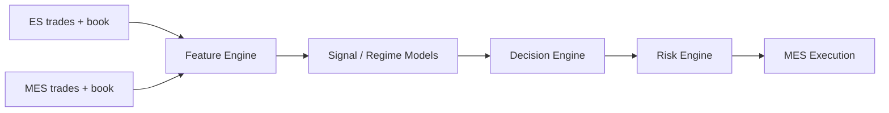

Potential use:

- **ES**: primary signal-generation and market-structure information.
- **MES**: execution-quality modeling and actual order placement.
- **Both**: detect temporary divergence, confirm state, and make the simulator instrument-correct.

This does **not** mean an ES fill can be assumed to represent an MES fill. MES execution must be simulated and evaluated from MES conditions.

---

## 5.3 MES is a sizing tool, not a safety guarantee

At an index level of `X`, one MES contract has approximate notional exposure:

```text
MES notional = X × $5
```

For example, if the index were 6,000:

```text
6,000 × $5 = $30,000 notional
```

Actual margin required is not the same as notional exposure and can vary with clearing/broker policies and conditions. A small posted margin does not make the economic exposure small.

Therefore:

> **Risk limits must be based on loss potential, exposure, volatility, and account equity—not merely on the broker's minimum margin requirement.**

---

# 6. Data Strategy

A central reason to choose this slice is that the required evidence can be generated primarily from market data.

## 6.1 Raw data families

### Trades

Capture:

- event timestamp,
- trade price,
- trade size,
- aggressor classification if derivable,
- sequence/order metadata where available,
- instrument,
- contract month.

### Quotes / top of book

Capture:

- best bid,
- bid size,
- best ask,
- ask size,
- spread,
- timestamp.

### Depth of book

Capture:

- price levels,
- quantity by level,
- additions,
- cancellations,
- modifications,
- queue/depth changes,
- book imbalance,
- liquidity replenishment/withdrawal.

### Time/session metadata

Capture:

- time since session start,
- time since U.S. cash open,
- day of week,
- contract roll state,
- scheduled session boundaries,
- holiday/shortened-session information.

### Derived cross-market data — optional later

Potentially:

- NQ/MNQ,
- RTY/M2K,
- Treasury futures,
- volatility products.

These should be treated as incremental features whose value must be demonstrated.

---

## 6.2 Historical data availability

CME advertises futures/options datasets ranging from top-of-book to full depth/order-by-order data and states that its historical archives span **40+ years overall**. The actual history available for a specific dataset/product varies.  
Source: [CME — Futures and Options Data](https://www.cmegroup.com/market-data/browse-data/catalog/futures-and-options-data.html)

CME's Market Depth documentation states that its depth files contain the messages necessary to recreate the order book for supported historical periods and notes that timestamp granularity is millisecond-level. It also explicitly says start dates depend on product.  
Source: [CME DataMine — Market Depth FAQ](https://www.cmegroup.com/market-data/files/cme-group-market-depth-faq.pdf)

This matters because:

> We should never write “40 years of ES order-book data” merely because CME has 40+ years of historical archives overall.

Dataset coverage must be verified **per product, field, and period** before an experiment is accepted.

---

## 6.3 Data provenance

Every record used in research should carry enough lineage to answer:

```text
Where did this value originate?
What was its source timestamp?
When did our system receive it?
Was it corrected later?
Which raw event produced this feature?
Which dataset/version was used?
```

Recommended metadata:

```typescript
interface MarketEventMeta {
  source: string;
  venue: string;
  instrument: string;
  contract: string;

  exchangeTimestamp: string;
  receiveTimestamp?: string;

  sequenceNumber?: string;
  datasetVersion: string;

  ingestionRunId: string;
  checksum?: string;
}
```

---

# 7. Feature Engine

We should begin with interpretable features before using higher-dimensional representation learning.

## 7.1 Price / return features

Examples:

- 1s / 5s / 30s / 1m / 5m return,
- log return,
- acceleration,
- distance from session VWAP,
- distance from moving VWAP,
- distance from prior day high/low,
- distance from opening range,
- local high/low structure,
- range position,
- realized excursion.

---

## 7.2 Volume features

Examples:

- current volume,
- volume rate,
- relative volume vs same time-of-day history,
- rolling volume percentile,
- buy/sell volume estimate,
- volume acceleration,
- volume-at-price concentration.

---

## 7.3 Volatility features

Examples:

- rolling realized volatility,
- ATR-like intraday range measures,
- high-low range,
- volatility percentile,
- short/long volatility ratio,
- range-expansion rate,
- volatility-of-volatility.

---

## 7.4 Order-flow features

Examples:

- bid/ask size imbalance,
- depth imbalance by level,
- aggressive buy/sell imbalance,
- trade-sign imbalance,
- cancellation intensity,
- replenishment rate,
- spread state,
- liquidity withdrawal,
- queue turnover.

Care is required: derived order-flow signals can be highly sensitive to feed semantics and reconstruction correctness.

---

## 7.5 Market-structure features

Examples:

- opening-range break state,
- VWAP reclaim/rejection,
- trend persistence,
- failed high/low breakout,
- compression after impulse,
- breakout after compression,
- distance from session extremes,
- rate of new highs/lows,
- micro pullback magnitude.

---

## 7.6 Time features

Examples:

- seconds since 09:30 ET,
- session bucket,
- lunch period,
- close proximity,
- day of week,
- roll proximity,
- holiday session.

---

# 8. Initial Strategy Family

We should not start with 50 strategies. We should begin with a few interpretable families that can be falsified.

## Strategy A — Trend continuation after controlled pullback

Hypothesis:

> When a sufficiently strong intraday trend is confirmed by price, volume, and order flow, a controlled pullback toward VWAP/short-term fair value may have positive continuation expectancy.

Illustrative conditions:

```text
trend_strength > threshold
relative_volume > threshold
price > VWAP
pullback_depth within allowed range
order_flow recovers in trend direction
spread/liquidity healthy
not too extended from reference
```

---

## Strategy B — Failed breakout reversal

Hypothesis:

> A breakout through a recent structural extreme that rapidly loses order-flow confirmation and re-enters the prior range may have short-horizon reversal expectancy.

Potential features:

- breakout distance,
- time outside range,
- volume confirmation,
- depth withdrawal/replenishment,
- aggressive trade imbalance,
- re-entry speed.

---

## Strategy C — Volatility compression → expansion

Hypothesis:

> Certain low-range/liquidity states followed by directional order-flow expansion produce predictable short-duration momentum.

This should be modeled probabilistically rather than with a simplistic “Bollinger squeeze = buy” rule.

---

## Strategy D — Excess deviation → mean reversion

Hypothesis:

> Under explicitly identified non-trending regimes, extreme deviation from intraday reference values may mean-revert.

The key qualifier is **regime**. A naive mean-reversion strategy is vulnerable to repeatedly fading a genuine trend.

---

## Strategy E — No-trade classifier

This may prove as valuable as any entry strategy.

Objective:

> Identify conditions in which otherwise valid-looking signals have historically produced poor or unstable expectancy.

Examples might include:

- abnormal spreads,
- rapidly changing volatility,
- insufficient depth,
- unstable regime classification,
- conflicting directional evidence,
- unmodeled session condition.

---

# 9. Deterministic Strategy Engine

Every strategy should emit a structured proposal, never a broker instruction.

```typescript
interface TradeProposal {
  proposalId: string;

  instrument: "MES";
  signalInstrument?: "ES";

  direction: "LONG" | "SHORT";
  strategyVersion: string;

  confidence: number;
  expectedReturn?: number;
  expectedRisk?: number;

  entry: {
    preferredType: "LIMIT" | "MARKETABLE_LIMIT";
    referencePrice: number;
    maxSlippageTicks: number;
  };

  stop: {
    policy: string;
    price?: number;
    maxLossUsd: number;
  };

  exit: {
    targetPrice?: number;
    maxHoldingTimeSeconds: number;
  };

  evidence: Record<string, number | string>;
  invalidationConditions: string[];

  createdAt: string;
  expiresAt: string;
}
```

This boundary is important:

```text
Strategy produces intent.
Risk determines permission.
Execution determines implementation.
Broker adapter performs transmission.
```

---

# 10. Confidence and Calibration

A confidence score is only useful if it is calibrated.

If a strategy emits `0.70`, that number needs an empirically defined meaning.

We should evaluate:

- reliability diagrams,
- Brier score or comparable calibration metrics,
- realized expectancy by confidence bucket,
- regime-conditioned calibration,
- strategy-specific calibration,
- stability over time.

Example:

| Confidence bucket | Trades | Expected P&L/trade | Actual P&L/trade | Calibration status |
| ----------------- | -----: | -----------------: | ---------------: | ------------------ |
| 0.50–0.60         |      — |                  — |                — | —                  |
| 0.60–0.70         |      — |                  — |                — | —                  |
| 0.70–0.80         |      — |                  — |                — | —                  |
| 0.80–0.90         |      — |                  — |                — | —                  |
| 0.90–1.00         |      — |                  — |                — | —                  |

No numeric confidence threshold should be considered permanent until this evidence exists.

---

# 11. Agentic Reasoning Architecture

Agentic reasoning should be separated into **live reasoning** and **slow research**.

---

# 12. Fast Trading Reasoner

## 12.1 Purpose

The fast reasoner handles ambiguous but potentially valuable situations.

It should receive a bounded **Market State Packet**, not unrestricted internet access.

Example:

```json
{
  "instrument": "ES",
  "time": "10:17:22.481-04:00",

  "state": {
    "regime": "VOLATILITY_EXPANSION",
    "regimeConfidence": 0.73,

    "vwapDistanceSigma": 0.84,
    "momentum5m": 0.72,
    "momentum15m": 0.48,
    "relativeVolume": 1.31,

    "bidAskImbalance": 0.17,
    "aggressiveFlowImbalance": 0.24
  },

  "proposal": {
    "strategy": "trend_pullback_v4",
    "direction": "LONG",
    "confidence": 0.63
  },

  "analogs": {
    "count": 50,
    "positive": 31,
    "negative": 14,
    "neutral": 5
  }
}
```

---

## 12.2 Agent roles

A small committee is preferable to a sprawling swarm.

### Researcher

Answers:

> What evidence is most relevant to this proposal?

### Advocate

Answers:

> What is the strongest evidence that the proposed trade is valid?

### Critic

Answers:

> What evidence suggests the proposal is wrong, mistimed, overextended, or regime-mismatched?

### Judge

Returns:

```typescript
type AgentDecision = "APPROVE" | "REJECT" | "REDUCE_SIZE" | "DEFER";
```

along with structured evidence.

---

## 12.3 Agent output

```typescript
interface AgentReview {
  proposalId: string;

  decision: "APPROVE" | "REJECT" | "REDUCE_SIZE" | "DEFER";

  confidence: number;

  supportingEvidence: EvidenceRef[];
  opposingEvidence: EvidenceRef[];

  primaryReasonCode: string;

  recommendedSizeMultiplier?: number;

  expiresAt: string;

  modelVersion: string;
  promptVersion: string;
  contextHash: string;
}
```

Free-form explanation can be retained for debugging, but downstream systems should consume structured fields.

---

## 12.4 What the fast agent cannot do

The fast agent cannot:

```text
search arbitrary websites
change account limits
change strategy code
change production prompts
submit broker orders
disable stops
increase size above deterministic allowance
extend its own decision TTL
erase prior decisions
```

A future strategy may deliberately add approved news/event data, but v0 should prove value without it.

---

# 13. Historical Analogue Retrieval

A particularly attractive use of reasoning is to provide the model with nearby historical states.

Given current state vector `S`, retrieve historically similar states under strict point-in-time constraints.

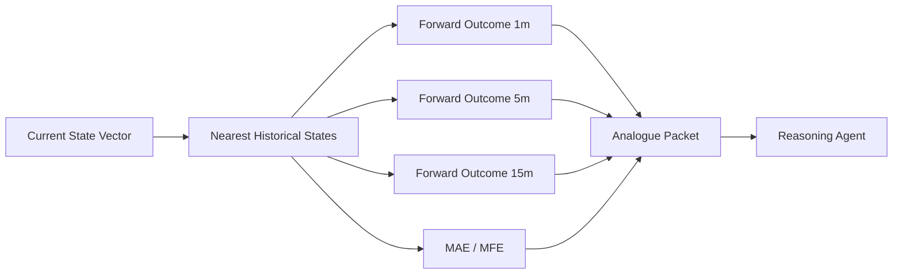

Important:

The model must not receive outcome fields for the current trade. Historical outcome data is allowed only for genuinely historical analogues.

---

# 14. Slow Research Agent

The slow agent is more ambitious.

Its job is not to make today's trade.

Its job is:

> **operate an automated scientific process over our accumulated market and trading history.**

Inputs can include:

- all raw/derived market states,
- every candidate signal,
- every executed trade,
- every rejected trade,
- every agent intervention,
- counterfactual outcomes,
- fill-quality diagnostics,
- model calibration,
- drawdown periods,
- regime performance,
- strategy/version lineage.

Example research prompt:

```text
Strategy trend_pullback_v4 has underperformed its expected
distribution over the last 15 sessions.

Determine whether the degradation is:
1. statistical noise,
2. execution deterioration,
3. regime shift,
4. feature drift,
5. strategy overfit,
6. data/infrastructure defect,
or another explainable cause.

Generate falsifiable hypotheses.
Do not modify production.
```

---

# 15. Automated Scientific Loop

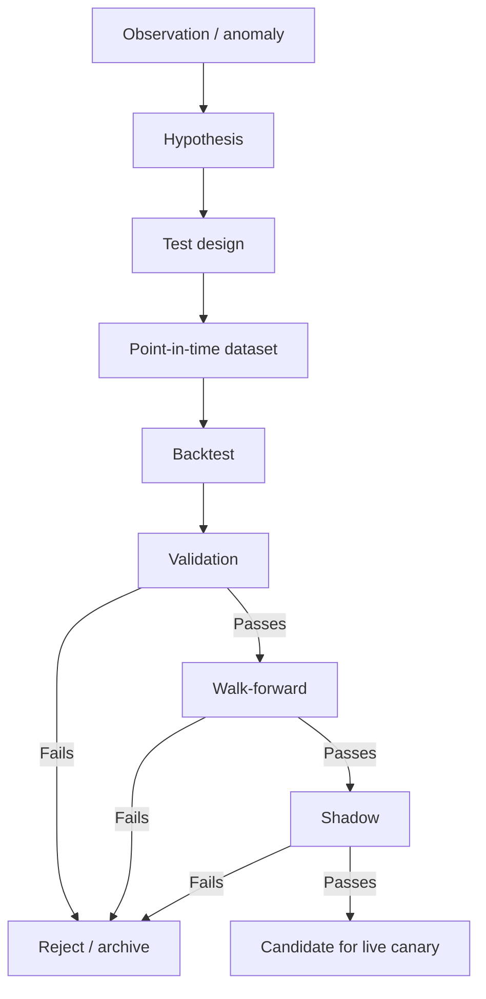

Every hypothesis must be falsifiable.

Bad:

> “Momentum seems stronger lately.”

Good:

> “For trend-pullback candidates between 09:45–11:00 ET, requiring relative volume > 1.4 and 5-minute realized-volatility percentile > 60 should improve net expectancy after estimated costs without increasing maximum drawdown beyond baseline.”

---

# 16. Experiment Registry

Every experiment should have a durable identity.

```typescript
interface Experiment {
  experimentId: string;

  hypothesis: string;

  parentStrategyVersion?: string;
  candidateStrategyVersion: string;

  trainingPeriod: DateRange;
  validationPeriod: DateRange;
  holdoutPeriod: DateRange;

  parameters: Record<string, unknown>;

  datasets: DatasetVersion[];

  costModelVersion: string;
  simulatorVersion: string;

  metrics: ExperimentMetrics;

  decision:
    | "REJECTED"
    | "NEEDS_REVIEW"
    | "SHADOW"
    | "PAPER"
    | "CANARY_ELIGIBLE";

  createdBy: "HUMAN" | "AGENT";
}
```

---

# 17. Backtesting Must Be Event-Driven

A vectorized return calculation is useful for exploratory research but is insufficient for deployment-grade validation.

The production backtester should replay market events through the same strategy logic used live.


---

# 18. Execution Simulation Requirements

A paper system that assumes every desired fill occurs at the displayed price will systematically overstate performance.

The simulator should support:

- bid/ask spread,
- marketable order slippage,
- limit-order queue assumptions,
- partial fills,
- order cancellations,
- order expiry,
- execution latency,
- exchange/broker fees,
- commissions,
- rejected orders,
- duplicate-event protection,
- contract rolls,
- session transitions,
- price gaps.

Queue simulation may be approximate unless the dataset provides sufficient order-level information, but the approximation must be conservative and versioned.

---

# 19. Point-in-Time Correctness

This is non-negotiable.

A simulation at:

```text
2025-04-03 10:32:00 ET
```

may only use information that would have been available to the production system by that point.

This applies to:

- raw market data,
- derived features,
- contract-roll knowledge,
- event calendars,
- cross-market information,
- agent context,
- model parameters,
- historical analogue indexes.

Any revision or hindsight data must preserve the original as-known-at timestamp.

---

# 20. Preventing Research Bias

The research platform should explicitly defend against:

## Look-ahead bias

Future data accidentally enters a current decision.

## Survivorship bias

Mostly relevant when incorporating securities universes or external reference datasets.

## Data snooping / multiple testing

If agents run thousands of hypotheses, some will look exceptional by chance.

## Overfitting

A strategy fits a specific period but fails outside it.

## Regime leakage

Training and validation contain nearly identical adjacent conditions.

## Cost underestimation

A raw edge disappears after spread, slippage, fees, and latency.

## Strategy-selection bias

Only successful experiments are remembered.

Therefore the experiment registry must preserve **failures as well as successes**.

---

# 21. Validation Framework

A candidate strategy should face several validation layers.

## 21.1 Train / validation / holdout

Example structure:

```text
TRAIN       learn parameters / hypotheses
VALIDATION  tune limited choices
HOLDOUT     untouched final historical test
```

The exact dates should move through multiple walk-forward windows.

---

## 21.2 Walk-forward testing

Instead of one historical split:

```text
Train A → Test A
Train B → Test B
Train C → Test C
...
```

This lets us inspect stability through changing regimes.

---

## 21.3 Perturbation testing

A robust strategy should not collapse if:

- entry threshold changes slightly,
- execution latency increases,
- slippage rises,
- trade time moves by seconds,
- one feature is mildly noisy,
- position sizing is reduced.

A razor-thin parameter optimum is suspicious.

---

## 21.4 Cost stress

Evaluate under:

```text
base cost
1.25× cost
1.5× cost
2× cost
```

A strategy whose entire expectancy disappears under a modest cost increase deserves skepticism.

---

## 21.5 Regime slices

Evaluate independently across:

- high volatility,
- low volatility,
- trend days,
- range days,
- high volume,
- low volume,
- opening period,
- midday,
- closing period,
- roll periods.

---

# 22. Two Major Capital Phases

The entire platform should encode two top-level environments:

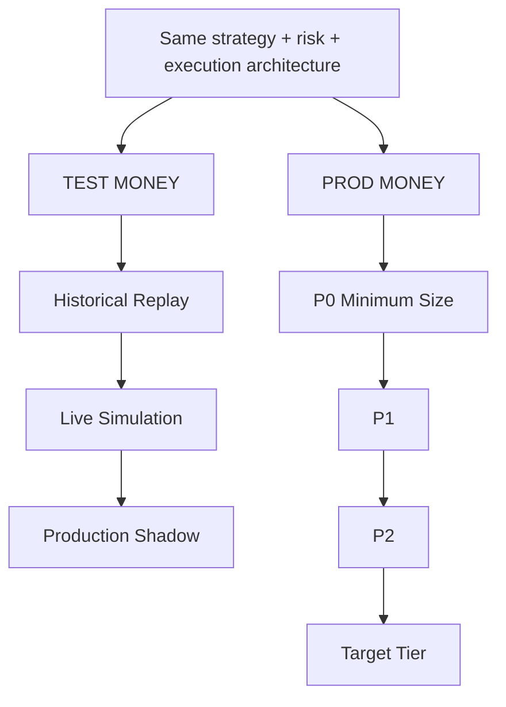

The strategy code should not contain ad hoc branches such as:

```python
if paper_mode:
    behave_differently()
```

Instead, the execution adapter changes.

---

# 23. Phase I — TEST MONEY

## 23.1 Stage I-A: Historical replay

Purpose:

- discover candidate edges,
- validate implementation,
- calibrate features,
- test risk behavior,
- quantify cost sensitivity,
- run agent-driven experiments.

The replay system should use a simulated clock and reproduce the exact ordering that the live system expects.

---

## 23.2 Stage I-B: Live simulated trading

The system consumes real live market data but orders terminate inside a simulated broker.


The simulator should intentionally err toward conservative assumptions.

---

## 23.3 Stage I-C: Production shadow

The exact production path is exercised, including the real broker integration, but transmission is blocked at the final boundary.


This is where we verify:

- order construction,
- account mapping,
- contract mapping,
- reconciliation paths,
- broker status handling,
- connection behavior,
- idempotency,
- observability,
- and kill-switch logic.

---

# 24. TEST MONEY Graduation

The system should not graduate because “it made money for three months.”

Graduation requires **evidence quality + system quality + risk quality + performance quality**.

Illustrative scorecard:

| Dimension   | Metric                                | Requirement type       |
| ----------- | ------------------------------------- | ---------------------- |
| Sample      | Number of live candidate signals      | Minimum                |
| Sample      | Number of simulated executions        | Minimum                |
| Time        | Distinct live-market months           | Minimum                |
| Regimes     | Volatility/trend/range coverage       | Required               |
| Performance | Net expectancy after costs            | Positive               |
| Risk        | Maximum drawdown                      | Within design          |
| Stability   | Profitable/acceptable rolling windows | Threshold              |
| Calibration | Confidence calibration                | Threshold              |
| Execution   | Sim-vs-observed fill assumptions      | Within tolerance       |
| Agent       | Incremental alpha vs baseline         | Positive / justified   |
| Reliability | Unexplained reconciliation errors     | Zero                   |
| Reliability | Risk-control failures                 | Zero                   |
| Operations  | Unhandled production-path incidents   | Zero before graduation |

The exact numerical thresholds should be chosen only once enough data exists to set them rationally.

---

# 25. Phase II — PROD MONEY

Production should itself contain multiple tiers.

```text
P0 = minimum meaningful live size
P1 = small allocation
P2 = moderate allocation
P3 = target allocation
```

For MES, P0 can plausibly begin at a single contract because of the smaller contract unit, subject to account/risk design.

---

# 26. P0: Reality-Gap Testing

P0 exists primarily to answer:

> **Where does live reality differ from our simulator?**

Track:

```text
predicted fill          vs actual fill
predicted slippage      vs actual slippage
predicted fees          vs actual fees
predicted rejection     vs actual rejection
expected latency        vs actual latency
simulated P&L           vs actual P&L
```

Define a **Reality Gap** dashboard.

A large unexplained gap should block scale-up even if live P&L happens to be positive.

---

# 27. Capital Promotion

Promotion should depend on evidence, not elapsed time.

Conceptually:

```typescript
eligibleToPromote =
  enoughLiveTrades &&
  enoughCalendarCoverage &&
  positiveNetExpectancy &&
  drawdownWithinExpectedRange &&
  realityGapWithinTolerance &&
  noRiskViolations &&
  systemReliabilityHealthy;
```

Each promotion is an explicit event with:

- source tier,
- destination tier,
- evidence snapshot,
- metric versions,
- approver/policy version,
- effective timestamp.

---

# 28. Capital Demotion

Scaling must work in reverse.

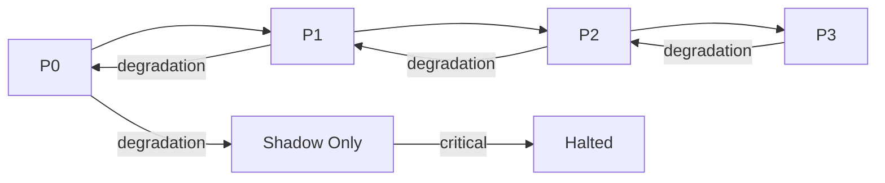

Triggers may include:

- drawdown breach,
- execution deterioration,
- confidence/calibration drift,
- feature-distribution drift,
- unexpected strategy behavior,
- broker reconciliation errors,
- market data degradation,
- order reject anomalies,
- risk incident,
- infrastructure incident.

---

# 29. Risk Architecture

Risk should be layered and independently enforceable.

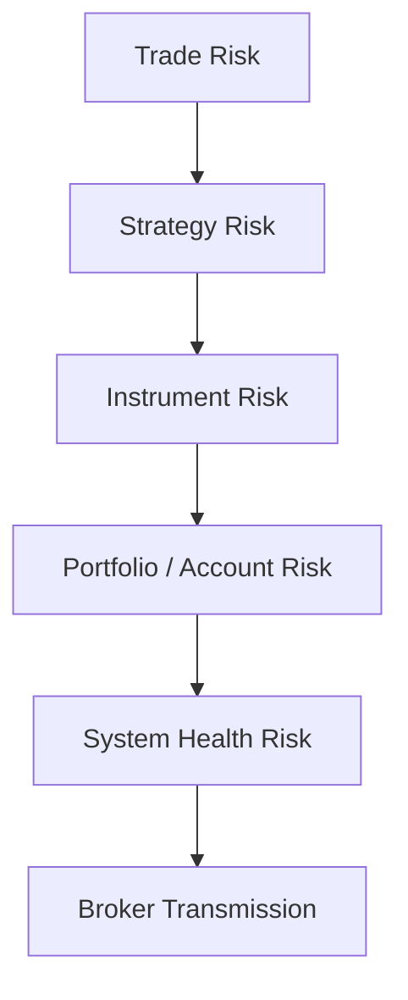

---

## 29.1 Trade-level controls

Potential controls:

- maximum allowed loss per trade,
- maximum contracts,
- required stop policy,
- maximum holding period,
- maximum slippage,
- signal expiration,
- minimum liquidity,
- maximum spread,
- duplicate proposal rejection.

---

## 29.2 Strategy-level controls

Potential controls:

- maximum concurrent exposure,
- maximum strategy daily loss,
- maximum strategy drawdown,
- maximum trade frequency,
- cooldown after repeated losses,
- regime eligibility.

---

## 29.3 Instrument-level controls

Potential controls:

- maximum net MES position,
- maximum order size,
- maximum notional exposure,
- contract-roll restrictions,
- expiry restrictions,
- liquidity thresholds.

---

## 29.4 Account-level controls

Potential controls:

- maximum account daily loss,
- maximum account weekly loss,
- maximum peak-to-trough drawdown,
- gross/net exposure caps,
- absolute maximum contracts.

---

## 29.5 System-health controls

Examples:

```text
market data stale         → HALT
broker disconnected       → HALT / reconcile
account state uncertain   → HALT
duplicate order detected  → BLOCK
clock drift excessive     → HALT
position mismatch         → HALT + reconcile
risk service unavailable  → FAIL CLOSED
```

The default failure posture should be **fail closed**, not “trade anyway.”

---

# 30. Kill Switch

There must be an independent mechanism capable of:

1. preventing new orders,
2. cancelling resting orders,
3. optionally flattening positions according to a predefined emergency policy,
4. marking the system `HALTED`,
5. requiring an explicit recovery workflow.

The kill switch should not depend on the reasoning agent being healthy.

---

# 31. Futures Position-Limit Compliance

The CFTC's federal position-limit regime primarily specifies federal limits for 25 physically settled core referenced commodity futures and related contracts. The CFTC also notes that for highly liquid financial futures, exchanges may use **position accountability** rather than the same type of federal speculative limit regime applied to certain physical commodities.

Sources:

- [CFTC — Position Limits for Derivatives](https://www.cftc.gov/IndustryOversight/MarketSurveillance/SpeculativeLimits/index.htm)
- [CFTC — Speculative Limits](https://www.cftc.gov/IndustryOversight/MarketSurveillance/SpeculativeLimits/speculativelimits.html)

For our system:

> Exchange, broker/FCM, account, and regulatory restrictions must be pulled into the risk configuration relevant to the actual account and contract. We should not hard-code a generic “CFTC futures position limit” and assume it applies uniformly.

Our internal limits will initially be orders of magnitude tighter than any scale relevant to institutional position-limit concerns.

---

# 32. Execution Engine

The strategy never invokes the broker directly.


---

## 32.1 Trade intent

```typescript
interface TradeIntent {
  intentId: string;

  instrument: "MES";
  targetPosition: number;

  urgency: "LOW" | "NORMAL" | "HIGH";

  maxSlippageTicks: number;
  maxOrderQuantity: number;

  expiresAt: string;

  sourceProposalId: string;
  riskPolicyVersion: string;
}
```

---

## 32.2 Execution planner

If:

```text
current position = +1 MES
target position  = +2 MES
```

then the planner derives:

```text
required delta = BUY 1 MES
```

It then checks:

- spread,
- depth,
- allowed order type,
- price bands,
- slippage ceiling,
- order TTL,
- existing resting orders.

This design makes retries and reconciliation much safer than issuing raw `BUY`/`SELL` commands directly from strategy logic.

---

# 33. Order State Machine

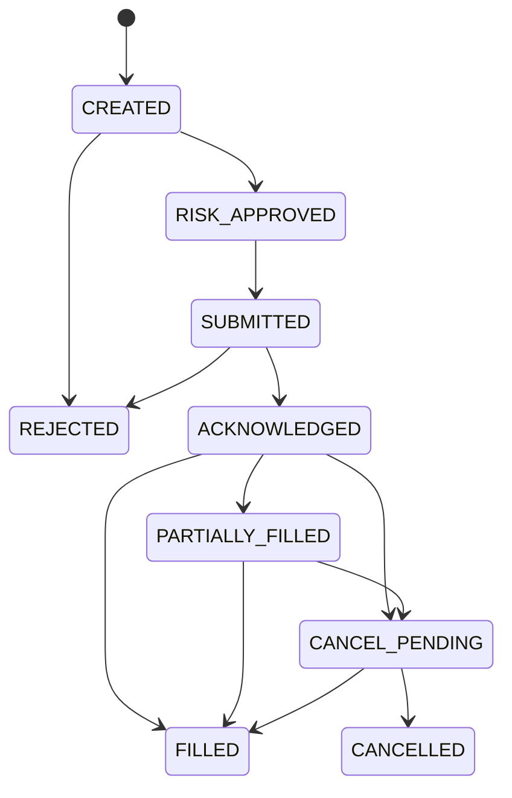

Every transition should be append-only and idempotent.

---

# 34. Reconciliation

At regular intervals and after any connectivity event:

```text
Our order state
vs
Broker order state

Our fills
vs
Broker fills

Our position
vs
Broker position

Our cash/equity estimate
vs
Broker account state
```

Any unexplained position mismatch is a high-severity event.

No new discretionary order should be allowed while account state is uncertain.

---

# 35. Immutable Decision Ledger

Every decision should be reconstructable later.

A single trade record should answer:

```text
What did the market look like?
Which raw events did we use?
Which features existed?
Which strategy version fired?
What confidence did it produce?
Was an agent invoked?
Which model/prompt/version?
What evidence did the agent see?
What did the agent recommend?
What did risk approve?
What order did execution create?
What did the broker acknowledge?
What actually filled?
Why did we exit?
What was P&L?
What would the baseline have done?
```

---

# 36. Example Decision Record

```text
TRADE #18,391
────────────────────────────────────────────
Instrument               MES
Direction                LONG
Quantity                 1
Time                     09:47:31 ET

Signal market            ES
Strategy                 trend_pullback_v4
Strategy confidence      0.64

Regime                   VOLATILITY_EXPANSION
Regime confidence        0.78

Agent invoked            YES
Agent decision           APPROVE
Agent confidence         0.77

Primary supporting evidence
  + directional order flow
  + relative volume
  + trend persistence

Primary opposing evidence
  - elevated VWAP distance

Risk budget              $X
Maximum slippage         Y ticks

Requested price          ...
Actual fill              ...
Realized slippage        ...

Exit reason              ...
Net P&L                   ...

COUNTERFACTUALS
Baseline/no-agent        ...
Full-size                ...
Delayed-entry            ...
Prior strategy version   ...
```

---

# 37. Counterfactual Engine

Counterfactuals are essential to the learning loop.

If the agent says:

```text
REJECT
```

we still track the proposed trade in simulation.

If the agent says:

```text
REDUCE_SIZE to 0.5×
```

track:

- actual 0.5× outcome,
- hypothetical 1.0× outcome,
- abstention outcome.

If the production strategy is `v6`, keep `v5` and strong challengers running in shadow.

This creates a persistent **champion/challenger** framework.

---

# 38. Observability

Observability should cover four planes.

## Market-data health

- event rate,
- quote age,
- sequence gaps,
- feed disconnects,
- timestamp delay,
- book reconstruction errors.

## Strategy health

- signals/hour,
- confidence distribution,
- feature distribution,
- regime distribution,
- no-trade rate,
- expected value.

## Execution health

- submit latency,
- acknowledgement latency,
- fill latency,
- slippage,
- rejection rate,
- cancel rate,
- partial-fill rate.

## Portfolio/risk health

- realized/unrealized P&L,
- current exposure,
- risk budget usage,
- drawdown,
- loss streak,
- kill-switch state.

---

# 39. Distributed Tracing

A trade should have one correlation ID across:

```text
market event
→ feature computation
→ signal
→ agent invocation
→ risk decision
→ order plan
→ broker request
→ acknowledgement
→ fill
→ portfolio update
```

This turns “why did we enter this trade?” from a forensic investigation into a query.

---

# 40. Core Dashboards

## Dashboard A — Command Center

Show:

- environment: `TEST / SHADOW / PROD`,
- production tier,
- market-data health,
- broker health,
- risk state,
- current position,
- realized/unrealized P&L,
- active orders,
- current strategy versions,
- kill-switch status.

## Dashboard B — Strategy

Show:

- rolling expectancy,
- Sharpe/Sortino-like risk-adjusted measures where statistically meaningful,
- maximum drawdown,
- profit factor,
- win/loss distribution,
- regime breakdown,
- confidence calibration,
- turnover,
- estimated vs realized costs.

## Dashboard C — Agent Attribution

Show:

- total interventions,
- approval count,
- rejection count,
- reduce-size count,
- defer count,
- value added by action,
- value lost by action,
- inference cost,
- net incremental value.

## Dashboard D — Reality Gap

Show:

- predicted vs real slippage,
- predicted vs real latency,
- predicted vs real fill probability,
- simulated vs live P&L divergence.

## Dashboard E — Research

Show:

- active experiments,
- hypotheses,
- agent-generated experiments,
- rejected experiments,
- shadow candidates,
- promotion readiness.

---

# 41. Metrics That Matter

Do not over-index on win rate.

A strategy can win frequently and still have negative expectancy.

Core metrics:

```text
net P&L
net expectancy per trade
expected value after costs

max drawdown
drawdown duration

profit factor

average winner
average loser
winner/loser ratio

tail loss
worst day
worst rolling 5-day period

turnover
slippage
fees

exposure time
trades/day

performance by regime
performance by time-of-day
performance by confidence

calibration

agent incremental value

sim-to-live reality gap
```

---

# 42. Learning Loop

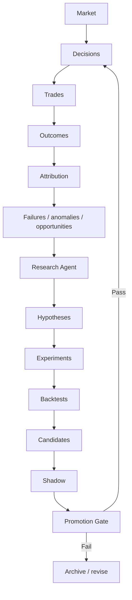

The crucial part:

> **Learning is continuous; production modification is gated.**

---

# 43. Promotion Gate for Strategy Versions

An illustrative—not final—policy might require:

```yaml
strategy_promotion:
  data_quality:
    known_critical_errors: 0

  backtest:
    minimum_sample: required
    net_expectancy_after_costs: positive
    drawdown_within_limit: true
    cost_stress_survived: true

  walk_forward:
    required: true
    stable_across_windows: true

  parameter_robustness:
    required: true

  shadow:
    required: true

  live_simulation:
    required: true

  manual_or_policy_approval:
    required: true
```

We should not prematurely pick impressive-looking universal Sharpe thresholds. Required metrics must reflect sample size, strategy horizon, autocorrelation, and selection bias.

---

# 44. Capital-Governor State Machine

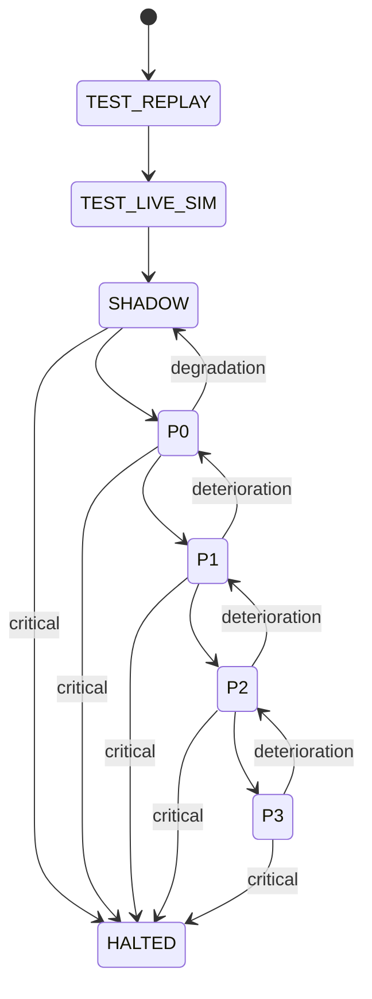

Capital-tier transitions should be recorded as immutable events.

---

# 45. Suggested Software Architecture

A pragmatic split:

```text
apps/
  web-dashboard
  cli

services/
  market-data
  feature-engine
  strategy-engine
  agent-reasoning
  experiment-engine
  risk-engine
  execution-engine
  broker-gateway
  portfolio
  capital-governor
  observability

workers/
  historical-replay
  live-simulation
  counterfactual
  research
  evaluation
  reconciliation

data/
  raw-market-store
  normalized-market-store
  feature-store
  event-ledger
  experiment-store
  model-registry

strategies/
  trend-pullback
  failed-breakout
  vol-expansion
  mean-reversion
  no-trade

models/
  regime-classifiers
  signal-models
  reasoning-agents

infra/
  event-bus
  scheduling
  metrics
  tracing
  secrets
```

---

# 46. Language / Runtime Split

A sensible implementation:

## Python

Prefer for:

- quantitative research,
- feature generation,
- event-driven backtesting,
- statistical modeling,
- ML,
- experimental analysis,
- agent orchestration.

## TypeScript / React

Prefer for:

- operator dashboard,
- experiment UI,
- trade explorer,
- observability views,
- control plane,
- administrative configuration.

The live latency requirements described here are on human-scale short-horizon strategies—not nanosecond HFT. That makes a carefully engineered Python live-research/strategy stack plausible, although latency should still be measured rather than assumed.

---

# 47. Event Model

A common envelope:

```typescript
interface EventEnvelope<T> {
  eventId: string;
  eventType: string;

  aggregateId?: string;
  correlationId: string;
  causationId?: string;

  eventTime: string;
  ingestTime: string;

  schemaVersion: number;

  environment: "REPLAY" | "SIM" | "SHADOW" | "PROD";

  payload: T;
}
```

Important event types:

```text
MarketEvent
FeatureSnapshot
RegimeChanged
SignalGenerated
TradeProposed
AgentReviewRequested
AgentReviewCompleted
RiskApproved
RiskRejected
TradeIntentCreated
OrderCreated
OrderSubmitted
OrderAcknowledged
OrderRejected
OrderPartiallyFilled
OrderFilled
OrderCancelled
PositionChanged
ExitTriggered
TradeClosed
CounterfactualResolved
RiskStateChanged
CapitalTierChanged
SystemHalted
ExperimentCreated
ExperimentCompleted
StrategyPromoted
StrategyDemoted
```

---

# 48. Storage Philosophy

Different workloads imply different stores.

## Raw market store

Optimized for:

- append-heavy time series,
- compression,
- deterministic replay,
- range scans.

## Feature store

Optimized for:

- point-in-time feature lookup,
- training datasets,
- live feature parity.

## Event ledger

Optimized for:

- immutable business/system events,
- audits,
- reconstruction.

## Experiment store

Optimized for:

- metrics,
- lineage,
- parameters,
- candidate comparisons.

The specific database technologies should be selected after measuring data volume and access patterns rather than choosing infrastructure first.

---

# 49. Model and Prompt Registry

Every model call that can affect a trade must record:

```text
provider/model
model version if available
temperature / reasoning configuration
prompt template version
system instructions hash
toolset version
input context hash
output schema version
latency
cost
```

A prompt change is effectively a strategy change and should be versioned accordingly.

---

# 50. Security

At minimum:

- broker credentials isolated from research agents,
- no raw broker secret in model context,
- environment-separated credentials,
- least-privilege service identities,
- signed/audited production configuration,
- production risk rules write-protected,
- kill switch outside reasoning path,
- complete audit log for configuration changes.

The research agent should be physically incapable—not merely instructed not—to access order-submission credentials.

---

# 51. Failure Modes and Expected Behavior

| Failure                              | Required response                              |
| ------------------------------------ | ---------------------------------------------- |
| Market feed stale                    | Block new trades                               |
| Market feed disconnect               | Halt strategy; reconcile on restore            |
| Feature service unavailable          | Block dependent strategies                     |
| Agent timeout                        | Follow deterministic fallback, usually abstain |
| Agent malformed output               | Ignore/reject agent recommendation             |
| Risk service unavailable             | Fail closed                                    |
| Broker disconnect                    | Halt new orders; reconcile                     |
| Position mismatch                    | Halt and reconcile                             |
| Duplicate signal                     | Idempotently reject                            |
| Duplicate broker request uncertainty | Reconcile before retry                         |
| Clock drift                          | Halt if beyond tolerance                       |
| Excessive slippage                   | Reduce/disable strategy                        |
| Daily loss breach                    | Lock trading per policy                        |
| Kill switch activated                | Cancel/block according to emergency policy     |

---

# 52. What We Explicitly Do Not Build in v0

To keep the scientific surface area manageable:

- no overnight positions,
- no options,
- no individual equities,
- no broad multi-asset portfolio,
- no fundamental stock research,
- no unrestricted news-browsing trading agent,
- no self-modifying production strategy,
- no autonomous risk-limit increases,
- no high-frequency market making,
- no microsecond-latency race,
- no capital promotion based solely on recent profits,
- no opaque end-to-end LLM deciding `BUY/SELL` directly from raw prose.

---

# 53. v0 Definition of Done

A credible v0 is not “the bot made a simulated profit.”

A credible v0 can:

1. ingest and normalize ES/MES market data,
2. replay historical events deterministically,
3. generate a small number of versioned strategy signals,
4. classify market regime,
5. produce calibrated trade proposals,
6. optionally route ambiguous proposals to a bounded reasoner,
7. enforce independent deterministic risk checks,
8. simulate instrument-correct MES execution,
9. retain every decision as immutable events,
10. generate counterfactual outcomes,
11. reproduce a trade exactly from historical events,
12. run continuously on live data in TEST mode,
13. reconcile internal state reliably,
14. present operator dashboards,
15. automatically halt under defined failure conditions.

No production capital is required for v0.

---

# 54. Build Sequence

## Milestone 0 — Research specification

Deliverables:

- exact data products,
- contract-roll policy,
- session definition,
- feature schema,
- cost model,
- initial strategy hypotheses,
- metric definitions.

## Milestone 1 — Data + replay

Build:

- raw ingestion,
- normalized event format,
- market clock,
- ES/MES replay,
- contract mapping,
- deterministic feature engine.

## Milestone 2 — Strategy laboratory

Build:

- first strategy families,
- no-trade classifier,
- experiment registry,
- walk-forward evaluation,
- cost stress,
- regime analytics.

## Milestone 3 — Execution simulator

Build:

- order state machine,
- fill simulator,
- slippage model,
- fees,
- latency,
- partial fills,
- position/P&L engine.

## Milestone 4 — Risk

Build:

- trade limits,
- strategy limits,
- account limits,
- health gates,
- kill switch,
- fail-closed behavior.

## Milestone 5 — Agent layer

Build:

- bounded market-state packets,
- historical analogue retrieval,
- advocate/critic/judge flow,
- structured output,
- counterfactual attribution.

## Milestone 6 — Live TEST MONEY

Connect:

- live data,
- simulator,
- dashboards,
- alerting,
- continuous reconciliation.

Run for months.

## Milestone 7 — Shadow production

Connect real broker infrastructure but block final transmission.

Validate complete production order path.

## Milestone 8 — P0 live

Deploy minimum allowed capital only after TEST promotion gates pass.

Measure Reality Gap.

## Milestone 9 — Capital scaling

Progress through P1/P2/P3 only through capital-governor rules.

---

# 55. Key Research Questions We Must Answer Empirically

The project should be organized around questions rather than assumptions:

1. Do the proposed intraday market states have stable predictive meaning?
2. Which strategy families retain positive expectancy after realistic costs?
3. How much of apparent edge survives unseen historical periods?
4. How much survives live simulation?
5. How sensitive is edge to execution assumptions?
6. Does ES information measurably improve MES trading?
7. Does order-book depth add value beyond simpler trade/quote data?
8. At which horizons does edge exist?
9. Which times of day are useful?
10. Which regimes should produce `NO_TRADE`?
11. Does agentic review add incremental expectancy?
12. Which types of agent intervention add or destroy value?
13. Does historical-analogue retrieval help?
14. How stable is confidence calibration?
15. What is the sim-to-live Reality Gap?
16. At what size does execution degradation become meaningful?
17. When should the capital governor automatically reduce exposure?

---

# 56. Research Standards

A claim should not become a system rule because it is intuitive.

Each accepted claim should record:

```text
Hypothesis
Dataset
Time period
Sample size
Cost model
Backtest version
Result
Confidence / uncertainty
Out-of-sample result
Regime sensitivity
Known limitations
```

The phrase:

> “This usually works”

should be treated as an unresolved hypothesis.

---

# 57. Regulatory and Operational Notes

This project is intended for trading the owner's own account. If its scope changes to managing external capital, giving commodity-trading advice to others, operating a pooled vehicle, or offering signals/services, additional regulatory questions can arise. Those questions should be reviewed with qualified legal/compliance counsel before such a change.

For the trading system itself, the engineering posture should mirror good automated-trading controls regardless of whether a particular institutional rule directly applies to this personal account:

- pre-trade limits,
- order-size controls,
- position/exposure controls,
- testing before production,
- monitoring,
- kill mechanisms,
- auditability.

The CFTC has historically emphasized risk controls, testing, monitoring, and mechanisms for disabling automated trading systems in its automated-trading policy work. We should adopt those principles voluntarily because they are sound system design.

---

# 58. Verified Facts vs Research Hypotheses

This distinction should remain visible throughout the project.

## Verified external facts

- MES is `$5 × S&P 500 Index`.
- MES has a 0.25-point outright minimum tick, worth `$1.25`.
- Micro E-mini equity-index futures follow quarterly expirations.
- CME lists Micro E-mini equity-index futures for near-24-hour weekday trading.
- CME offers historical futures data including top-of-book and granular depth/order-oriented products.
- Historical coverage varies by product/dataset.
- Futures are leveraged instruments.
- Relevant exchange/broker/regulatory constraints exist and must be checked for the actual account.

## Research hypotheses — **not facts**

- ES/MES intraday patterns contain exploitable alpha for us.
- Order flow will materially improve our strategy.
- Historical analogue retrieval improves decisions.
- Agentic reasoning improves expectancy.
- Mean-reversion or momentum strategies will work.
- 1–30 minutes is the optimal horizon.
- The suggested time windows are superior.
- Our simulator will accurately predict fills.
- Strategy performance will survive live deployment.

The entire architecture exists to **test these hypotheses without risking meaningful capital prematurely**.

---

# 59. Canonical Product Requirement

> **Build an autonomous intraday S&P 500 futures research and trading system that learns short-horizon market-state patterns primarily from price, volume, volatility, liquidity, order flow, market structure, and time-of-day. The system may use the highly liquid ES market as a primary source of market information and initially expresses live positions through the smaller MES contract.**
>
> **The system combines deterministic quantitative strategies with bounded model reasoning while keeping order execution, exposure, position sizing, loss limits, system-health controls, and kill switches under deterministic authority.**
>
> **The project begins entirely in a TEST MONEY environment composed of historical event replay, live simulated execution, and production shadowing. It remains there for months while strategies and infrastructure are validated across multiple market regimes. Only after explicit promotion gates pass may a strategy enter PROD MONEY.**
>
> **Production capital is introduced incrementally through predefined tiers. Promotion requires sufficient live evidence, acceptable drawdown and execution behavior, a small sim-to-live Reality Gap, and zero unresolved risk/infrastructure violations. Deterioration automatically reduces capital or returns a strategy to shadow-only mode.**
>
> **Every market state, signal, model decision, agent intervention, risk decision, order, fill, rejected trade, capital-tier change, strategy version, and counterfactual is retained. A separate autonomous research system continuously analyzes this history, generates falsifiable hypotheses, and runs experiments, but cannot modify or promote production strategies without passing independent validation gates.**

---

# 60. Final System Mental Model

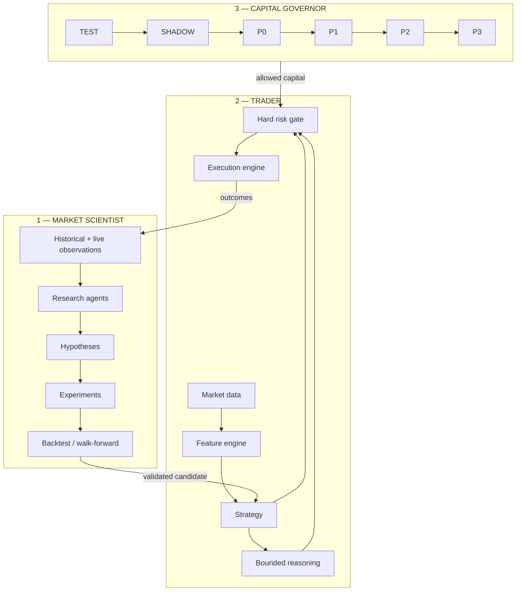

The operating philosophy is:

```text
RESEARCH aggressively.
TEST skeptically.
ABSTAIN freely.
RISK deterministically.
DEPLOY gradually.
MEASURE everything.
PROMOTE reluctantly.
DEMOTE automatically.
```

---

# 61. Primary Sources / Fact-Check Ledger

The document intentionally favors primary exchange/regulatory sources for contract and regulatory facts.

| Topic                                   | Primary source                                                                                                                                                                                              | Fact used                                                                       |
| --------------------------------------- | ----------------------------------------------------------------------------------------------------------------------------------------------------------------------------------------------------------- | ------------------------------------------------------------------------------- |
| MES contract multiplier / tick          | [CME MES Contract Specs](https://www.cmegroup.com/markets/equities/sp/micro-e-mini-sandp-500.contractSpecs.html)                                                                                            | `$5 × index`; 0.25-point minimum tick                                           |
| MES tick dollar value / quarterly cycle | [CME Micro E-mini FAQ](https://www.cmegroup.com/articles/faqs/frequently-asked-questions-micro-e-mini-equity-index-futures.html)                                                                            | 0.25 = $1.25; quarterly contract cycle                                          |
| Micro contract sizing                   | [CME Micro E-mini Product Overview](https://www.cmegroup.com/education/courses/understanding-micro-futures-contracts-at-cme-group/micro-e-mini-futures/micro-e-mini-equity-index-futures-products-overview) | Micro multiplier relationship and cash-settlement overview                      |
| Current Micro E-mini hours              | [CME Micro E-mini FAQ](https://www.cmegroup.com/articles/faqs/micro-e-mini-equity-index-futures-frequently-asked-questions.html)                                                                            | Near-24-hour weekly schedule                                                    |
| ES multiplier/tick                      | [CME Understanding Stock Index Futures](https://www.cmegroup.com/education/files/understanding-stock-index-futures.pdf)                                                                                     | `$50 × index`; 0.25 = $12.50                                                    |
| Historical data                         | [CME Futures and Options Data](https://www.cmegroup.com/market-data/browse-data/catalog/futures-and-options-data.html)                                                                                      | Top-of-book through granular depth; broad historical archive                    |
| Market depth details                    | [CME Market Depth FAQ](https://www.cmegroup.com/market-data/files/cme-group-market-depth-faq.pdf)                                                                                                           | Book reconstruction messages; millisecond timestamps; product-dependent history |
| Position-limit framework                | [CFTC Speculative Limits](https://www.cftc.gov/IndustryOversight/MarketSurveillance/SpeculativeLimits/speculativelimits.html)                                                                               | Federal/exchange position-limit and accountability framework                    |
| Federal position limits                 | [CFTC Position Limits for Derivatives](https://www.cftc.gov/IndustryOversight/MarketSurveillance/SpeculativeLimits/index.htm)                                                                               | Scope of federal core referenced futures position limits                        |
| AI trading risk warning                 | [CFTC AI Trading Bots Advisory](https://www.cftc.gov/LearnAndProtect/AdvisoriesAndArticles/AITradingBots.html)                                                                                              | AI does not eliminate market uncertainty; beware guaranteed-return claims       |

---

## Next Design Artifact

The next document should be a narrower **`v0-quantitative-spec.md`** defining:

1. exact ES/MES datasets and resolutions,
2. contract-roll handling,
3. canonical schemas,
4. first feature set,
5. precise definitions for initial market regimes,
6. first 3–5 falsifiable strategy hypotheses,
7. fill/cost simulator design,
8. confidence-calibration methodology,
9. experiment protocol,
10. concrete TEST MONEY promotion metrics.

That is the point where implementation can begin without quietly embedding undefined trading assumptions.
