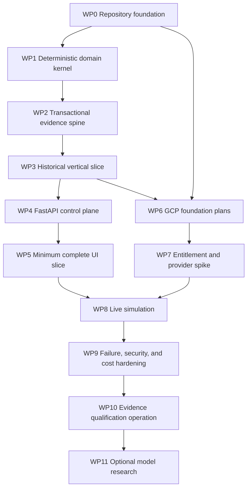

<!-- @format -->

# Sopara Implementation Plan

**Status:** Work Package 4 complete — awaiting Chairman authorization for Work Package 5

**Version:** 0.6.0

**Date:** 2026-09-10

**Source contracts:** `docs/product.md`, `docs/architecture.md`, `docs/design.md`, `docs/business.md`

**Repository baseline:** Work Package 0 foundation built over initial commit `8d77883`; changes remain unstaged and uncommitted

> [!IMPORTANT]
> This plan authorizes only named work packages. Work Packages 0–4 were authorized and completed on 2026-09-10. They did not authorize GCP resource creation, market-data purchases, licensed ingestion, deployment, or externally reachable application behavior. Each later package requires Chairman authorization and must satisfy its exit criteria before a dependent package starts.

## 1. Delivery objective

Implement the smallest production-quality system that can:

1. register an entitled ES/NES dataset;
2. execute deterministic historical replay;
3. generate point-in-time proposals and `NO_TRADE` outcomes;
4. apply deterministic eligibility, risk, cost, and NES fill rules;
5. persist immutable decision and evidence records;
6. reproduce and reconcile every accepted result;
7. operate two bounded live-simulation windows on GCP;
8. remain private, single-owner, non-commercial, and incapable of real-order transmission;
9. complete 20 consecutive eligible, reconciled, observed-NES live-simulation sessions.

The delivery sequence optimizes for proof, not visible surface area. The first end-to-end slice uses synthetic fixtures and runs locally. No paid or licensed dependency is required to prove the domain spine.

## 2. Planning principles

1. Build one vertical slice before broadening feature coverage.
2. Keep domain logic independent of FastAPI, PostgreSQL, GCS, Cloud Run, and React.
3. Use real PostgreSQL in integration tests; do not treat SQLite as equivalent.
4. Treat local object-store adapters as test doubles, never production alternatives to GCS.
5. Make every state transition and rejection reason explicit and fixture-tested.
6. Store integers or exact decimals for prices, ticks, money, quantity, and nanosecond time.
7. Make idempotency, fencing, watermarks, and immutable evidence part of the first slice.
8. Generate transport types from FastAPI OpenAPI; do not hand-maintain parallel API models.
9. Introduce GCP resources only when a passing slice needs the managed boundary.
10. Keep licensed inputs, live sessions, BigQuery, and Vertex AI behind independent gates.
11. Finish one package with evidence before opening the next dependency.
12. Preserve all failed, rejected, invalid, and abstaining outcomes.

## 3. Implementation technology decisions

### 3.1 Python dependency and workspace management

#### Option A — one uv-managed Python project

Use one root `pyproject.toml`, one `uv.lock`, a `src/sopara` package, dependency groups for development and testing, and locked/frozen CI installs.

Benefits:

- matches the approved modular-monolith topology;
- one cross-platform lock records exact transitive versions;
- simple Docker layer caching and SBOM export;
- fewer package boundaries to police during the first vertical slice;
- avoids dependency leakage between nominal uv workspace members.

Failure modes:

- internal modules can import across boundaries without package-manager enforcement;
- one dependency set can grow if adapters are not kept optional;
- lock changes can be broad.

Controls:

- architecture import tests;
- domain package contains no framework imports;
- dependency groups for GCP, development, and testing;
- `uv lock --check` and frozen sync in CI;
- automated dependency graph review.

#### Option B — uv workspace with multiple Python packages

Create separate packages for domain, application, adapters, and deployable units under a shared workspace lock.

Benefits:

- explicit distribution boundaries;
- independent package metadata and import surfaces;
- useful if components later ship independently.

Failure modes:

- false microservice modularity without independent deployment need;
- more packaging and versioning work;
- uv workspaces share one environment and do not guarantee dependency isolation;
- circular package design can hide behind workspace wiring.

#### Recommendation

Option A. Enforce modularity through imports, ports, tests, and ownership before paying a multi-package tax.

### 3.2 PostgreSQL access layer

#### Option A — SQLAlchemy Core 2.x over psycopg 3

Use SQLAlchemy Core expressions and explicit repository queries with the psycopg async dialect. Do not use active-record models, lazy-loading relationships, or ORM-owned domain entities.

Benefits:

- explicit PostgreSQL transactions and constraints;
- composable typed table metadata for queries and migrations;
- connection pooling and FastAPI lifecycle integration;
- enough abstraction to test query construction without hiding SQL semantics;
- preserves access to `FOR UPDATE`, advisory locks, `SKIP LOCKED`, JSONB, arrays, and conflict clauses.

Failure modes:

- async implicit I/O or ORM patterns can leak into domain behavior;
- SQLAlchemy and Alembic metadata can become a second domain model;
- generated queries may be less obvious than hand-written SQL.

Controls:

- Core only in canonical repositories;
- repository integration tests assert concurrency and query plans where material;
- domain objects map explicitly at the adapter boundary;
- no database calls from domain modules.

#### Option B — direct psycopg 3 with hand-written SQL

Use psycopg pools, SQL composition, and row factories without SQLAlchemy.

Benefits:

- smallest runtime abstraction;
- SQL remains completely visible;
- direct control over PostgreSQL-specific behavior.

Failure modes:

- schema metadata, parameter typing, row mapping, and migration declarations become custom infrastructure;
- more repetitive query and test code;
- dynamic query composition is easier to get wrong;
- API and schema evolution require more manual coordination.

#### Recommendation

Option A, while treating SQLAlchemy as an adapter implementation rather than the domain model.

### 3.3 Schema migration ownership

#### Option A — Alembic with reviewed forward-only revisions

Alembic owns revision ordering and current-head inspection. Every generated migration is reviewed and committed as explicit operations. Destructive autogeneration is prohibited. Deployment renders offline SQL for review before applying the same revision through a dedicated migration identity.

Benefits:

- mature integration with SQLAlchemy metadata;
- explicit revision graph and environment checks;
- supports expand/backfill/switch/contract migrations;
- current-head validation is automatable.

Failure modes:

- autogenerate can propose destructive or incomplete changes;
- async migration configuration adds unnecessary complexity;
- downgrades can imply unsafe rollback confidence.

Controls:

- migrations run synchronously through a dedicated short-lived process;
- forward repair rather than downgrade in deployed environments;
- CI rejects multiple heads and unreviewed drop operations;
- blank-database upgrade and production-shaped upgrade fixtures both pass.

#### Option B — numbered hand-written SQL migrations

Maintain an application-owned migration ledger and ordered SQL files.

Benefits:

- complete SQL visibility;
- no autogeneration risk;
- minimal Python migration runtime.

Failure modes:

- custom locking, checksums, transaction behavior, and current-head tooling;
- higher probability of a home-grown migration runner bug;
- schema metadata can drift from queries.

#### Recommendation

Option A. Alembic provides the ledger; reviewed operations and PostgreSQL tests provide the safety.

### 3.4 Repository task interface

Use a small `Makefile` as the stable human and CI entrypoint. Targets call pinned tools through uv, Bun, and Terraform rather than installing global wrappers.

Required initial targets:

```text
make format
make lint
make typecheck
make test-unit
make test-integration
make test-contract
make test-ui
make test-e2e
make check
```

`make check` is the local pre-merge gate and must fail closed if any required tool, lock, schema, generated file, or test is missing.

## 4. Repository target topology

```text
.
├── AGENTS.md
├── Makefile
├── README.md
├── pyproject.toml
├── uv.lock
├── bunfig.toml
├── cloudbuild.yaml
├── Dockerfile
├── docs/
│   ├── idea.md
│   ├── product.md
│   ├── architecture.md
│   ├── design.md
│   ├── business.md
│   └── implementation-plan.md
├── src/sopara/
│   ├── domain/
│   ├── application/
│   ├── adapters/
│   │   ├── database/
│   │   ├── evidence/
│   │   ├── market_data/
│   │   ├── gcp/
│   │   └── observability/
│   ├── api/
│   ├── jobs/
│   └── settings/
├── migrations/
│   ├── versions/
│   └── env.py
├── web/
│   ├── components.json
│   ├── package.json
│   ├── bun.lock
│   ├── src/
│   └── tests/
├── contracts/
│   ├── openapi/
│   ├── events/
│   └── reason-codes/
├── fixtures/
│   ├── contracts/
│   ├── market-data/
│   ├── replay/
│   └── failures/
├── tests/
│   ├── unit/
│   ├── property/
│   ├── integration/
│   ├── contract/
│   ├── golden/
│   └── security/
├── infra/
│   ├── terraform/
│   │   ├── modules/
│   │   └── environments/
│   └── policies/
└── scripts/
```

This is one application repository, not a set of independently versioned services. Deployable commands import the same application package and select a composition root.

## 5. Dependency graph



`WP7` has an external contract track that may begin after plan approval, but licensed credentials cannot enter code or infrastructure until its rights gate passes.

## 6. Work Package 0 — repository foundation

### 6.1 Objective

Create a reproducible, testable repository skeleton without provisioning GCP or implementing business behavior.

### 6.2 Deliverables

- record the implementation technology decisions in an ADR;
- root Python 3.14 uv project and checked-in `uv.lock`;
- `src/sopara` module boundaries with import rules;
- test dependency groups and empty test-layer directories with collection checks;
- an empty `web/` target, followed by the exact frontend initialization command with the process working directory set to `web/` so the CLI cannot replace repository-root documentation:

```bash
bunx --bun shadcn@latest init --preset b3ZheXgQEs --template start --pointer
```

- inspect the generated diff before any normalization; preserve the preset output and remove only behavior that violates approved runtime boundaries;
- committed `components.json` proving Base UI and the approved preset;
- Bun lockfile with frozen installation checks;
- no Radix dependency or generated primitive;
- multi-stage Dockerfile producing a Python-only runtime image;
- Terraform formatting and static-validation skeleton with no applied resources;
- Cloud Build pipeline skeleton that calls the same checks as local development;
- license allowlist, SBOM commands, secret scan, and dependency audit hooks;
- `Makefile` with one trustworthy `make check` entrypoint;
- README setup, local prerequisites, commands, and explicit non-goals;
- architecture tests that prevent domain imports from adapters, FastAPI, SQLAlchemy, GCP, or frontend code.

### 6.3 Negative fixtures

- stale `uv.lock` fails;
- stale `bun.lock` fails;
- Radix package or import fails;
- TanStack server function or JavaScript database package fails;
- Bun or Node executable in the final image fails;
- framework import in `sopara.domain` fails;
- unknown or prohibited license fails;
- placeholder test directory with zero collected tests fails after its package becomes active.

### 6.4 Exit criteria

1. Clean clone setup is documented and reproducible.
2. `make check` runs the available foundation checks and returns zero.
3. Both lockfiles are immutable under CI commands.
4. The final container inspection finds Python and static assets but no Node/Bun runtime.
5. Terraform validation creates no resource and requires no GCP credential.
6. No application endpoint, database table, or cloud resource is claimed complete.

## 7. Work Package 1 — deterministic domain kernel

### 7.1 Objective

Implement pure domain types, policies, and state machines using synthetic fixtures only.

### 7.2 Domain modules

- instrument identity and contract metadata;
- exact tick, point, quantity, and money arithmetic;
- source event identity and ES/NES independent watermarks;
- exchange calendar, approved windows, early close, roll, and expiry policy;
- dataset package and entitlement snapshot values;
- experiment, strategy version, feature version, simulator version, cost version, and runtime manifest;
- proposal, eligibility decision, deterministic risk decision, simulated order, fill, position, and P&L;
- session, window, incident, recovery, and reconciliation states;
- canonical versus counterfactual authority;
- evidence class and qualification policy;
- stable reason-code catalogue.

### 7.3 Mandatory invariants

- one NES tick for one contract equals `$0.25`;
- an ES-valid price can still be rejected as off-grid for NES;
- pre-launch observed-NES evidence is impossible;
- synthetic proxy evidence cannot satisfy observed-NES qualification;
- identical input and version hashes yield identical results;
- risk and health rejection precede simulated order creation;
- model output has no canonical transition authority;
- an invalid or skipped eligible date resets the qualification streak;
- every state transition is legal, attributed, and serializable;
- no domain type can express a broker destination or real order.

### 7.4 Tests

- example tests for every state transition and reason code;
- property tests for price grids, P&L, ordering, idempotency keys, and ledger folds;
- timezone/DST/holiday/early-close fixtures;
- mutation-style tests proving guards are exercised;
- serialization compatibility fixtures for domain events.

### 7.5 Exit criteria

1. Domain tests run without network, database, filesystem, clock, random, or framework access.
2. All mandatory deterministic fixtures from architecture Section 20.2 have domain-level coverage where applicable.
3. Event and reason-code schemas are versioned under `contracts/`.
4. An import-boundary test proves domain purity.

## 8. Work Package 2 — transactional evidence spine

### 8.1 Objective

Implement PostgreSQL and evidence-object adapters that make state durable, fenced, idempotent, and independently reconcilable.

### 8.2 Database slice

- Alembic baseline with named constraints and one revision head;
- tables from architecture Section 6.3;
- database roles represented as migrations or declarative grants;
- transaction wrapper and explicit repository interfaces;
- command inbox and transactional outbox;
- singleton session-window lease with fencing token;
- optimistic expected-version checks;
- unique idempotency keys and payload-hash conflict detection;
- append-only domain and audit ledgers;
- projection rebuild path;
- bounded connection pools per deployable unit.

### 8.3 Evidence-object slice

- object-store port;
- in-memory/filesystem fake limited to synthetic tests;
- GCS adapter implemented but not exercised against canonical buckets;
- Parquet schema and compression policy;
- temporary-write, checksum, generation-precondition, and manifest-commit protocol;
- independent reconciliation of SQL records and object generations;
- evidence class embedded in path, schema, manifest, and database row.

### 8.4 Failure tests

- transaction failure before and after outbox append;
- duplicate command with same and conflicting payload;
- lease theft and stale fencing writer;
- object collision and checksum mismatch;
- object committed before SQL manifest and SQL event committed before object seal;
- connection exhaustion, lock timeout, and process cancellation;
- projection deletion followed by ledger rebuild.

### 8.5 Exit criteria

1. Blank PostgreSQL reaches one migration head.
2. A previous schema fixture upgrades forward to the same head.
3. Concurrent integration tests prove fencing and idempotency.
4. Ledger rebuild equals stored projections.
5. Object/SQL disagreement is detectable and never accepted.
6. SQLite is absent from canonical test claims.

## 9. Work Package 3 — historical vertical slice

### 9.1 Objective

Prove one complete synthetic historical workflow before building the full API or UI.

### 9.2 Slice

```text
fixture manifest
  -> validation and quarantine
  -> normalized ES/NES events
  -> deterministic replay clock
  -> one point-in-time feature
  -> one deterministic strategy plus NO_TRADE
  -> ordered eligibility and simulated risk
  -> NES fill model
  -> decisions, fills, positions, and counterfactuals
  -> immutable object and SQL manifest
  -> independent reconciliation
  -> report
```

### 9.3 Required commands

- register synthetic dataset;
- create immutable experiment manifest;
- start bounded replay;
- inspect progress and terminal result;
- reconcile a completed or interrupted replay;
- regenerate report from authoritative evidence;
- compare canonical output with `NO_TRADE` baseline.

Commands are application services with a thin CLI adapter. The CLI is temporary operational access, not a second authority.

### 9.4 Golden proof

The same fixture, seed, code hash, configuration hashes, and runtime manifest must produce identical:

- accepted input hashes;
- proposal and reason-code sequence;
- simulated orders and fills;
- gross and net P&L components;
- counterfactual output;
- object generations and content hashes where normalization permits;
- reconciliation conclusion.

### 9.5 Exit criteria

1. Golden replay passes in two clean processes.
2. Every result decomposes gross outcome, spread, latency, slippage, fees, and allocated research cost.
3. Corrupt, incomplete, off-grid, out-of-order, and mixed-evidence fixtures fail closed.
4. Interrupted replay resumes only from an approved checkpoint and cannot duplicate effects.
5. Proxy evidence cannot enter an observed-NES report or qualification count.

### 9.6 Execution decisions and red-team resolution

#### Option A — ordered application replay with injected logical time

Consume the frozen manifest by explicit global input index. Advance one pure engine state at a time, commit an append-only hash-chained checkpoint after each accepted input, and create result records only after the bounded input is exhausted.

Operational profile:

- deterministic decision order does not depend on thread scheduling or task completion order;
- interruption cost is bounded to validation of the checkpoint chain;
- a checkpoint binds the input key, both current source watermarks, engine-state hash, preceding output hash, runtime manifest, and task index;
- the first implementation is intentionally single-task and trades throughput for an auditable authority boundary;
- at 10x volume, deterministic nonoverlapping input shards may be added only if a canonical aggregation-order proof produces byte-identical results.

Failure modes and controls:

- large checkpoints can become expensive because v0 snapshots accumulated decision state; measure size before sharding and move to content-addressed state objects without weakening the hash chain;
- PostgreSQL can contain a result reference while object storage differs; reconciliation independently checks object metadata, bytes, SQL record hashes, checkpoint chain, input hashes, and the P&L fold;
- an interrupted worker can restart with stale memory; resume ignores process memory and reconstructs only from the database-selected checkpoint after full envelope validation;
- object creation precedes the SQL result transaction; an orphan remains detectable and is never accepted as a completed run.

#### Option B — vectorized Polars replay

Prejoin ES and NES streams with `join_asof`, calculate features and strategy outcomes in batches, and materialize results after the frame completes.

Operational profile:

- materially higher analytical throughput and a concise implementation for static feature research;
- Polars requires as-of keys to be sorted, so ingestion must prove ordering before the join;
- batch cancellation has a coarser recovery boundary, sequential risk/position mutation is less explicit, and tracing each decision to its predecessor requires an additional ledger pass;
- migrating a canonical batch implementation back to an event loop after live-state requirements emerge would change ordering semantics and force new golden baselines.

Resolution: Option A is canonical for WP3 and for later parity with the live path. Polars remains approved for precomputed, point-in-time research transforms after explicit sort validation; its output cannot become sequencing authority by convenience.

#### Operator adapter

Python 3.14 `argparse` is the thin temporary CLI adapter. Typer was considered, but its richer framework behavior and transitive dependency add no value for this private command set. Each command delegates to one application service, emits one canonical JSON response, and uses exit code 2 for rejected input or invalid state. FastAPI replaces this transport surface in Work Package 4; the CLI does not own a separate rule set.

## 10. Work Package 4 — FastAPI control plane

### 10.1 Objective

Expose authoritative read, command, SSE, health, and safe-halt interfaces without changing domain authority.

### 10.2 API order

1. health and build manifest;
2. readiness snapshot;
3. datasets and entitlements;
4. experiments and replay commands;
5. session and decision traces;
6. incident and reconciliation views;
7. reports and export requests;
8. resumable SSE;
9. degraded `/safe/**` halt surface.

### 10.3 Cross-cutting contracts

- IAP assertion validation with production and test adapters;
- owner allowlist and recent-auth requirements;
- CSRF for browser mutations;
- idempotency and expected-version headers;
- `202`, `409`, `412`, `422`, and `503` semantics;
- bounded pagination and stable cursors;
- snapshot revision and schema version;
- SSE event IDs, heartbeat, retention, resume, and resnapshot rules;
- problem-details error envelope without sensitive payloads;
- generated and reviewed OpenAPI artifact.

### 10.4 Exit criteria

1. Contract tests exercise every response and error class.
2. OpenAPI generation is deterministic and stale generated TypeScript fails CI.
3. Duplicate or stale commands converge safely.
4. SSE duplicate, gap, expiry, reconnect, and schema-change fixtures pass.
5. `/safe/**` operates without the SPA bundle.
6. No JavaScript server handler or client validation is authoritative.

### 10.5 Candidate walkthroughs and red-team resolution

#### Option A — one FastAPI control plane, direct IAP, and PostgreSQL outbox SSE

The Python composition root validates every protected request against the direct Cloud Run IAP signed assertion and an exact single-owner allowlist. Browser mutations add short-lived signed double-submit CSRF, exact-origin, recent-authentication, idempotency, and expected-version checks. Commands enter PostgreSQL durably and return receipts; workers remain responsible for execution. SSE resumes from the transactional outbox sequence, using bounded polling as the correctness mechanism. FastAPI serves the checked static TanStack bundle and a separate script-free safe-halt document.

Operational profile:

- one runtime, one authentication policy, one database ordering source, and no paid broker or gateway;
- a process-local cached IAP key set avoids a public certificate fetch per request while signature and claim checks still fail closed;
- database loss makes command acceptance and authoritative progress unavailable, reported as retryable `503`; it cannot degrade into process-memory authority;
- a Cloud Run instance restart loses only connections and the warm key cache, not command receipts or event cursors;
- migration to notification-assisted wake-ups is additive because the outbox sequence remains authoritative.

Failure modes and controls:

- at 10x browser connections, per-connection polling can pressure Cloud SQL; bound connection duration, batch reads, rotate before platform timeout, and add `LISTEN/NOTIFY` only as a lossy wake-up optimization if measurements justify it;
- an expired or pruned cursor can no longer prove continuity; return a resnapshot-required problem instead of silently skipping;
- a command retry can race a resource change; lock and compare the target version in the same transaction as inbox insertion;
- a generated client can drift from FastAPI; deterministic OpenAPI and TypeScript regeneration checks fail the repository gate;
- an SPA bundle can fail during an incident; `/safe/halt` remains plain server-rendered HTML with no script, asset, or client-router dependency.

#### Option B — API Gateway or TanStack backend-for-frontend with brokered progress

Put API Gateway or a TanStack server runtime before separate FastAPI services and publish progress through Pub/Sub or another fan-out service.

Operational profile:

- independent scaling and richer edge policy are useful once multiple users, public clients, or independently deployed services exist;
- the initial system gains another authentication mapping, deployable, failure domain, IAM graph, billable service, and schema boundary;
- TanStack server functions violate the approved Python-only server authority, while API Gateway duplicates direct IAP routing for one private owner;
- broker retention and redelivery still need reconciliation to PostgreSQL domain commits, so Pub/Sub cannot replace the outbox cursor without a dual-write problem;
- migrating back to a simpler modular monolith would require removing public contracts and operational dependencies, while Option A can add a gateway later without changing domain authority.

Resolution: Option A is implemented for Work Package 4. The council rejected infrastructure whose primary benefit begins only after the approved single-owner scope changes.

#### Cross-cutting forks

- Signed CSRF versus database sessions: subject-bound signed double-submit tokens win for the short IAP-authenticated browser session. Database-backed one-time tokens offer centralized revocation but make even token issuance depend on PostgreSQL and introduce cleanup/race behavior.
- Outbox polling versus notification authority: durable polling wins. Notifications may reduce idle latency later but cannot prove continuity.
- Generated versus handwritten browser contracts: checked-in `openapi-typescript` output wins because it is runtime-free and mechanically detects backend drift; handwritten types are rejected.

## 11. Work Package 5 — minimum complete UI slice

### 11.1 Objective

Implement every interaction primitive needed for one complete replay investigation across mobile, tablet, and desktop before adding all screens.

### 11.2 First routes

- startup/IAP failure frame;
- readiness;
- experiment creation;
- replay progress and result;
- experiment comparison;
- decision trace;
- system health and audit summary.

### 11.3 Shared primitives

- simulation banner;
- operability and freshness indicator;
- evidence-class badge;
- ES signal versus NES execution identity pair;
- command receipt and correlated completion;
- warning stack;
- exact-number presentation;
- accessible table and chart-with-table composition;
- reason-code details;
- confirmation dialog/drawer;
- route, panel, command, and stream error boundaries.

### 11.4 State proof

- snapshot loading, current, stale, unknown, unavailable;
- stream connected, reconnecting, gap, expired, incompatible;
- command requested, accepted, completed, rejected, conflicted, unknown;
- light, system, and dark themes without semantic drift;
- keyboard-only completion of every route;
- mobile completion at `320px` and `390px` without omitted information.

### 11.5 Exit criteria

1. One historical workflow completes from creation through decision trace.
2. `202 Accepted` never renders as domain completion.
3. stale or unknown state disables start/resume and retains safe halt where available.
4. Playwright covers the approved browser, responsive, keyboard, and theme matrix for the implemented slice.
5. Axe finds no unwaived serious or critical issue; manual screen-reader evidence covers critical journeys.
6. Initial bundle and interaction budgets pass.

## 12. Work Package 6 — GCP foundation and deployment

### 12.1 Objective

Create development infrastructure, CI/CD, and policy controls only after the historical slice is locally proven.

### 12.2 Terraform order

1. remote state bucket and state access;
2. required APIs and project labels;
3. workload and deployment service accounts;
4. IAM deny/allow policy tests;
5. Artifact Registry and Cloud Build identities;
6. Secret Manager metadata without secret values;
7. development GCS, Cloud SQL, and networking;
8. development Cloud Run service/jobs;
9. IAP and owner binding;
10. logging, monitoring, trace, error reporting, and audit logs;
11. billing export, budgets, alerts, quotas, and selective cost freeze;
12. evidence-resource definitions held disabled until later gate.

### 12.3 Deployment proof

- build with locked Python and frontend dependencies;
- generate SBOM, provenance, vulnerability, and license reports;
- build one final Python/static image;
- push by digest;
- migrate through dedicated identity;
- deploy to development;
- execute smoke, integration, restore, and rollback drills;
- promote the same digest only through an explicit later authorization.

### 12.4 Exit criteria

1. Terraform plan matches the approved single-project topology and contains no surprise service.
2. Development identity cannot mutate evidence resources.
3. Web identity cannot delete evidence or read source credentials.
4. Public access and service-account keys are absent.
5. Budget and anomaly notifications are observed end to end.
6. Selective freeze preserves halt, reconciliation, audit, and storage.
7. Cloud SQL PITR and GCS reconciliation drills pass with synthetic data.

## 13. Work Package 7 — entitlement and market-data provider spike

### 13.1 External rights track

The owner obtains written answers to all questions in business Section 7.2 and a quote-specific approval. Code must not automate agreement acceptance or provider communication.

### 13.2 Technical spike order

1. confirm ES and NES product availability;
2. confirm real-time versus delayed timing class;
3. authenticate through approved workload identity or Secret Manager credential;
4. receive top-of-book, trade, and statistics messages required by scope;
5. validate contract identifiers, tick grids, timestamps, corrections, and sequences;
6. measure startup, reconnect, recovery, lag, bandwidth, and cost during approved windows;
7. prove bounded queues and no silent sampling;
8. capture only contract-permitted diagnostic fixtures;
9. compare GCP-native and WebSocket paths if both are eligible;
10. produce direct-versus-vendor total annual cost and operational decision.

### 13.3 Disqualifiers

- NES unavailable or not distinguishable from MES;
- no reliable gap detection or recovery;
- startup/reconnect invalidates an unacceptable share of bounded windows;
- rights exclude necessary storage, replay, recovery, display, or purge behavior;
- credentials require unsafe long-lived keys;
- total approved cost exceeds the separate market-data authorization;
- provider output cannot satisfy canonical event identity.

### 13.4 Exit criteria

1. Active entitlement record points to written terms.
2. Deployed application/device inventory matches provider approval.
3. Chosen transport passes contract and failure fixtures.
4. No licensed payload appears in logs, traces, exports, source, or local fixtures.
5. Purge drill succeeds on synthetic equivalents.
6. Chairman separately approves actual contract spend before activation.

## 14. Work Package 8 — bounded live simulation

### 14.1 Objective

Operate the deterministic system against licensed ES/NES inputs in two bounded Cloud Run Jobs without real-order capability.

### 14.2 Delivery slices

1. Scheduler invocation and duplicate rejection;
2. lease and fencing acquisition;
3. full preflight and entitlement evaluation;
4. market-data startup and continuity proof;
5. event-to-decision hot path;
6. NES simulator and counterfactual persistence;
7. live command center projection;
8. safe halt and Cloud Run signal handling;
9. window seal and reconciliation;
10. daily-session acceptance or invalidation;
11. incident recovery creating a new session boundary.

### 14.3 UI completion

- command center;
- morning/afternoon window status;
- live decision trace;
- session list and detail;
- incidents and recovery review;
- datasets and entitlements;
- reports and evidence-safe exports;
- full system health and audit.

### 14.4 Exit criteria

1. Duplicate schedule, stale execution, termination signal, timeout, OOM, and source disconnect drills fail closed.
2. ES-healthy/NES-unhealthy and NES-healthy/ES-unhealthy both reject new simulated orders.
3. halt acknowledgment is never conflated with completion.
4. AM and PM use an identical runtime manifest or the trade date is invalid.
5. restart cannot silently continue a window.
6. reconciliation independently matches SQL, GCS, decisions, fills, and projections.
7. No type, secret, endpoint, route, IAM permission, or network destination can express a real order.

## 15. Work Package 9 — failure, security, performance, and cost hardening

### 15.1 Failure program

- every row of architecture Section 15 receives a controlled test or documented platform drill;
- queue pressure runs at twice observed p99 and at the 10x planning case;
- eight-hour browser soak verifies stream and memory bounds;
- Cloud SQL lock, pool, restart, PITR, and recovery behavior is measured;
- GCS collision, partial commit, version, soft-delete, and purge behavior is verified;
- stale IAP, CSRF, replayed command, path traversal, injection, and export bypass tests pass.

### 15.2 Cost program

- billing export joins application usage ledger;
- GCP-only and all-in accepted-session costs are computed;
- forecast freeze and optional-work admission controls are exercised;
- BigQuery remains disabled unless its entitlement gate opens;
- Vertex AI remains disabled;
- logs remain below target without suppressing safety evidence;
- invalid-session waste remains below the approved threshold.

### 15.3 Exit criteria

1. No unresolved critical security, evidence-integrity, entitlement, or recovery defect.
2. Architecture and design performance budgets pass under defined profiles.
3. Restore and rebuild meet the documented RTO/RPO.
4. IAM drift and public-access checks fail closed in CI and monitoring.
5. Monthly operating packet is generated from measured data.

## 16. Work Package 10 — evidence qualification operation

### 16.1 Objective

Run the approved v0 completion gate without changing strategy, runtime, or evidence rules mid-streak.

### 16.2 Pre-streak freeze

- runtime image digest;
- dataset and entitlement versions;
- strategy, feature, risk, simulator, cost, calendar, and contract versions;
- evidence schemas and qualification query;
- session-window schedule;
- alert, halt, and reconciliation configuration;
- owner operating checklist.

### 16.3 Streak rules

- 20 consecutive eligible trade dates;
- observed NES evidence only;
- both required windows reconciled unless an exchange-calendar exception applies;
- identical manifest across required windows;
- zero unresolved source gap, mismatch, critical incident, restart, or stale writer;
- any invalid or skipped eligible date resets the streak;
- an exchange-defined closure does not reset it.

### 16.4 Exit criteria

1. The counted-session query returns 20 and can be independently reproduced.
2. Every session has verified object generations and ledger folds.
3. The monthly cost packet reports both GCP-only and all-in economics.
4. Known limitations and negative results are retained.
5. Highest allowed disposition is `EVIDENCE_READY_FOR_FUTURE_SHADOW_REVIEW`.
6. Completion does not authorize broker shadow or real money.

## 17. Work Package 11 — optional model research

This package is dormant. It requires a new explicit authorization after Work Package 10 and all gates in architecture Section 13.3 and business Section 18.

It may never block completion of v0, alter canonical outcomes, or consume raw or reconstructable data without written permission.

## 18. Verification matrix

| Proof | First required | Repeated at |
| --- | --- | --- |
| Lock and provenance | WP0 | Every build |
| Import boundaries | WP0 | Every check |
| Domain/state machines | WP1 | Every check |
| PostgreSQL concurrency | WP2 | Every migration/runtime change |
| Golden replay | WP3 | Every release and upgrade |
| OpenAPI/client contract | WP4 | Every API/UI change |
| Mobile/keyboard/theme | WP5 | Every component or route change |
| Terraform/IAM policy | WP6 | Every infrastructure plan |
| Provider contract | WP7 | Every source or entitlement change |
| Live failure drills | WP8 | Before qualification and major runtime change |
| Recovery/performance/security | WP9 | Before evidence promotion |
| Counted-session query | WP10 | Every qualification decision |
| Model counterfactual | WP11 | Every optional model experiment |

## 19. Change-control rules

- A package may refine implementation details without changing approved behavior.
- A change to a product boundary, architecture ADR, design ADR, budget, entitlement, or qualification rule requires the corresponding document update and Chairman approval.
- A failed exit criterion blocks dependent packages.
- Waivers are written, scoped, expiring, and excluded from qualification where relevant.
- Generated files identify their source and fail CI when stale.
- No migration or deployment occurs between approved live windows.
- No dependency major upgrade occurs during the qualification streak.
- No hidden manual database or bucket mutation may repair counted evidence.

## 20. Definition of work-package completion

A work package is complete only when:

1. its code and documentation are present;
2. positive and negative tests exercise its acceptance criteria;
3. the repository-wide check passes;
4. runtime or browser evidence exists where static verification is insufficient;
5. security, entitlement, cost, and accessibility effects are recorded;
6. known limitations are explicit;
7. no result is described more strongly than the observed proof;
8. the Chairman receives a concise checkpoint before dependent work begins.

## 21. Explicit implementation non-goals

- no microservice split;
- no GKE, Kafka, Redis, Spanner, Bigtable, or Dataflow;
- no SQLite correctness substitute;
- no local canonical evidence;
- no public deployment or customer identity;
- no TanStack server functions or JavaScript production server;
- no Radix component base;
- no broker domain, credential, adapter, or destination;
- no real, paper-broker, shadow-broker, canary, or production orders;
- no live model authority or automatic strategy promotion;
- no licensed data before written rights and spend approval;
- no BigQuery raw-event lake;
- no optional model work before v0 completion.

## 22. First execution authorization

The recommended first implementation authorization is:

> Execute Work Package 0 only: establish the reproducible repository foundation, locks, boundaries, build skeleton, checks, and approved Base UI/TanStack Start scaffold without provisioning GCP or implementing application behavior.

Work Package 0 should end with a repository checkpoint and an explicit request to begin Work Package 1.

## 23. Sources

- [uv project structure and universal lockfile](https://docs.astral.sh/uv/concepts/projects/layout/)
- [uv locking and frozen synchronization](https://docs.astral.sh/uv/concepts/projects/sync/)
- [uv workspaces and their isolation limits](https://docs.astral.sh/uv/concepts/projects/workspaces/)
- [Python 3.14 Decimal exact arithmetic](https://docs.python.org/3/library/decimal.html)
- [Python 3.14 frozen and slotted data classes](https://docs.python.org/3/library/dataclasses.html)
- [SQLAlchemy 2.0 asyncio support](https://docs.sqlalchemy.org/en/20/orm/extensions/asyncio.html)
- [psycopg 3 async connection pools](https://www.psycopg.org/psycopg3/docs/api/pool.html)
- [Alembic documentation](https://alembic.sqlalchemy.org/en/latest/)
- [Alembic async and current-head patterns](https://alembic.sqlalchemy.org/en/latest/cookbook.html)
- [shadcn TanStack Start installation](https://ui.shadcn.com/docs/installation/tanstack)
- [TanStack Start SPA mode](https://tanstack.com/start/latest/docs/framework/react/guide/spa-mode)
- [CME E-nano Equity Index Futures FAQ](https://www.cmegroup.com/articles/faqs/faq-e-nano-equity-index-futures.html)
- [CME E-nano launch notice](https://www.cmegroup.com/notices/electronic-trading/2026/08/20260817.html)
- [Cloud Build pricing](https://cloud.google.com/build/pricing)
- [Cloud Run direct IAP](https://docs.cloud.google.com/iap/docs/enabling-cloud-run)
- [Google IAP signed-header verification](https://docs.cloud.google.com/iap/docs/signed-headers-howto)
- [Google IAP identity guidance](https://docs.cloud.google.com/iap/docs/identity-howto)
- [Google Auth ID-token verification and certificate caching](https://google-auth.readthedocs.io/en/stable/reference/google.oauth2.id_token.html)
- [Cloud Run Jobs](https://cloud.google.com/run/docs/create-jobs)
- [Cloud SQL connections from Cloud Run](https://docs.cloud.google.com/sql/docs/postgres/connect-run)
- [PostgreSQL 18.6 release and supported versions](https://www.postgresql.org/docs/18/perm-functions.html)
- [PostgreSQL advisory lock functions](https://www.postgresql.org/docs/18/functions-admin.html#FUNCTIONS-ADVISORY-LOCKS)
- [PostgreSQL constraints](https://www.postgresql.org/docs/18/ddl-constraints.html)
- [PostgreSQL security-definer function safety](https://www.postgresql.org/docs/18/sql-createfunction.html)
- [PostgreSQL 18.6 official Docker image](https://hub.docker.com/_/postgres)
- [Cloud Storage generation preconditions](https://docs.cloud.google.com/storage/docs/request-preconditions)
- [Google Cloud Storage Python client 3.14.1](https://pypi.org/project/google-cloud-storage/)
- [SQLAlchemy PostgreSQL schema-reflection guidance](https://docs.sqlalchemy.org/en/20/dialects/postgresql.html#remote-schema-table-introspection-and-postgresql-search-path)
- [Python 3.14 argparse subcommands](https://docs.python.org/3/library/argparse.html)
- [Polars as-of join ordering contract](https://docs.pola.rs/api/python/stable/reference/dataframe/api/polars.DataFrame.join_asof.html)
- [PyArrow 25.0.1 Parquet writer controls](https://arrow.apache.org/docs/python/generated/pyarrow.parquet.write_table.html)
- [FastAPI streaming responses](https://fastapi.tiangolo.com/advanced/custom-response/)
- [WHATWG server-sent events](https://html.spec.whatwg.org/multipage/server-sent-events.html)
- [RFC 9457 problem details](https://www.rfc-editor.org/rfc/rfc9457.html)
- [openapi-typescript CLI](https://openapi-ts.dev/cli)
- [CacheControl 0.14.4](https://pypi.org/project/CacheControl/0.14.4/)

## 24. Planning decision record

| Date | Decision | Selection | Status |
| --- | --- | --- | --- |
| 2026-09-10 | Begin implementation planning | Authorized by Chairman | Approved |
| 2026-09-10 | Python project manager | uv single-project | Approved |
| 2026-09-10 | PostgreSQL access | SQLAlchemy Core over psycopg 3 | Approved |
| 2026-09-10 | Migration runner | Alembic forward-only reviewed revisions | Approved |
| 2026-09-10 | First execution package | Work Package 0 only | Complete |
| 2026-09-10 | Second execution package | Work Package 1 only | Complete |
| 2026-09-10 | Third execution package | Work Package 2 with zero-spend boundary | Complete |
| 2026-09-10 | Fourth execution package | Work Package 3 with synthetic-only, zero-spend boundary | Complete |
| 2026-09-10 | Fifth execution package | Work Package 4 FastAPI control plane with local-only, zero-spend boundary | Complete |
| 2026-09-10 | Canonical replay execution | Ordered application loop with injected logical time | Approved and implemented |
| 2026-09-10 | Temporary operator adapter | Python standard-library `argparse` | Approved and implemented |
| 2026-09-10 | Browser control plane | Direct-IAP FastAPI modular-monolith adapter | Approved and implemented |
| 2026-09-10 | Browser progress | PostgreSQL-outbox SSE with polling as correctness path | Approved and implemented |

## 25. Work Package 0 execution record

Work Package 0 completed on 2026-09-10 without application endpoints, database tables, GCP resources, deployments, or licensed inputs.

| Proof | Observed result |
| --- | --- |
| Exact toolchain | Python 3.14.7, uv 0.12.11, Bun 1.4.2, Terraform 1.16.2 |
| Repository gate | `make check` returned zero |
| Python tests | 5 foundation tests passed, including negative guardrail fixtures |
| Frontend tests | 1 Vitest test passed |
| Import architecture | 1 contract kept, 0 broken |
| Lock immutability | `uv --locked` operations and `bun install --frozen-lockfile` passed |
| Frontend production build | TanStack SPA prerendered `/` to `dist/client/_shell.html` |
| Terraform | initialized with backend disabled; configuration valid; no provider or resource |
| Dependency licenses | 50 Python and 598 web packages matched the reviewed allowlist |
| Supply-chain outputs | CycloneDX 1.5 Python SBOM and web dependency tree generated under ignored `build/sbom/` |
| Container build | `sopara-foundation:wp0-local` built from digest-pinned inputs |
| Container runtime | ran as UID/GID 65532, Python 3.14.7 present, 13 static files present, Node/Bun/Bunx and `/web` absent |
| Local image identity | `sha256:d1cb3e3c30662bdb6c02b44f7aea677be32577c314c3bc64babc376a4e870c70`, 175,712,655 bytes |

Known boundaries: the local image identity is verification evidence, not a published artifact or deployment. Cloud Build is defined but was not submitted, and no GCP API was called. CycloneDX export is experimental in uv 0.12.11, so the pinned version and generated artifact are authoritative for this package and the command must be revalidated before any uv upgrade.

## 26. Work Package 1 execution record

Work Package 1 completed on 2026-09-10 using synthetic values only. It introduced no database access, filesystem dependency, wall-clock read, random source, network dependency, FastAPI route, GCP resource, external dataset, or order destination.

| Proof | Observed result |
| --- | --- |
| Exact arithmetic | Decimal inputs reject binary floats; ES and NES grids remain independent; one NES tick for one contract equals $0.25 |
| Contract identity | Only explicit ES/NES quarterly contracts are representable; no continuous symbol or broker destination exists |
| Evidence boundary | `OBSERVED_NES` before 2026-08-24 is unconstructable; proxy evidence requires opt-in and cannot count toward qualification |
| Time and calendar | Both approved windows, excluded midday, winter/summer offsets, holiday, early close, expiry, and roll overlap have deterministic fixtures |
| Market semantics | ES/NES watermarks are independent; cross-stream ordering raises; identical and conflicting duplicate events differ |
| Eligibility | Fifteen checks execute in the approved order and fail closed before simulated-order construction |
| Simulation | NES-only orders/fills, book failure modes, conservative passive touch, partial/cancel state paths, tick alignment, gap-through stops, and decomposed P&L are covered |
| State machines | 95 allowed transition edges across dataset, experiment, strategy, operability, session, window, order, incident, recovery, and reconciliation state sets are exercised |
| Authority | Canonical, counterfactual, and model-review records are distinct; only canonical decisions may mutate canonical state |
| Qualification | Invalid or skipped eligible dates reset the streak; exchange closures do not; proxy evidence cannot count |
| Stable contracts | Domain-event v1 and reason-code v1 schemas are checked against a compatibility fixture and all 38 runtime reason codes |
| Repository gate | `make check` returned zero: 150 foundation/unit examples, 4 property tests, 3 contract tests, and 1 frontend test passed |
| Import boundary | Import Linter kept the domain contract across 35 Python files and 90 analyzed dependencies |
| Container proof | Wheel-based package install is importable as the non-root user; Python 3.14.7 and static assets are present; Node/Bun/Bunx are absent |
| Local image identity | `sha256:8cdf3d5a56fc71a330f6ced2d49c2826f01777cf1d204fc7791efd3c90d7da1c`, 175,764,288 bytes |

Red-team correction: the first WP1 image used uv's editable-project default. Its `.pth` file pointed at the discarded build stage, so an installed-package smoke test correctly failed. The Dockerfile now uses `uv sync --no-editable`, and both local and Cloud Build container gates import the installed NES invariant to prevent regression.

Known boundary: state transitions and pure policies are proven in memory. PostgreSQL concurrency, durable idempotency, object commits, schema migrations, and reconciliation against persisted projections belong to Work Package 2 and are not claimed here.

## 27. Work Package 2 execution record

Work Package 2 completed on 2026-09-10 without GCP authentication, API calls, resource creation, deployment, Cloud Build submission, licensed inputs, or paid services. PostgreSQL proof used an official PostgreSQL 18.6 image pinned to multi-platform digest `sha256:4ef4dbc939d61acea57712655ddb4b4ab27419c913f94cca0cd57cb3ea3c2280`; every test container was removed automatically.

| Proof | Observed result |
| --- | --- |
| Migration history | A blank PostgreSQL database and a preserved `0001_pre_wp2` fixture both upgraded forward to the single `0002_transactional_evidence` head |
| Schema surface | 27 named-constraint tables cover sessions/windows, leases, command inbox, domain/audit ledgers, transactional outbox, projections, source/entitlement/evidence metadata, experiments, decisions, simulated execution records, incidents, reconciliation, exports, and model review |
| Role policy | Seven application roles were created as `NOLOGIN`; runtime roles do not receive ledger update/delete privileges; production grants are also recorded in `migrations/roles.sql` |
| Transaction atomicity | Injected failures before outbox creation and after event/projection/outbox creation left no partial ledger or outbox effect |
| Durable idempotency | Concurrent commands with one scoped idempotency key converged on one command ID; a different payload hash raised a conflict |
| Optimistic concurrency | PostgreSQL transaction advisory locks serialized competing aggregate writers; exactly one expected-version writer committed and the loser failed without an extra event |
| Lease fencing | Expired-lease takeover incremented the epoch; a resumed stale holder could not append a live-domain event |
| Append-only enforcement | Database triggers rejected domain and audit ledger update/delete attempts independently of application code |
| Projection recovery | Deleting and folding rebuildable projections from ordered domain events reproduced stored state and version |
| Operational failures | Bounded-pool exhaustion, lock timeout, async task cancellation, and post-cancellation connection reuse passed against real PostgreSQL |
| Evidence encoding | Synthetic market fixtures wrote the versioned Arrow schema as Zstandard-compressed Parquet with evidence class in rows, path, object metadata, manifest, and SQL metadata |
| Object commit | Content-addressed object and manifest writes were create-only and idempotent; mismatched key collisions failed closed; the GCS contract asserted `if_generation_match=0` and checksum validation without contacting GCP |
| Reconciliation | Independent comparison detected missing objects, generation/metageneration/size/CRC32C/SHA-256/class changes, and objects present without SQL records |
| Local adapter boundary | Memory and filesystem stores reject non-synthetic evidence; the GCS adapter requires an injected bucket and is the only production object-store path |
| Repository gate | `make check` returned zero: 156 foundation/unit examples, 4 property tests, 9 PostgreSQL integration tests, 3 contract tests, and 1 frontend test passed |
| Static architecture | Pyright reported 0 errors and Import Linter kept the domain boundary across 53 Python files and 141 analyzed dependencies |
| Dependency policy | 70 Python and 598 web packages passed the reviewed license policy; package-specific metadata correction keeps generic `UNKNOWN` licenses prohibited |
| Container proof | `sopara-foundation:wp2-local` installed the locked runtime as a wheel, ran as UID/GID 65532, imported the NES invariant, retained static assets, and contained no Node/Bun/Bunx runtime |
| Local image identity | `sha256:3a5b621af9cdc02156a0291d2294f2adbf9f98ee9ec1b675c09b54115bfd2f66`, 185,871,671 bytes |

Red-team corrections: the first real integration run exposed that SQLAlchemy async requires its `asyncio` extra, so the lock now includes greenlet explicitly through `sqlalchemy[asyncio]`. Alembic migration connections pin `search_path` to `public` before transactional DDL because the local database user and application schema share the name `sopara`; this avoids PostgreSQL `"$user"` search-path ambiguity. Aggregate writes take a transaction-level advisory lock before reading the expected version, eliminating the absent-row race that a projection-row lock alone cannot cover. Local object stores now require synthetic evidence at construction and write time rather than relying on caller convention.

Known boundaries: the GCS adapter was contract-tested with injected doubles, not a live bucket. Cloud Build contains an equivalent disposable-PostgreSQL step but was not submitted. No claim is made about Cloud SQL, IAM database authentication, production GCS metadata behavior, deployment, provider data, or historical replay; those remain behind later authorization and spend gates.

## 28. Work Package 3 execution record

Work Package 3 completed on 2026-09-10 with the golden synthetic fixture only. It made no GCP API call, submitted no Cloud Build, created no cloud resource, used no credential or licensed market data, opened no externally reachable endpoint, and created no real-order destination. PostgreSQL proof used the same digest-pinned disposable PostgreSQL 18.6 image as Work Package 2; cleanup left no Sopara test container running.

| Proof | Observed result |
| --- | --- |
| Forward migration | Blank and preserved `0001_pre_wp2` databases reached the single `0003_historical_replay` head with named constraints; the schema now has 29 tables |
| Fixture admission | The v1 parser requires exact contracts, complete per-type fields, contiguous source sequences, global order, receive time, and one synthetic evidence class; rejected input is content-addressed under the quarantine prefix |
| Normalized evidence | ES trades and NES books are separated into schema-fixed PyArrow 25.0.1 Parquet objects with Zstandard compression, explicit row-group size, evidence metadata, and a frozen manifest of exact keys, generations, CRC32C, SHA-256, schema, and row counts |
| Replay authority | A single ordered pure loop uses source nanoseconds as injected logical time, one point-in-time ES delta feature, a deterministic threshold strategy, explicit `NO_TRADE`, approved eligibility order, one-contract risk, and NES-only fill construction |
| Determinism | Two clean Python processes produced byte-identical canonical proof output, including accepted Parquet hashes, object generations, three decisions/reason sequences, two orders, two fills, positions, P&L, counterfactual, result hash, and result-object hash |
| Durable interruption | Six input events produced six append-only checkpoints. An intentional stop after event 2 reconciled as a valid interrupted checkpoint, then resumed from the full validated chain and completed without duplicate decision or fill rows |
| Checkpoint integrity | Every checkpoint binds the exact input key, accumulated ES/NES watermarks, engine state and hash, preceding checkpoint hash, runtime manifest, and task index; PostgreSQL independently rejects checkpoint update/delete |
| Result persistence | Completion records the content-addressed result object and SQL feature, decision, policy, order, fill, position, cost, and export-manifest evidence in one SQL transaction after object creation |
| Independent reconciliation | The reconciler rechecks the complete checkpoint chain, frozen input hashes, object generation and bytes, SQL record hashes, evidence class, net P&L fold, and allocated research-cost fold before moving the run to `RECONCILED` |
| Economics | The fixture produces `$0.750` gross, `$0.125` spread, `$0.025` latency, `$0` slippage, `$0.040` exchange fees, `$0.020` broker fees, `$0.050` allocated research cost, and `$0.490` net versus the predeclared zero `NO_TRADE` baseline |
| Evidence isolation | The filesystem adapter accepts synthetic proxy evidence only. `--as-observed` rejects the reconciled proxy run, and existing qualification policy still excludes proxy evidence from counted sessions |
| Operator commands | The temporary `argparse` adapter proves dataset registration, experiment creation, bounded start, status, interrupted/completed reconciliation, resume, report regeneration, and `NO_TRADE` comparison; all behavior remains in application/domain services |
| Negative fixtures | Corrupt JSON, incomplete fields, non-integral/off-grid price representation, out-of-time-order events, sequence gaps, and mixed evidence fail closed |
| Repository gate | `make check` returned zero: 163 foundation/unit examples, 4 property tests, 12 PostgreSQL integration tests, 3 contract tests, and 1 frontend test passed |
| Static architecture | Pyright reported 0 errors and Import Linter kept the domain boundary across 64 Python files and 222 analyzed dependencies |
| Build and policy | TanStack Start production build, Terraform validation, repository guardrails, 70 Python licenses, 598 web licenses, and supply-chain output generation passed |
| Container proof | `sopara-foundation:wp3-local` installed the CLI and locked runtime as a wheel, ran as UID/GID 65532, retained the static shell, and contained no Node/Bun/Bunx runtime |
| Local image identity | `sha256:cfbd6dd45ae6b828e380bca30245f0344444af8d8f59ef2bff2551ce0bbc656c`, 185,946,225 bytes |

Red-team corrections: the first integration run showed older migration assertions still named the Work Package 2 head and a global evidence query allowed one test's objects to contaminate another store's reconciliation; the migration assertion now names `0003_historical_replay`, and evidence expectations can be scoped to an exact prefix. The first replay result emitted a terminal fill without a matching exit order and omitted per-fill assumptions; the final contract persists both entry and terminal orders and embeds simulator/cost hashes, latency, queue, slippage, passive-fill policy, and evidence class on every fill. Reconciliation initially handled completed results only; it now independently validates and records interrupted checkpoint state without converting that run to terminal status.

Known boundaries at the WP3 checkpoint: the replay uses six synthetic events and a local filesystem object adapter, not observed NES or licensed ES data. The local adapter demonstrates the GCS object contract but not live GCS generation, CRC, IAM, latency, or outage behavior. Checkpoints intentionally snapshot accumulated decision state for audit simplicity; replay throughput, checkpoint growth, deterministic sharding, real Cloud SQL, Cloud Run Jobs, and provider ingestion remain unproven. The CLI is temporary private operational access. The subsequently authorized FastAPI work is recorded below.

## 29. Work Package 4 execution record

Work Package 4 completed on 2026-09-10 using synthetic identities, an injected control-plane adapter, and disposable local PostgreSQL only. It made no GCP API call, submitted no Cloud Build, created no cloud resource, used no real credential or licensed input, opened no externally reachable endpoint, and created no real-order destination.

| Proof | Observed result |
| --- | --- |
| Runtime boundary | One FastAPI/Uvicorn Python runtime serves `/api/v1`, resumable SSE, the static TanStack Start bundle, and the independent `/safe/halt` HTML surface; the final image contains no Node, Bun, Bunx, or `/web` tree |
| Identity | The production adapter verifies the signed IAP JWT through Google Auth with exact audience, issuer, expiry, subject, and owner email checks; rotating public keys use a process-local HTTP cache and the unsigned identity headers are never read |
| Browser mutation security | Short-lived subject-bound HMAC CSRF, exact-origin comparison, recent-authentication age, `Idempotency-Key`, and `If-Match-Version` are mandatory before command insertion |
| Command semantics | `202` is emitted only for a durable inbox receipt and explicitly sets `completionImplied: false`; PostgreSQL tests prove duplicate convergence, payload conflict, target locking, and stale-version rejection |
| Read surface | Health/build, session bootstrap, readiness, datasets, entitlements, experiments, replays, sessions, decisions, incidents, reconciliations, reports, and bounded stable-cursor detail/page contracts are exposed without moving authority into the transport |
| Error contract | RFC 9457 `application/problem+json` covers `401`, `403`, `404`, `409`, `412`, `422`, and `503`, carries a correlation ID and retryability, and does not echo rejected payloads or internal exceptions |
| SSE continuity | Transactional outbox sequence is the event ID; duplicate, reconnect, gap, expired-retention, and schema-change fixtures pass, with gaps/expiry/schema changes requiring resnapshot and polling retained as the correctness path |
| Safe halt | `/safe/halt` is authenticated, no-cache, script-free server HTML with a restrictive CSP, explicit confirmation, optional bounded reason, CSRF, idempotency, and durable-receipt-only semantics |
| Generated contract | Deterministic OpenAPI 3.1 contains 17 paths and 9 schemas; the checked `openapi-typescript` declaration is regenerated in a temporary file and byte-compared so stale output fails the normal gate |
| Repository gate | `make check` returned zero: 170 foundation/unit examples, 4 property tests, 14 PostgreSQL integration tests, 20 contract tests, and 1 frontend test passed |
| Static architecture | Pyright reported 0 errors; Import Linter kept the domain boundary across 84 Python files and 298 analyzed dependencies |
| Build and policy | TanStack static prerender, Terraform validation, repository guardrails, 75 Python licenses, 611 web licenses, and both supply-chain outputs passed |
| Held runtime smoke | The actual Uvicorn container returned `200` with `{"status":"ok"}` at `/healthz`; `/api/v1/build` and `/safe/halt` each returned the `IAP_ASSERTION_REQUIRED` problem without an assertion; the container was removed afterward |
| Local image identity | `sha256:9751740c520557b2beeb1b9a42a876d980c9bac25e7baf28217d414a7a443959`, 186,481,352 bytes, non-root UID/GID `65532:65532`, Uvicorn bound to port 8080 |

Red-team corrections: FastAPI/Starlette's current test client deprecated legacy `httpx`, so the locked development dependency follows its supported `httpx2` path. Google's verifier documentation says certificate verification refetches keys by default, so the production adapter now wraps one serialized session in CacheControl rather than adding a public-key fetch to every request. The first image build proved that frontend schema freshness depended on repository-level files missing from the build stage; the Dockerfile now copies only the OpenAPI artifact and codegen script needed for that check. The license gate then caught `type-fest`'s exact `(MIT OR CC0-1.0)` expression; both constituent licenses were already approved, and only that exact expression was added.

Known boundaries: IAP claims were tested through a production-adapter double, not against live IAP or rotating Google keys. SSE behavior was proven against deterministic fixtures and a real PostgreSQL outbox, not through a Cloud Run timeout, proxy buffer, network partition, or Cloud SQL failover. The held container used a deliberately unreachable local database and therefore proved startup, health, static packaging, and fail-closed authentication—not authenticated live reads. No load benchmark, GCP deployment, browser UI workflow, live Cloud SQL, provider data, or paid service has been exercised. Work Package 5 remains unauthorized.
