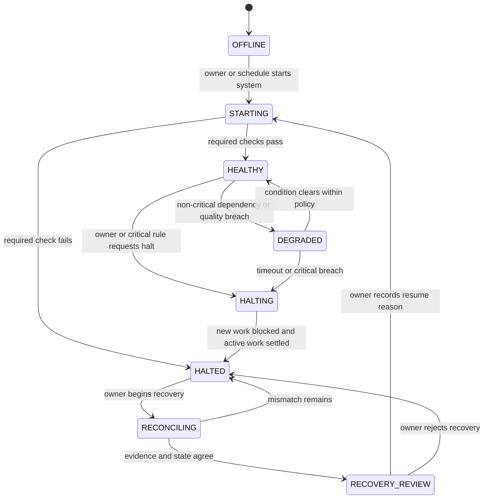
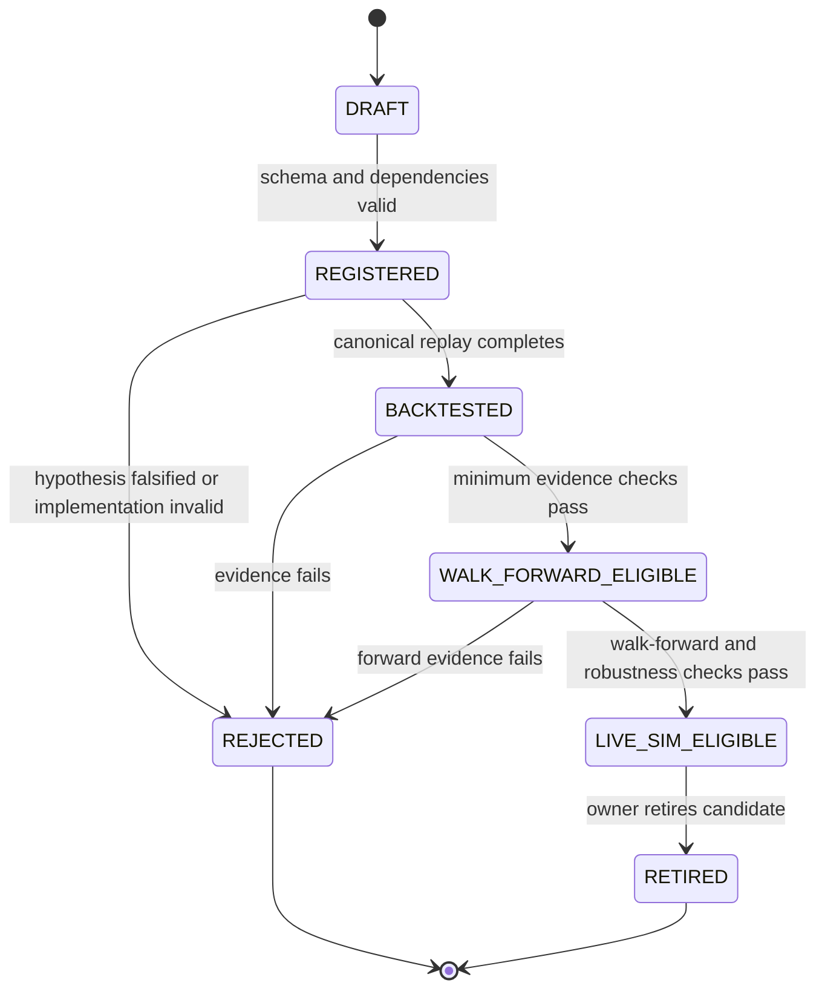
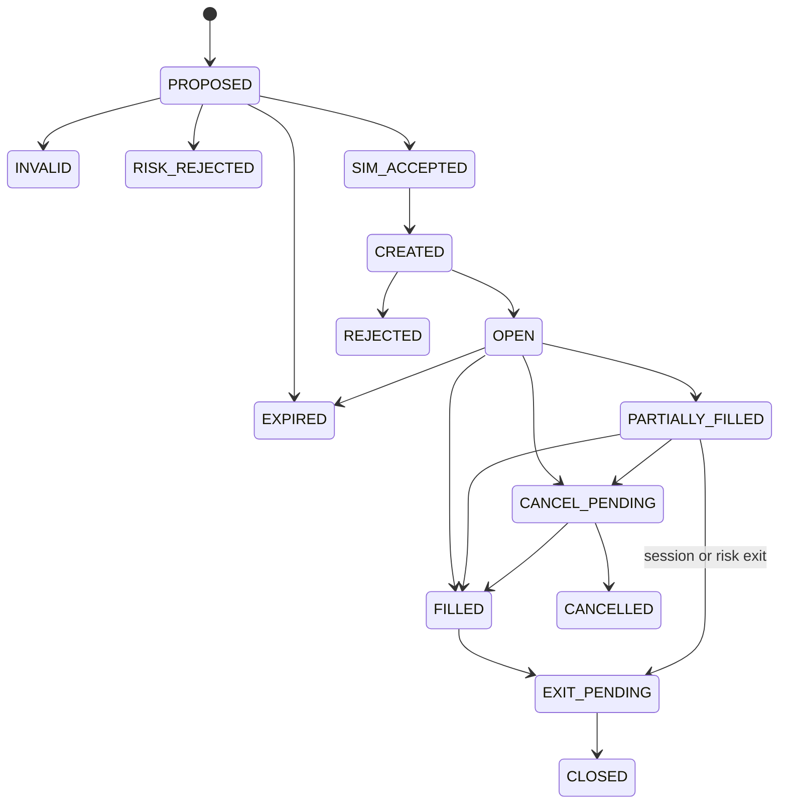
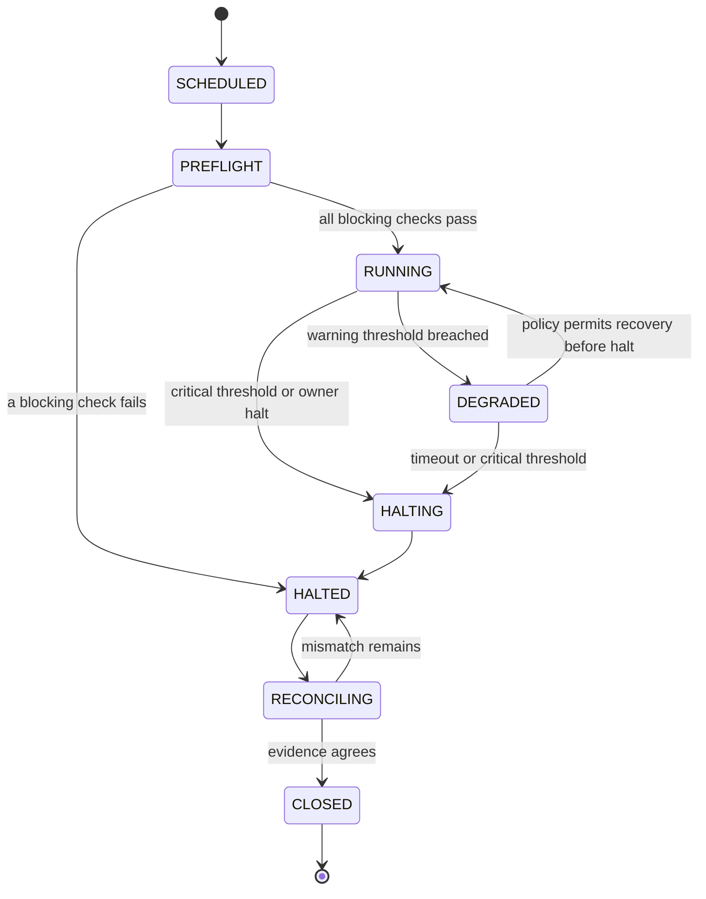
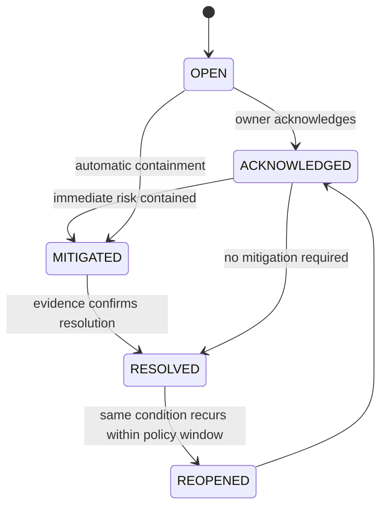
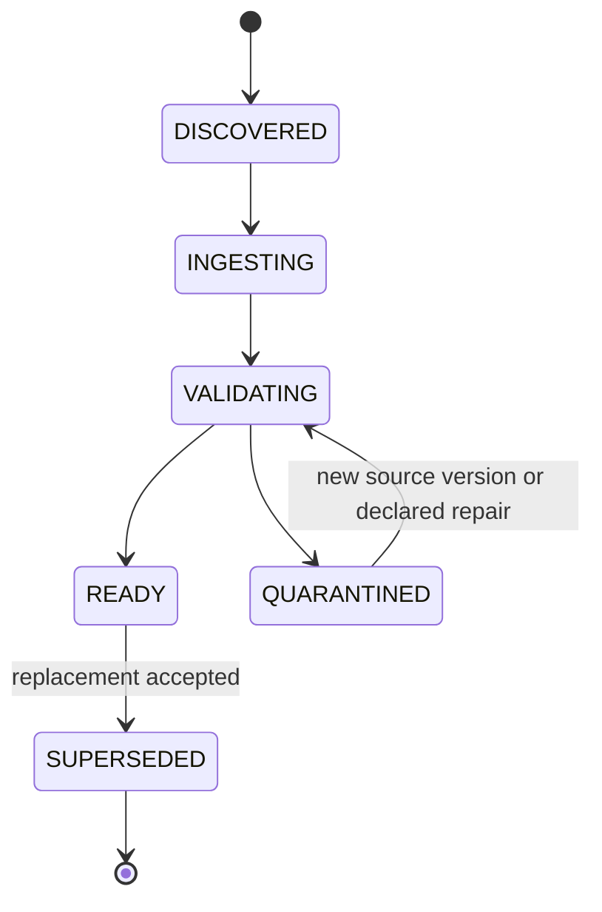
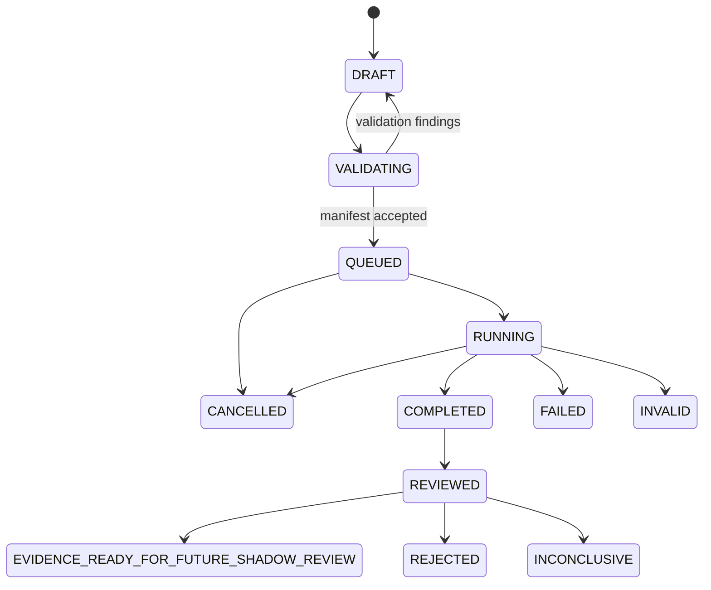
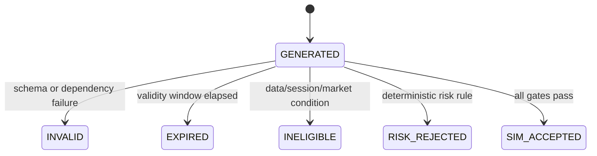

<!-- @format -->

# Sopara Product Specification

**Status:** Approved — Phase 1, amended by approved Phase 3 interface directives

**Version:** 0.2.0

**Date:** 2026-09-10

**Source:** `docs/idea.md`

**Product boundary:** Private, single-owner, non-commercial evidence lab

**v0 deployment ceiling:** Live simulated trading; no broker connection or real order transmission

> [!IMPORTANT]
> Sopara v0 is a research and simulation product. It does not claim that any strategy has an edge, does not provide investment advice, and cannot place a real order. Futures are leveraged instruments. All displayed profit and loss in v0 is simulated.

## 1. Product definition

### 1.1 Product thesis

Sopara is a falsifiable, point-in-time-correct research and execution-simulation environment for short-horizon S&P 500 futures hypotheses.

It observes the E-mini S&P 500 futures market (`ES`) as the primary information market and simulates execution in E-nano S&P 500 futures (`NES`).

The product exists to answer four questions with reproducible evidence:

1. Does a precisely defined signal have positive expectancy after conservative costs?
2. Does that result survive unseen periods, changed regimes, and small perturbations?
3. Does the same implementation behave consistently in historical replay and live simulation?
4. Does any optional model-assisted intervention improve results over a deterministic counterfactual?

The correct product output may be `NO_EDGE`, `NO_TRADE`, or `INSUFFICIENT_EVIDENCE`.

### 1.2 Governing principle

Deterministic software owns:

- data eligibility;
- feature eligibility;
- strategy eligibility;
- simulated position sizing;
- cost and fill rules;
- risk limits;
- health gates;
- state transitions;
- halting;
- audit retention.

Probabilistic or agentic components may create offline research proposals and counterfactual reviews. They may not change an accepted experiment, change a running strategy, bypass a rule, or affect the canonical v0 simulation path.

### 1.3 Approved Phase 0 decisions

| Decision | Approved result |
| --- | --- |
| v0 product | Evidence lab ending at live simulation |
| Information instrument | ES |
| Simulated execution instrument | NES |
| Ownership | One beneficial owner and operator |
| Commercial posture | Private and non-commercial |
| Broker connectivity | Outside v0 |
| Real capital | Outside v0 |

### 1.4 NES contract facts that affect product behavior

CME states that NES uses a `$0.50 × S&P 500 Index` multiplier, a `0.5` index-point tick, and a `$0.25` tick value. CME currently lists the nearest two quarterly months, trades the product Sunday 6:00 p.m. through Friday 5:00 p.m. ET with a daily 5:00–6:00 p.m. ET maintenance period, and financially settles it against the quarterly special opening quotation.

Source: [CME E-nano Equity Index Futures FAQ](https://www.cmegroup.com/articles/faqs/faq-e-nano-equity-index-futures.html)

These facts produce product requirements:

- all NES prices must align to a 0.5-point grid;
- all simulated NES P&L must use the `$0.50` multiplier;
- contract selection must use an explicit quarterly contract, never an ambiguous continuous symbol;
- roll behavior must be versioned and visible;
- maintenance periods, early closes, price limits, and expiry sessions must be represented explicitly;
- ES observations must never be treated as proof that an NES order would fill.

### 1.5 Product promise

For every accepted result, the owner can determine:

- which source events were used;
- what the system knew at decision time;
- which dataset, feature, strategy, simulator, and cost-model versions ran;
- why a proposal was eligible or rejected;
- how a simulated order changed state;
- which counterfactuals were evaluated;
- whether data or system health affected the outcome;
- whether the result can be reproduced.

## 2. Scope

### 2.1 v0 in scope

1. Register licensed historical and live ES/NES data sources.
2. Validate, normalize, quarantine, and version data.
3. Replay historical market events through a simulated clock.
4. Consume live market data into the same decision path.
5. Calculate a deliberately small, versioned feature set from trades and best bid/offer data.
6. Run versioned deterministic strategy candidates.
7. Represent `NO_TRADE` as an explicit eligibility decision.
8. Apply deterministic simulated-risk rules before order creation.
9. Simulate NES order submission, acknowledgement, partial fill, fill, cancellation, expiration, rejection, and exit.
10. Apply conservative spread, slippage, latency, fee, and missed-fill assumptions.
11. Track canonical and counterfactual outcomes.
12. Preserve immutable experiment and decision evidence.
13. Compare historical-replay and live-simulation behavior.
14. Present system health, experiments, decisions, simulated exposure, and alerts to the owner.
15. Halt simulation automatically or manually without losing evidence.
16. Export permitted aggregate results without exporting restricted raw market data.
17. Run model-assisted research only outside the canonical decision path and only with licensed inputs.

### 2.2 Explicit v0 non-goals

Sopara v0 will not:

- connect to a broker or futures commission merchant;
- store broker credentials;
- transmit, stage, preview, or reconcile a real order;
- trade real or test-account capital;
- claim readiness for broker shadow, canary, or production trading;
- support MES or other execution instruments as canonical v0 targets;
- support overnight positions;
- support options, equities, crypto, commodities, or a multi-asset portfolio;
- implement market-by-order reconstruction or cancellation-derived features;
- perform high-frequency market making or latency arbitrage;
- browse news or arbitrary websites as part of a decision;
- allow an LLM to approve or reject a canonical simulated trade;
- allow an agent to modify strategy code, parameters, datasets, prompts, risk rules, or experiment outcomes;
- promote a strategy to production;
- pool, accept, or manage another person's capital;
- publish or sell signals, advice, performance, data, or derived market products;
- provide customer accounts, organizations, teams, subscriptions, billing, or public APIs;
- ship a separate reduced-capability mobile product or native mobile application;
- equate simulated profit with validated edge.

### 2.3 Future products requiring a new approval

The following are separate products, not automatic v0 extensions:

- full market-depth research;
- broker-connected shadow validation;
- live canary trading;
- scaled live trading and capital governance;
- live model-assisted decisions;
- additional markets or instruments;
- commercial signals, managed accounts, pooled capital, or customer software.

Each requires a new scope, threat model, legal/licensing review, cost model, and Chairman approval.

## 3. User and actors

### 3.1 Primary user: owner-operator

The owner-operator is the only human user in v0.

Jobs to be done:

- determine whether the system and its data are trustworthy;
- define a falsifiable experiment without hidden hindsight;
- run and compare historical evaluations;
- supervise live simulation;
- understand why a simulated trade did or did not occur;
- stop activity immediately when evidence is untrustworthy;
- preserve failures as well as successes;
- decide whether a hypothesis is rejected, revised, or retained for more evidence.

The product must not assume that a second person is available for approval, incident response, or recovery.

### 3.2 System actors

| Actor | Responsibility | Prohibited authority |
| --- | --- | --- |
| Data source | Supplies licensed ES/NES events and metadata | Cannot mark its own data accepted |
| Data validator | Checks integrity, chronology, contract identity, and coverage | Cannot silently repair or discard evidence |
| Replay clock | Releases historical events in point-in-time order | Cannot read future events |
| Feature engine | Produces versioned features from eligible events | Cannot choose trades |
| Strategy candidate | Produces a proposal or abstention | Cannot create an order |
| Eligibility and risk policy | Allows, reduces, or rejects a simulated intent | Cannot change its policy while a run is active |
| Execution simulator | Models NES order behavior | Cannot invent liquidity or use ES fills as NES fills |
| Counterfactual evaluator | Resolves alternate outcomes | Cannot replace the canonical result |
| Research assistant | Proposes offline hypotheses or reviews completed evidence | Cannot mutate canonical artifacts or consume unlicensed data |
| Health supervisor | Degrades or halts activity | Cannot resume without recovery review |

### 3.3 Access requirements

- The product has exactly one owner identity in v0.
- Any network-accessible deployment must authenticate that identity.
- Administrative mutations require a recent authenticated session.
- Secrets and data entitlements must never appear in experiment exports or model contexts.
- Every user mutation records actor, time, prior value, new value, and reason.
- Read-only inspection remains available while simulation is halted, unless storage integrity is unknown.

## 4. Product operating model

### 4.1 Deployment modes

Only two modes exist in v0:

| Mode | Input | Clock | Execution destination | Real-order capability |
| --- | --- | --- | --- | --- |
| `HISTORICAL_REPLAY` | Versioned historical ES/NES events | Simulated | NES execution simulator | Impossible |
| `LIVE_SIMULATION` | Licensed live ES/NES events | Wall clock | NES execution simulator | Impossible |

Terms such as `TEST`, `PAPER`, `SHADOW`, `PROD`, `P0`, and `P1` are not v0 mode names.

### 4.2 Operability state

Operability is independent of deployment mode.



Required behavior:

- `HEALTHY` is the only state that permits new simulated proposals to become simulated orders.
- `DEGRADED` permits inspection and policy-defined processing but does not imply permission to create orders.
- `HALTING` blocks new simulated orders immediately.
- `HALTED` is sticky; elapsed time or a cleared alert cannot resume the system.
- `RECONCILING` recomputes data, simulated orders, positions, P&L, and evidence watermarks.
- `RECOVERY_REVIEW` requires an explicit owner decision.
- If the UI cannot establish current state, it displays `STATUS_UNKNOWN` and exposes no start or resume action.

### 4.3 Scheduled research window

The product must support an explicit exchange calendar and owner-approved research window.

Approved initial windows:

```text
09:45:00–12:00:00 America/New_York
13:30:00–15:45:00 America/New_York
Monday–Friday on eligible U.S. equity-index trading days
No position carried outside the window
```

The window is narrower than exchange hours by product policy. Early closes, holidays, maintenance periods, roll sessions, and expiry sessions override the ordinary schedule.

Changing the window creates a new experiment version; it may not mutate completed results.

### 4.4 Authority hierarchy

For every candidate:

```text
data health
→ feature eligibility
→ strategy proposal or abstention
→ deterministic policy and simulated risk
→ execution simulation
→ portfolio simulation
→ canonical outcome
→ counterfactual outcomes
```

A lower layer cannot override a rejection from an earlier layer.

## 5. Core user journeys

### 5.1 First-use readiness

Preconditions:

- owner identity exists;
- no broker configuration exists;
- source licenses and permitted uses are documented;
- supported ES and NES contracts are defined;
- system clock and exchange calendar are available.

Flow:

1. Owner registers a data source and records its permitted uses.
2. Product tests authentication, coverage, timestamp semantics, and contract identifiers.
3. Product imports a bounded sample into quarantine.
4. Product reports gaps, duplicates, out-of-order events, tick violations, and unsupported fields.
5. Owner accepts the validated source version or leaves it quarantined.
6. Product runs a known-fixture replay and verifies its checksum.
7. Product marks the workspace `RESEARCH_READY` only when every blocking check passes.

Failure behavior:

- no source is accepted automatically;
- a failed check identifies the failed rule and affected interval;
- partial readiness cannot be presented as full readiness;
- changing entitlements returns the source to validation.

### 5.2 Create an experiment

1. Owner states a falsifiable hypothesis.
2. Owner selects immutable dataset versions and point-in-time ranges.
3. Owner selects one strategy version, feature-set version, simulator version, cost model, session policy, and seed where relevant.
4. Product validates train, validation, walk-forward, and holdout boundaries.
5. Product identifies leakage risks and overlapping windows.
6. Product produces an experiment manifest and content hash.
7. Owner accepts the manifest.
8. Accepted fields become immutable; any change creates a child experiment.

The product refuses experiments with:

- missing dataset provenance;
- overlapping holdout use not explicitly declared;
- an unavailable cost model;
- a strategy requiring unavailable fields;
- unsupported contract mapping;
- a mutable or ambiguous continuous-contract definition;
- an unlicensed downstream use;
- an undefined success or falsification criterion.

### 5.3 Run historical replay

1. Product validates all manifest dependencies again at start.
2. Replay clock releases only events available at the simulated decision time.
3. Strategy emits `PROPOSE`, `NO_TRADE`, or `INELIGIBLE`.
4. Deterministic policy records every rejection and reason.
5. Execution simulator creates instrument-correct NES order events.
6. Portfolio simulator resolves positions and P&L.
7. Counterfactual evaluator resolves declared alternatives without replacing the canonical path.
8. Product calculates metrics and uncertainty with their definitions and sample sizes.
9. Product stores a result manifest and reproducibility hash.
10. Re-running the same accepted manifest against identical inputs must produce the same canonical event sequence.

### 5.4 Compare experiments

The owner may compare experiments only when the product displays differences in:

- dataset versions and time ranges;
- strategy and feature versions;
- simulator and cost assumptions;
- session and roll policies;
- risk policy;
- sample count and regime coverage;
- canonical versus counterfactual definition;
- unresolved data-quality warnings.

The comparison must not rank a result as superior solely by total P&L.

### 5.5 Start a live simulation session

1. Product validates current data entitlement, source freshness, contract mapping, session calendar, strategy version, cost model, risk policy, and storage health.
2. Product shows the exact configuration and confirms that all activity is simulated.
3. Owner starts the session or an approved schedule starts it.
4. Product enters `STARTING`, then `HEALTHY` only after all required checks pass.
5. Live events follow the same feature, strategy, policy, simulator, and ledger contracts as replay.
6. The product records source time, receive time, decision time, and simulated execution time separately.
7. At the research-window boundary, the simulator cancels eligible resting orders and closes any simulated position under the declared exit policy.
8. Product reconciles the session and produces a completeness report.

### 5.6 Investigate a decision

From any proposal, abstention, rejection, simulated order, fill, exit, or alert, the owner can navigate to one decision record containing:

- correlation and causation identifiers;
- deployment and operability state;
- ES and NES contract identities;
- source events and their watermarks;
- feature values and versions;
- strategy evidence and invalidation conditions;
- eligibility and risk decisions in evaluation order;
- simulated order transitions;
- fill and cost assumptions;
- resulting position and P&L;
- declared counterfactuals;
- data-quality and health context;
- a concise machine reason code plus optional explanation.

Missing evidence is displayed as missing; it is never reconstructed silently.

### 5.7 Halt and recover

1. Owner selects `HALT SIMULATION` or a critical policy triggers it.
2. Product blocks new simulated orders immediately.
3. Product applies the declared policy to open simulated orders and positions.
4. Product records the trigger, scope, active state, and completion status.
5. Product enters `HALTED` after simulated state is internally consistent or identifies the remaining mismatch.
6. Owner may inspect evidence while halted.
7. Recovery recomputes data and portfolio state from durable evidence.
8. Product presents differences and unresolved alerts.
9. Owner records a recovery decision and reason.
10. Resume creates a new session boundary; it does not splice over the incident.

### 5.8 Review offline model assistance

Offline model assistance is disabled by default.

When enabled for an approved experiment:

1. Product creates a bounded, licensed, versioned evidence packet.
2. Product records model, prompt, configuration, input hash, output, latency, and cost.
3. Output is validated against a structured schema.
4. The output creates only a counterfactual annotation or new hypothesis proposal.
5. The canonical deterministic result remains unchanged.
6. Model failure, timeout, or malformed output records `MODEL_REVIEW_UNAVAILABLE`; it does not fail the experiment.

Raw or reconstructable CME data may not enter a hosted model without documented permission. CME requires effective entitlement and downstream-access controls for AI solutions using its information.

Source: [CME advisory on AI use of market data](https://www.cmegroup.com/files/download/ai-data-services-advisory.pdf)

## 6. Functional requirements

Requirement keywords `MUST`, `SHOULD`, and `MAY` indicate v0 priority. A `MUST` requirement is part of the release gate.

### 6.1 Data and entitlement

| ID | Requirement | Acceptance criterion |
| --- | --- | --- |
| `DATA-001` | The product MUST maintain a registry of every market-data source, dataset, permitted use, entitlement owner, effective period, and source contact. | No dataset can transition to `READY` without all required registry fields. |
| `DATA-002` | The product MUST distinguish ES information events from NES execution events. | Every event, feature, proposal, and simulated fill exposes instrument and exact contract. |
| `DATA-003` | The product MUST preserve source time, receive time where available, sequence metadata where available, ingestion time, dataset version, and correction status. | A decision trace can identify the last eligible source event for every input. |
| `DATA-004` | The product MUST detect duplicate, out-of-order, missing, malformed, and unsupported events. | Known defects produce stable reason codes and affected intervals. |
| `DATA-005` | The product MUST quarantine data with unresolved blocking defects. | Quarantined intervals cannot contribute to an accepted result. |
| `DATA-006` | The product MUST validate ES and NES tick grids independently. | Automated fixtures reject off-grid prices and inherited MES tick assumptions. |
| `DATA-007` | The product MUST version contract-selection and roll policies. | A result identifies the exact source and execution contracts at every decision. |
| `DATA-008` | The product MUST prevent any use outside recorded entitlements. | Unlicensed export or model routes fail closed and create an audit event. |
| `DATA-009` | The product SHOULD provide interval-level completeness reports. | Reports show expected, observed, duplicate, late, corrected, and missing event counts. |
| `DATA-010` | The product MUST represent market status and price-limit state when available. | A halt or ineligible price-limit state prevents a new simulated order. |

### 6.2 NES evidence classification

NES launched on August 24, 2026. Pre-launch ES or MES history cannot prove historical NES liquidity, spread, queue, or fill behavior.

Every execution result MUST carry one of these evidence classes:

| Evidence class | Meaning | Allowed use |
| --- | --- | --- |
| `OBSERVED_NES` | Uses contemporaneous NES observations from on or after launch | Canonical execution evidence |
| `SYNTHETIC_NES_PROXY` | Applies declared NES contract math to ES or MES-derived assumptions | Exploratory sensitivity analysis only |
| `NO_EXECUTION_EVIDENCE` | Tests signal behavior without an execution claim | Signal research only |

Rules:

- A pre-2026-08-24 experiment requesting `OBSERVED_NES` MUST be rejected.
- `SYNTHETIC_NES_PROXY` MUST require explicit opt-in.
- Proxy status MUST appear on every screen, comparison, metric, and export derived from it.
- Proxy results MUST NOT satisfy execution-realism, live-simulation, or future shadow-readiness gates.
- Observed and proxy results MUST never be pooled into one fill-quality metric.

Source: [CME E-nano product launch notice](https://www.cmegroup.com/notices/electronic-trading/2026/08/20260817.html)

### 6.3 Experiment registry

| ID | Requirement | Acceptance criterion |
| --- | --- | --- |
| `EXP-001` | Every experiment MUST state a falsifiable hypothesis and rejection criterion. | Empty or qualitative-only hypotheses cannot be accepted. |
| `EXP-002` | Every accepted experiment MUST bind immutable input and implementation versions. | Any material edit creates a child experiment with a new identity. |
| `EXP-003` | The product MUST preserve unsuccessful, invalid, cancelled, and inconclusive experiments. | They remain searchable and cannot be overwritten by later runs. |
| `EXP-004` | The product MUST separate training, validation, walk-forward, and untouched holdout use. | Reuse of holdout evidence is disclosed and versioned. |
| `EXP-005` | The product MUST detect obvious time overlap and leakage risks. | Acceptance is blocked or requires an explicit, retained owner exception. |
| `EXP-006` | Every run MUST bind a cost-model version and evidence class. | Metrics without either field are invalid. |
| `EXP-007` | The product MUST retain the declared counterfactual set before execution. | Counterfactuals cannot be added after their outcomes are known without creating a child experiment. |
| `EXP-008` | The product SHOULD support parameter perturbation and multiple walk-forward windows. | Results present stability, not only the best parameter point. |
| `EXP-009` | The product MUST expose sample size and uncertainty beside performance metrics. | No expectancy or rate appears without its denominator. |
| `EXP-010` | The highest v0 disposition MUST be `EVIDENCE_READY_FOR_FUTURE_SHADOW_REVIEW`. | No v0 record can say `PRODUCTION_READY` or equivalent. |

### 6.4 Strategy candidates



| ID | Requirement | Acceptance criterion |
| --- | --- | --- |
| `STRAT-001` | A strategy MUST produce `PROPOSE`, `NO_TRADE`, or `INELIGIBLE`. | Every evaluation produces exactly one outcome and a stable reason code. |
| `STRAT-002` | `NO_TRADE` MUST be an eligibility outcome, not a market-regime label. | Regime and eligibility are independently queryable. |
| `STRAT-003` | A proposal MUST declare direction, reference price, validity interval, stop policy, exit policy, maximum holding time, and evidence. | Missing fields prevent policy evaluation. |
| `STRAT-004` | A running strategy version MUST be immutable. | Code, parameters, or dependencies cannot change during a run. |
| `STRAT-005` | Strategy eligibility MUST be specific to data class, session policy, and execution evidence class. | Historical proxy success cannot grant observed-NES eligibility. |
| `STRAT-006` | A strategy MUST have a deterministic baseline that runs without model assistance. | Baseline results remain available if all model components are disabled. |

### 6.5 Replay

| ID | Requirement | Acceptance criterion |
| --- | --- | --- |
| `REPLAY-001` | Replay MUST release inputs according to as-known-at time. | Tests inject late and corrected events and verify they are unavailable early. |
| `REPLAY-002` | Identical accepted inputs MUST produce identical canonical results. | Event order, decisions, simulated fills, P&L, and reason codes match exactly. |
| `REPLAY-003` | Replay MUST support cancellation with a durable terminal state. | Cancellation never presents partial output as complete. |
| `REPLAY-004` | Restart MUST resume from a verified checkpoint or start a new run. | It cannot silently skip or duplicate an interval. |
| `REPLAY-005` | Resource exhaustion MUST fail visibly. | Disk, memory, or worker failure marks the run `INVALID` or `FAILED`, not `COMPLETED`. |
| `REPLAY-006` | Replay MUST record the effective calendar and time-zone database version. | DST and early-close handling can be reconstructed. |

### 6.6 Simulated policy and risk

| ID | Requirement | Acceptance criterion |
| --- | --- | --- |
| `RISK-001` | Every proposed simulated order MUST pass health, session, instrument, liquidity, exposure, loss, and duplication checks. | The ledger records checks in evaluation order. |
| `RISK-002` | A missing or unavailable required check MUST fail closed. | No simulated order is created. |
| `RISK-003` | Risk-policy changes MUST create a new version. | Running and completed sessions retain their original policy. |
| `RISK-004` | Simulated maximum position MUST be bounded by configuration. | Attempts above the bound are rejected with requested and allowed quantity. |
| `RISK-005` | The initial canonical evaluation unit SHOULD be one NES contract. | Multi-contract results are separately labeled sensitivity experiments. |
| `RISK-006` | Session-end policy MUST cancel eligible resting orders and resolve open simulated positions. | No canonical simulated position crosses the configured window boundary. |
| `RISK-007` | Health recovery MUST NOT resume order eligibility automatically after a halt. | Owner recovery review is required. |

### 6.7 NES execution simulation



| ID | Requirement | Acceptance criterion |
| --- | --- | --- |
| `SIM-001` | The simulator MUST use the NES tick and multiplier. | One 0.5-point tick changes one-contract gross P&L by `$0.25`. |
| `SIM-002` | The simulator MUST use NES observations for canonical fill evidence. | ES prices or fills cannot directly create an `OBSERVED_NES` fill. |
| `SIM-003` | Every fill MUST identify its model and assumptions. | Fill evidence includes spread, latency, queue assumption, slippage, and cost-model version. |
| `SIM-004` | Passive fill logic MUST be conservative and evidence-class aware. | Touching a limit price alone does not guarantee a fill unless the declared model says so. |
| `SIM-005` | The simulator MUST support partial fills, cancellation races, expiry, rejection, and gaps. | Deterministic fixtures cover each transition. |
| `SIM-006` | Stops and targets MUST align to the NES price grid using declared direction-aware rounding. | Off-grid values are rejected or transformed with the transformation recorded. |
| `SIM-007` | Gross P&L, exchange and broker fee assumptions, modelled spread, slippage, and inference/data allocation MUST be separate fields. | Net results can be recomputed from displayed components. |
| `SIM-008` | A zero-volume, empty-book, crossed-book, stale-book, halted, or price-limited condition MUST block or conservatively resolve execution according to policy. | The selected behavior and reason code are present in evidence. |

### 6.8 Live simulation



| ID | Requirement | Acceptance criterion |
| --- | --- | --- |
| `LIVE-001` | Preflight MUST validate data, contracts, calendar, clocks, storage, strategy, simulator, costs, and risk policy. | `RUNNING` is impossible with a failed blocking check. |
| `LIVE-002` | Healthy ES signal data and healthy NES execution data MUST both be present for a canonical proposal. | Either unhealthy stream produces `NO_TRADE` or `INELIGIBLE`. |
| `LIVE-003` | Feed disconnection or unrecoverable sequence gaps MUST halt new simulated orders. | Eligibility remains blocked until resynchronization and recovery review. |
| `LIVE-004` | Browser or dashboard disconnection MUST NOT change server-side state. | Reconnection retrieves authoritative state and missed events. |
| `LIVE-005` | Restart MUST begin halted unless the prior session closed cleanly. | It never silently resumes an active strategy. |
| `LIVE-006` | Session close MUST produce a reconciliation and completeness report. | Missing or contradictory evidence keeps the session out of `CLOSED`. |

### 6.9 Counterfactuals and model attribution

| ID | Requirement | Acceptance criterion |
| --- | --- | --- |
| `CF-001` | Counterfactuals MUST be declared before their outcome horizon completes. | Post-hoc additions create a visibly separate exploratory analysis. |
| `CF-002` | Counterfactual records MUST never mutate canonical state. | Canonical and alternate event streams use distinct identities. |
| `CF-003` | Agent-assisted variants MUST be compared with the deterministic baseline after incremental costs. | Attribution reports show both gross and net incremental value. |
| `CF-004` | Model timeout, malformed output, or unavailable service MUST resolve as `MODEL_REVIEW_UNAVAILABLE`. | The canonical run completes without the model. |
| `CF-005` | A model output MUST cite evidence identifiers contained in its packet. | Unsupported references invalidate the review. |
| `CF-006` | Model access MUST use a deny-by-default field allowlist. | Unapproved raw or reconstructable market data cannot leave the licensed boundary. |

NIST describes test, evaluation, verification, and validation as evidence used to assess whether AI systems meet goals while minimizing negative impacts. Sopara applies that posture to any optional model-assisted research rather than presuming model value.

Source: [NIST TEVV-Athlon framework](https://www.nist.gov/artificial-intelligence/ai-research/tevv-athlon-framework-evaluating-ai-systems)

### 6.10 Evidence, reporting, and export

| ID | Requirement | Acceptance criterion |
| --- | --- | --- |
| `EVID-001` | Every material state transition MUST be append-only and attributable. | Reconstruction does not depend on mutable UI state. |
| `EVID-002` | Every result MUST distinguish verified fact, configured assumption, inferred metric, and unresolved hypothesis. | Each field or section exposes its evidence status. |
| `EVID-003` | Reports MUST separate gross edge, all modeled costs, deterministic baseline, model-assisted variants, proxy evidence, and observed NES evidence. | These values cannot be collapsed into one unlabeled return. |
| `EVID-004` | Reports MUST display warnings and invalidity before performance. | An invalid run cannot appear in leaderboards or promotion views. |
| `EVID-005` | The product MUST retain rejected and abstained proposals. | They are available for counterfactual analysis. |
| `EVID-006` | Exports MUST enforce market-data and model-data permissions. | Restricted fields are omitted with an export manifest showing what was removed. |
| `EVID-007` | The product MUST not produce guaranteed-return, production-ready, or investment-advice claims. | Generated summaries use uncertainty language and evidence status. |

The CFTC cautions that AI cannot predict the future or sudden market changes. Sopara therefore treats any model result as an experiment, never a guarantee.

Source: [CFTC AI trading-bot advisory](https://www.cftc.gov/LearnAndProtect/AdvisoriesAndArticles/AITradingBots.html)

### 6.11 Alerts and incidents



| ID | Requirement | Acceptance criterion |
| --- | --- | --- |
| `ALERT-001` | Alerts MUST have severity, source, scope, first/last occurrence, count, operability impact, and stable reason code. | Event storms group into one inspectable alert without losing counts. |
| `ALERT-002` | Acknowledgement MUST NOT equal mitigation or resolution. | Each transition is separate and attributable. |
| `ALERT-003` | Critical alerts MUST trigger the declared fail-closed response without UI availability. | Automated tests exercise the behavior with the dashboard disconnected. |
| `ALERT-004` | Resolution MUST require current evidence that the condition cleared. | Time alone cannot resolve an alert. |
| `ALERT-005` | Stale UI state MUST display `STATUS_UNKNOWN`. | Cached health cannot remain green after connectivity loss. |

## 7. Product state machines

### 7.1 Dataset package



Completed results continue to reference superseded datasets. A repair creates a new version and never rewrites prior accepted bytes.

### 7.2 Experiment



`FAILED` means the system could not finish. `INVALID` means it finished or partially ran but its evidence cannot support the declared claim. Neither is equivalent to a falsified hypothesis.

### 7.3 Proposal eligibility



### 7.4 Research conclusion

Allowed conclusions are:

- `SUPPORTED_FOR_MORE_TESTING`;
- `FALSIFIED`;
- `INCONCLUSIVE`;
- `INVALID_EVIDENCE`;
- `EVIDENCE_READY_FOR_FUTURE_SHADOW_REVIEW`.

The product never maps these values automatically to capital or production states.

## 8. Edge-case catalogue

### 8.1 Market and contract

- NES has no observations before August 24, 2026.
- NES prints no trades during an otherwise active ES interval.
- ES is healthy while NES is stale, empty, locked, crossed, or excessively wide.
- NES is healthy while ES signal data is stale or gapped.
- Front and next quarterly contracts overlap during roll discovery.
- The configured execution contract reaches expiry or final-settlement day.
- A price limit or trading halt starts while a proposal is active.
- The ordinary session is replaced by an early close.
- Daylight-saving transitions change UTC offsets while local policy time remains stable.
- A stop or target falls between valid NES ticks.
- A market gap passes through stop or target levels.

### 8.2 Data

- duplicate events have identical identifiers but different payloads;
- corrections arrive after a run completed;
- receive timestamps are absent;
- source sequence numbers reset;
- an interval begins without a valid initial book state;
- the source changes a field definition or symbol;
- a continuous-contract series disagrees with the explicit roll policy;
- disk fills during ingestion or evidence write;
- checksums disagree after transfer;
- entitlement expires during a live session.

### 8.3 Strategy and experiment

- the strategy emits no proposals;
- every proposal is rejected;
- sample size is too small for the declared conclusion;
- one parameter point dominates while nearby values fail;
- costs turn gross positive expectancy negative;
- a holdout interval was previously inspected;
- an experiment requests a feature unavailable in part of its history;
- two strategies propose conflicting positions;
- an owner tries to mutate a running experiment;
- a model-assisted variant is available for only part of the sample.

### 8.4 Simulation and lifecycle

- cancel and fill occur at the same simulated timestamp;
- a partial fill remains at session end;
- halt occurs during an exit;
- repeated halt or resume commands arrive;
- the worker restarts after persisting an intent but before persisting the next transition;
- the dashboard disconnects while the session remains active;
- reconciliation finds a position not derivable from accepted fills;
- the owner is unavailable when a critical incident occurs;
- the wall clock moves backward or exceeds allowed drift;
- an alert flood obscures the initiating fault.

Required general response:

```text
preserve evidence
→ stop unsafe progression
→ expose the uncertainty
→ reconcile from durable state
→ require explicit recovery when trust was lost
```

## 9. Information hierarchy and accessibility requirements

Detailed layout belongs in `docs/design.md`; these product behaviors are mandatory:

- Every view displays deployment mode and evidence class.
- Any P&L display includes `SIMULATED` in adjacent text, not color alone.
- Signal and execution instruments are labeled separately.
- Blocking health and evidence warnings appear before performance metrics.
- Color, text, iconography, and shape redundantly communicate critical state.
- All actions and inspections are keyboard operable.
- Every workflow and surface is fully operable on supported mobile, tablet, and desktop viewports; responsive composition may change, but information, authority, and confirmation consequences may not.
- Light, system-following, and dark themes are supported with identical semantic meaning and independently verified contrast.
- Focus moves predictably after dialogs, errors, and state changes.
- Live updates use accessible status semantics without repeatedly stealing focus.
- Charts have an equivalent inspectable table or textual summary.
- Reduced-motion preferences are respected.
- Emergency controls are visually and spatially separated from routine actions.
- Destructive or state-changing actions name their consequence and affected session.
- The target conformance level is WCAG 2.2 AA.

Source: [W3C Web Content Accessibility Guidelines 2.2](https://www.w3.org/TR/WCAG22/)

## 10. Metrics and success criteria

### 10.1 v0 completion metrics

These measure product integrity, not strategy profitability.

| Dimension | Release criterion |
| --- | --- |
| Real-order isolation | No broker credential, broker adapter, or outbound order-transmission capability exists in the v0 runtime. |
| NES correctness | Contract, tick, P&L, expiry, session, and price-grid fixtures pass with zero MES-derived assumptions. |
| Reproducibility | Identical accepted manifests produce identical canonical event sequences, decisions, fills, reason codes, and P&L. |
| Point-in-time integrity | Known look-ahead fixtures are rejected; accepted runs contain zero known point-in-time violations. |
| Evidence completeness | Every canonical decision resolves to its input watermark and bound versions. |
| Invalidity handling | Corrupt, incomplete, or unlicensed inputs cannot produce an accepted result. |
| Fail-closed behavior | Every declared critical failure prevents new simulated orders in automated tests. |
| Recovery | Restart and reconciliation fixtures never silently resume or duplicate a session. |
| Cost visibility | Every net result decomposes into gross result and each modeled cost class. |
| Evidence classification | Every execution result is observed NES, synthetic proxy, or no-execution evidence. |
| Accessibility | Critical owner journeys meet WCAG 2.2 AA acceptance checks. |
| Continuous operation | At least 20 consecutive scheduled live-simulation sessions close with complete reconciliation and no unresolved critical incident. |

### 10.2 Research metrics

Every applicable result reports:

- sample size and effective sample caveats;
- net expectancy per trade;
- gross and net P&L;
- spread, slippage, fees, and inference/data-cost allocation;
- maximum drawdown and duration;
- average winner and loser;
- profit factor;
- tail loss and worst session;
- turnover and exposure time;
- performance by regime and time window;
- performance by confidence bucket where confidence exists;
- stability across walk-forward windows;
- sensitivity at `1.0×`, `1.25×`, `1.5×`, and `2.0×` modeled costs;
- observed-NES versus proxy separation;
- deterministic baseline versus model-assisted counterfactual.

Metrics MUST retain definitions and versions. The product MUST NOT label a metric statistically meaningful without displaying the method and required caveats.

### 10.3 Explicitly insufficient success signals

None of these independently establish product or strategy success:

- positive total simulated P&L;
- a high win rate;
- one profitable month;
- one favorable holdout;
- a persuasive model explanation;
- many generated experiments;
- a dashboard that remained online;
- zero operator interventions;
- small NES notional exposure.

## 11. Prioritization

### 11.1 Must ship for v0

- data-source and entitlement registry;
- ES/NES normalized data with validation and quarantine;
- explicit contract and roll identity;
- deterministic replay clock;
- one end-to-end deterministic strategy plus `NO_TRADE` baseline;
- experiment registry and immutable manifests;
- point-in-time feature generation;
- deterministic eligibility and simulated-risk gates;
- observed-NES execution simulator and clearly isolated proxy mode;
- decision ledger and counterfactual engine;
- live simulation with preflight, halt, reconciliation, and recovery review;
- owner command center, experiment comparison, and decision trace;
- evidence-safe export;
- accessibility and incident acceptance tests.

### 11.2 Should ship after the vertical slice is proven

- additional deterministic strategy families;
- parameter-sweep orchestration;
- richer calibration views;
- offline model-assisted hypothesis generation;
- historical-analogue counterfactuals;
- cost-budget controls and inference attribution;
- scheduled reports.

### 11.3 Could ship later

- additional cross-market information features;
- local-only model execution;
- alternative replay-speed controls;
- optional research notebooks backed by accepted manifests;
- optional installed/PWA packaging after the no-offline security boundary is reconsidered.

### 11.4 Will not ship in v0

All items in section 2.2.

## 12. Release gates

### Gate 0 — Research readiness

- supported sources and entitlements recorded;
- fixture data validated;
- explicit ES and NES contracts resolve correctly;
- no broker or order-transmission configuration exists;
- known deterministic replay fixture passes.

### Gate 1 — Historical vertical slice

- one hypothesis runs end to end;
- accepted manifest is immutable;
- canonical and counterfactual outputs are reproducible;
- failures and abstentions are retained;
- proxy evidence cannot masquerade as observed NES evidence.

### Gate 2 — Robustness

- walk-forward and perturbation paths run;
- cost stresses run;
- data-gap, restart, clock, contract-roll, and price-grid fixtures pass;
- research conclusion is evidence-backed and correctly qualified.

### Gate 3 — Live-simulation readiness

- live preflight, health gating, session policy, halt, and reconciliation pass controlled drills;
- ES-healthy/NES-unhealthy and NES-healthy/ES-unhealthy cases fail closed;
- the operator can reconstruct every decision;
- stale UI cannot present healthy state.

### Gate 4 — v0 completion

- all section 10.1 criteria pass;
- the approved continuous-operation requirement passes;
- no unresolved critical integrity or entitlement issue remains;
- known limitations are recorded;
- the only allowed highest disposition is `EVIDENCE_READY_FOR_FUTURE_SHADOW_REVIEW`.

Gate 4 does not authorize broker shadow or real-money development.

## 13. Decision log

| Date | Decision | Authority | Status |
| --- | --- | --- | --- |
| 2026-09-10 | v0 ends at live simulation | Chairman | Approved |
| 2026-09-10 | NES replaces MES as simulated execution instrument | Chairman | Approved |
| 2026-09-10 | Product is private, single-owner, and non-commercial | Chairman | Approved |
| 2026-09-10 | ES remains primary information instrument | Chairman | Approved |
| 2026-09-10 | Pre-launch NES proxy is exploratory and cannot satisfy canonical execution gates | Chairman | Approved |
| 2026-09-10 | One deterministic strategy plus `NO_TRADE` forms the first vertical slice | Chairman | Approved |
| 2026-09-10 | Initial research windows are 09:45–12:00 and 13:30–15:45 ET | Chairman | Approved |
| 2026-09-10 | v0 continuous-operation gate requires 20 consecutive reconciled scheduled sessions | Chairman | Approved |
| 2026-09-10 | Every workflow and surface has mobile feature parity | Chairman | Approved |
| 2026-09-10 | Light, system, and dark themes are required | Chairman | Approved |
| 2026-09-10 | Keyboard navigation is a first-class interface contract | Chairman | Approved |

## 14. Product risks

| Risk | Consequence | Product mitigation |
| --- | --- | --- |
| NES history is extremely short | Execution conclusions appear stronger than evidence permits | Mandatory evidence classes and pre-launch rejection |
| NES liquidity remains sparse | Simulated fills are unrealistic or opportunity is unusable | Require healthy NES execution data; retain `NO_TRADE` |
| ES signal and NES execution diverge | ES edge does not transfer to NES | Instrument-separated data, health, and attribution |
| Researcher overfits repeated holdouts | False discovery | Holdout-use history, child experiments, failed-result retention |
| Simulation assumptions dominate returns | False profitability | Cost decomposition, stress tests, model versions, conservative fills |
| Optional AI creates persuasive noise | Research effort and costs increase without value | Offline counterfactual only; deterministic baseline; net attribution |
| Data use exceeds license | Legal and financial exposure | Entitlement registry, deny-by-default routes, export manifests |
| Single operator is unavailable | Incidents remain unattended | No real orders; automatic fail-closed simulation halt |
| Mode confusion | Simulation mistaken for live or vice versa | Only two v0 modes; persistent simulated labeling |
| Metric selection hides failure | Misleading product conclusions | Required denominators, uncertainty, invalidity-first reporting |

## 15. Traceability to the entry document

This specification retains the entry document's strongest principles:

- deterministic authority over probabilistic reasoning;
- abstention as a first-class outcome;
- counterfactual measurement;
- immutable research evidence;
- event-driven replay;
- point-in-time correctness;
- realistic costs and fills;
- fail-closed health controls;
- explicit non-goals;
- hypotheses separated from verified facts.

It intentionally removes from v0:

- MES execution assumptions;
- broker shadow and reconciliation;
- production capital tiers;
- live agent committees;
- automatic capital promotion or demotion;
- distributed-service topology;
- full-depth order-flow commitments;
- commercial distribution.

Those subjects may be specified only after their corresponding product boundary is approved.
